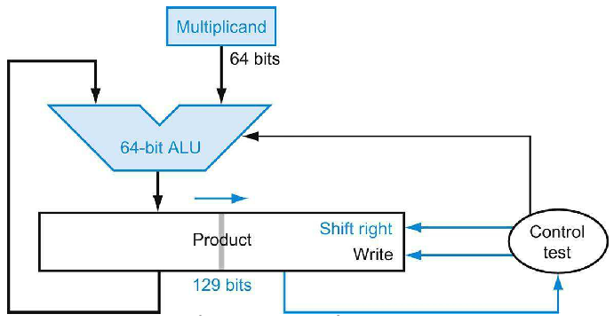

# Arithmetic for Computers

## Addition and Substraction


This is how to detect overflow for two's complement numbers in a computer

For **unsigned overflow** using **a branch target**.

- Unsigned integers are commonly used for memory addresses where overflows are ignored

- Addition has overflowed if the sum is less than either of the address

- whereas substraction has overflowed if the difference is greater than the minuend.

## Multiplication

### Sequential Version of the Multiplication Algorithm and Hardware


- The **Multiplicand register**, **ALU**, and **Product** register are **all 128 bits wide**, with only the **multiplier register conatining 64 bits**.

- The **64-bit multiplicand starts in the right half of the Multiplicand register** and is **shifted left 1 bit on each step**.

- The **multiplier is shifted in the opposite direction** at each step.

- The algorithm starts with the product initialized to 0

- **Control decides when to shift the Multiplicand and Multiplier registers** and when to write new values into the Product Register.


Three basic steps for each bit

- The **least significant bit of the multiplier (multiplier 0)** determines whether the multiplicand is added to the product regsiter.

- The left shift in step 2 has the effect of moving the intermediate operands to the left

- The shift right in step 3 gives us the next bit of the multiplier to examine in the following iteration.

These three steps are repeated **64 times** to obatin the product.

- If each step took a clock cycle, this algorithm would require almost 200 clock cycles to multiply two 64-bit numbers.

### Refined Version of the multiplication

The speed up comes from performing the operations in parallel

- **the multiplier and multiplicand are shifted** while **the multiplicand is added to the product if the multiplier bit is a 1**

The hardware just has to ensure that it **tests the right bit of the multiplier** and **gets the preshifted version of the multiplicand**

The hardware is usually further optimized to **halve the width of the adder and registers** by noticing where are unused protions of registers and adders



- The **Multiplicand register and ALU have been reduced to 64 bits**.

- Now the product is **shifted right**

- The separate **Multiplier register also disappeared**.

- The multipler is **placed instead in the right half of the Product Register**, which has grown by one bit to 129 bits to hold the carry-out of the adder.

### Signed Multiplication

The easiest way to understand how to deal with signed numbers is to first convert the multiplier and multiplicand to positive numbers and then remember their original signs.

### Faster Multiplication

Whether the multiplicand is to be added or not is known at the beginning of the multiplication by looking at each of the 64 multiplier bits.

Faster multiplications are possible by **essentially providing one 64-bit adder for each bit of the multiplier**

- one input is the **multiplicand** ANDed with **a multiplier bit**

- and the other is **the output of a prior adder**


- Rather then use a single 64-bit adder 63 times, this hadware "unrolls the loopp" to use 63 adders and then organizes them to minimize delay

## Division

$$\text{Dividend} = \text{Quotient} \times \text{Divisor} + \text{Remainder}$$

### A Division Algorithm and Hardware


- start with 64-bit Quotient register set to 0

- Each iteration of the algorithm needs to **move the divisor to the right one digit**

- start with the **divisor placed in the left half of the 128-bit Divisor Register** and **shift it right 1 bit each step to align it with the dividend**

- The **Remainder register is initialized with the dividend**.

- The Divisor register, ALU and Remainder register are all 128 bits wide, with only the Quotient register being 64 bits.

- Control decides when to shift the Divisor and Quotient registers and when to write the new value into Remainder Register.


### Improved version of the Divison Hardware

The speed-up comes from 

- shifting the operands and the quotient simultaneously with substarction

- Halves the width of the adder and registers by noticing where there are unused portions of registers and adders.


- The Divisor register, ALU, and Quotienet regsiter are all 64 bits wide.

- The ALU and Divisor registers are halved and **the remainder is shifted left**

- This version also **combines the Quotient register with the right half of the Remainder register**

### Signed Divison

The simplest solution is to remember the signes of the divisor and dividend and then nature the quotient if the signs disagree.

### Fast Division

We used many adders to speed up multiply, but we cannot do the same trick for divide. 

- The reason is that we need to know the sign of the difference before we can perform the next step of the algorithm

- Whereas with multiply we could calculate the 64 partial products immediately.

#### SRT Division

One technique to produce more than one bit of the quotient bits per step.

*SRT Divison* techniques tries to **predict** several quotient bits per step, using a table lookup based on the upper bits of the dividend and remainder.

It relies on subsequent steps tp correct wrong predictions.

A typical value today is 4 bits.

The key is **gussing the value to substract**.

These algorithms use **6 bits from the remainder** and **4 bits from the divisor** to index a table that determines the guess for each step.

#### Newton's iteration

Another technique to leverage a fast multiplier is Newton’s iteration,  where division is recast as finding the zero of a function to produce the reciprocal 1/c, which is then multiplied by the other operand.

$$Q = \frac{N}{D}$$

$$R = \frac{1}{D}$$

then

$$Q = N \times R$$

Let

$$f(x) = \frac{1}{x} - D$$

The solution is 

$$x^* = \frac{1}{D}$$

The iteration formula is

$$x_{n+1} = x_n(2 - Dx_n)$$


## Floating Point

### IEEE 754 Floating-Point Standard


$$(-1)^{S} \times (1 + \text{Fraction}) \times 2^{\text{Exponent - Bias}}$$

The range of single precision numbers is then form as small as

$$\pm 1.00000000000000000000000_\text{two} \times 2^{-126}$$

$$\pm 1.11111111111111111111111_\text{two} \times 2^{127}$$

### Floating-Point Addition

Let's add numbers in scientific notation by hand to illustrate the problems in floating-point addition

$$9.999 \times 10^1 + 1.610 \times 10^{-1}$$

Assume that we can store only four decimal digits of the significand and two decimal digits of the expoenent.

#### Step 1

To be able to add these numbers properly, we must **align the decimal point of the number that has the smaller exponent**.

$$\text{1.610}_\text{ten} \times 10^{-1} = 0.1610_\text{ten} \times 10^{0} = 0.01610_\text{ten} \times 10^1$$

The first step shifts the significand of the smaller number to the right until its corrected exponent matches that of the larger number.

But we can represent only four decimal digits

$$0.016 \times 10^1$$

#### Step 2

Next comes the addition of the significands:

```
    9.999
+   0.016
   10.015
```

#### Step 3

Adjust to scientific notation:

$$10.015_\text{ten} \times 10^1 = 1.0015_\text{ten} \times 10^2$$

This example shows shifting to right

- but if one number were positive and the other were negative, it would be possible for the sum to have many leading 0s, requiring left shifts.

- Whenever the exponent is increased or decreased, we must check for overflow or underflow—that is, we must make sure that the exponent still fits in its field.

#### Step 4

Round the number.

The significand could be only four digits long (excluding the sign)

$$1.002_\text{ten} \times 10^2$$

### The basic organization of hardware for Floating-point Addition


- First, the exponent of one operand is subtracted from the other using the small ALU to determine which is larger and by how much.

- This difference controls the three multiplexors; from left to right, they select the larger exponent, the significand of the smaller number, and the significand of the larger
 number.
 
- The smaller significand is shifted right and then the significands are added together using the big ALU.

- The normalization step then shifts the sum left or right and increments or decrements the exponent.

- Rounding then creates the final result, which may require normalizing again to produce the actual final result.

### Floating-Point Multiplication

We start by multiplying decimal numbers in scientific notation by hand: 

$$1.110_\text{ten} \times 10^{10} \times 9.200_\text{ten} \times 10^{-5}$$

#### Step 1

Unlike addition, we calcuate the expoenent of the product by simply **adding the exponents of the operands together**:

$$\text{New exponent} = 10 + (-5) = 5$$

We know that the bias is $10 + 127 = 127$ and $-5 + 127 = 122$

Accordingly, to get the correct biased sum when we add biased numbers, we must **substract the bias from the sum**

$$(10 + 127) + (-5 + 127) - 127 = (5 + 127) = 132$$

#### Step 2

Next comes the **multiplication** of the significands:

```asm
            1110
x           9200
            0000
           0000
          2220
         9990
        10212000
```

the final result will be $10.21200_\text{ten}$

#### Step 3

This product is unnormalized, so we need to **normalize** it:

$$10.212_\text{ten} \times 10^5 = 1.0212_\text{ten} \times 10^6$$

the product can be shifted right one digit to put it normalized form, adding 1 to the exponent. At this point, we can check for overflow and underflow. Underflow may occur if both operands are small, that is, if both have large negative exponents.

#### Step 4

We assumed that the significant is only four digits long (excluding the sign), so we must **round the number**.

$$1.021_\text{ten} \times 10^6$$

#### Step 5

**The sign of the product** depends on the signs of the original operands.

$$+1.021_\text{ten} \times 10^6$$

### Accurate Arithmetic

IEEE 754, therefore, always keeps **two extra bits on the right during intervening additions**, called **guard** and **round**, respectively. 

#### Guard

The first of two extra bits kept on the right **during intermediate calculations of floating-point numbers**; used to improve rounding accuracy.

#### Round

Method to make the intermediate floating-point result fit the floating-point format; the goal is typically to find the nearest number that can be represented in the format. It is also the name of the second of two extra bits kept on the right during intermediate floating-point calculations, which improves rounding accuracy.

Since the worst case for rounding would be when the actual number is halfway between two floating-point representations, accuracy in floating point is normally measured in terms of the number of bits in error in the least significant bits of the significand;

- the measure is called the number of units in the last place, or **ulp**. If a number were off by 2 in the least significant bits, it would be called off by 2 ulps.

#### Sticky bit

To support this goal and round to **the nearest even**, the standard has a third bit in addition to guard and round; it is set whenever there are nonzero bits to the right of the round bit. This **sticky bit** allows the computer to see the difference between $0.50 … 00_\text{ten}$ and 0.$50 … 01_\text{ten}$
when rounding.

