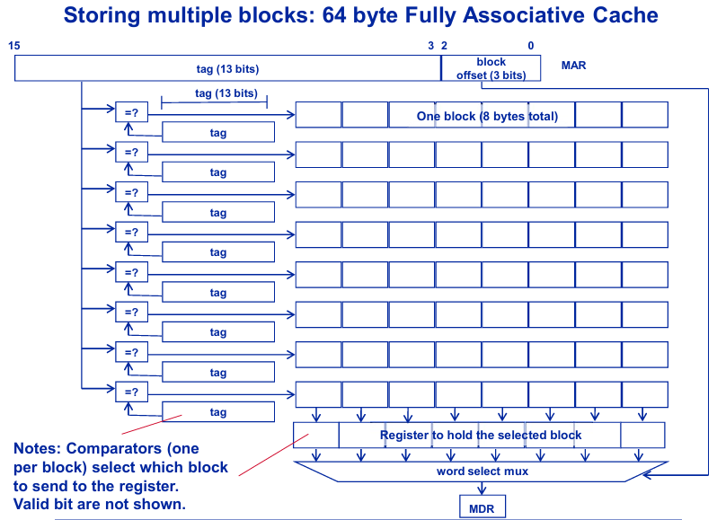
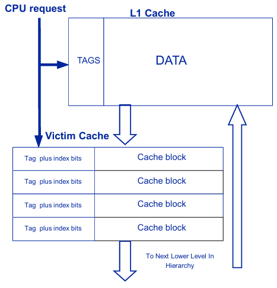
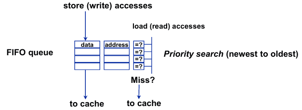

# N1: Introduction of Computer Architecture

## 1. Architecture tricks: Speculation with and without Prediction, Parallelism

1. Parallisim 

2. Speculation

    2.1 with prediction

    2.2 without prediction

Note: prediction requires speculation to get performance, but speculation does not require predicition.

## 2. Parallelsim grain size: Bit level (BLP), instruction level (ILP), thread level (TLP), and inter-program (PLP) level

### Instruction-Level parallelism


### Bit-level parallisim

Chain along four 8-bit Carry Lookahead Adder cells:

- A good tradeoff between cost and speed

- and **byte-level parallelism**

 

## 3. Flynn's taxnomony: Multiprocessing: SIMD vs. MIMD vs. Pipeling

### Flynn's SIMD

**No synchronization**: everyone in "lock step"

Not all program parallelism can be exploited with this approach


### Flynn's MIMD

Each PE executes **its own thread of instructions**

Program-level: **no synchronization**, but speedup due to **throughout**.

Thread-level: **sychronization needed**, thread-level can "simulate" SIMD, but at a higher performance hit.


### SIMD/MIMD hybrids

SPMD: Single Program, Multiple Data

- Control flow paths may vary between PEs

SPMT: Single Program, Multiple Thread

- New age hip name for SPMD.

### Pipelining

Example: Floating-point operations take multiple steps.

$$1.23 \times 10^3 + 2.34 \times 10^{-1}$$

- First **DeNormalize** to $1230 + 0.234$

- Then **ADD** to get $1230.234$

- Then **Renomalize** to get $1.230234 \times 10^3$

- These three steps can be piplined providing a potential speed up of 3x


## 4. Vectors: Packed word SIMD vector instructions vs. Pipelined vector operations

### Packed Word (bit level) SIMD

SIMD instructions or **"packed word"** is another example of bit-level parallelism

```asm
PADD.B R3, R2, R1
```

It uses 4, 8-bit CLAs (carray and lookahead adders) of a "regular adder but disconnects the carries in between them"

```asm
adds R3[31:24] = R2[31:24] + R1[31:24]
```

### Pipelined Vector Operations

Piplelined Vector Operations is a kind of **DLP (data-level parallisim)**, closed to ILP.

Example: cray-1 (**cray-style vector processing**)

- had **vector registers** that were 1-dimmensional arrays of 64 floating-point numbers.

- V1 was V1[0] to V1[63]

- Adder and multiplier were pipelined into 3 stages each

```asm
VADD V3, V1, V2
VMUL V5, V4, V3
```

- Total speedup is 6x!

- Chaining, supported **vector chaining**, the output of one vector operation could be directly fed as input to another **without waiting for the entire operation to complete**

# N2: Performance evaluation

Other metrices of performance

Energy used:

$$\text{Energy (dynamic)} = \text{Capacitive load} \times \text{Voltage}^2$$

Power:

$$\text{Power (dynamic)} = \frac{1}{2} \times \text{Capacitive load} \times \text{Volatge}^2 \times \text{Frequency}$$

To reduce dynamic power

- Lower voltage

- Lower frequency

To reduce energy

- Lower voltage (frequency doesn't matter)

## 1. Benchmarking && what benchmarks are for

Benchmarking in computer architecture refers to the process of measuring a system's performance using standardized tests. It helps compare hardware and software by executing predefined workloads and analyzing their execution time, throughput, power consumption, or efficiency.

- **Performance Evaluation**: Helps in assessing CPU, GPU, memory, storage, or overall system performance.

- **Hardware comparsions**: Allows comparison of different processors, GPUs, or architectures.

- **Optimization**: Identifies bottlenecks and helps in optimizing software/hardware.

## 2. Amdahl's law && how to use it

### Speed up

$$\text{performance (x)} = \frac{1}{\text{executime time(x)}}$$

**"X is n times faster than Y"** means (*n* is the *speed up*):

$$n = \frac{\text{Performance of X}}{\text{Performance}} = \frac{\text{Execution time of Y}}{\text{Execution time of X}}$$

### Amdahl's law

**Performance improvement ("speed up") is limited by the part you cannot improve**

$$\text{Speedup}_{\text{overall}} = \frac{\text{Time}_{\text{odd}}}{\text{Time}_{\text{odd}} \times (1 - f_e)  + \text{Time}_{\text{odd}} \times \frac{f_e}{S_e}}= \frac{1}{(1 - f_e) + \frac{f_e}{S_e}} $$

$S_e$: best case speedup from enhancement when used all the time

$f_e$: fraction of TIME that can be *enhanced*

## 3. Gustafson's law & why it doesn't contradict Amdahl's law

Gutasfson's law is called **Weak Scaling** and (Amdahl's is **Strong Scaling**).

$$S(P) = \frac{\text{sequential time}}{\text{parallel time}} = \frac{\text{T1} + \text{T2} \times \text{N}}{\text{T1} + \text{T2}} = \alpha + (1 - \alpha) \times N = N - \alpha \times (N - 1)$$

, where $N$ is the number of processors,

$\text{T1}$ is the time spent *sequentially*,

$\text{T2}$ is the time spent *in parallel*

$\alpha = \frac{\text{T1}}{\text{T1} + \text{T2}}$, the *sequential fraction* of a parallel program 

### Comparison between Amdahl's law and Gustafson's law

Amdahl: the speedup for a fixed amount of work is limited by the part you cannot speed up

Gustafson: If you have other work to do, however, you can accelerate that, too… until you run out of work to do

For seeing if a new idea (gizmo) is better than an old, use **Amdahl’s law**

- Amdahl's $f_e$: fraction of a *sequential, fixed* program that is *parallelizable*

- Gustafson's $\alpha$: fraction of a *parallel, scalable, changeable* program that is *sequential*

## 4. CPU run time equation in terms of IC, CPI and CT

$$\text{CPU time} = \text{IC} \times \text{CPI} \times \text{CT}$$

To improve CPU time:

- Decrease instruction count (IC)

    - Good compiler

    - Better software algorithms

- Decrease CPI (increase "IPC", or, instruction level of parallelsim (ILP))
    
    - Fancy hardware (e.g. caches, branch prediction, pipeling, superscalar)

    - Good Compiler

- Decrease CT

    - Deeper pipeling & really good circuit design

    - Technology scaling (i.e, faster transistors)

    - Simple ISA; Less aggressive ILP (simple microarchiecture)

## 5. RISC vs. CISC: what the differences are

RISC: Simple instructions

- Takes a lot of them to do anything: **Increase IC** (bad)

- Easier to build hardware: **Decrease CT** (good)

- Easier to parallelize: **Decrease CPI** (good)

- Net effect:
    
    - Need a lot of memory to hold program, **more instruction memory storage**

    - but runs faster if **increasment on IC** is less than **Decreasement on CT and CPI**

CISC: Big, honking complex instructions

- Takes very few to do anything: **Decrease IC** (good)

- Easier to program by hand

- Harder to build fast hardware: **Increase CT** (bad)

- Harder to parallelize: **Increase CPI** (bad)

- Net effect:

    - Memory efficient

    - Runs faster if **Decreasement on IC** is greater than **Increasement on CT** and **Increasement on CPI**

Tradeoff

- If memory is expensive, compiler are terrible so people hand code assembly, and compilers are terrible => uses CISC

- If memory is inexpensive, and compilers are terrific (excellent) => uses RISC

## 6. Combining numbers：harmonic vs. arithmetic mean && when to use each

Use **arithmetic mean** to combine *run times*

$$\bar{x} = \sum_{i=1}^{N} \text{weight}_i \times \text{time}_i = \frac{1}{N} \sum_{i=1}^{N} \text{time}_i \text{ (for }\text{weight}_i = \frac{1}{N} \text{)}$$

Use **harmonic mean** to combine *run rate*, (e.g. **transactions per second**), because it actually combines them as times then converts back to a rate

$$\bar{H} = \frac{1}{\sum_{i=1}^{N} \frac{\text{weight}_i}{\text{rate}_i}}= \frac{N}{\sum_{i=1}^{N} \frac{1}{\text{rate}_i}} \text{ (for } \text{weight}_i = \frac{1}{N} \text{)}$$

# N3: Cache Memories

## 1. Memory design: DRAM vs. SRAM, the effect of longer bit lines on delay

### Random Access Memory

"Random" means access time is indepedent of the location (address) of the data. As opposed to sequential access, as in tapes, disk

### SRAM: static random access memory

Low density, high power, expensive, fast

"Two inverters arguing"

Static: content will last "foreover" (until lose power)

SRAM cell about 10X larger than DRAM cell

Burns a lot more power than DRAM

### DRAM: dynamic random access memory

high density, low power, cheap, slow

**Forgets** - "dynamic" is marketing: need to be "refreshed" regular-memory that forgets.

### Structure of a random access memory

**Decoder** (decode MAR address to word lines)

**Word** (select) lines (data selected)

**Bit** (input/output) lines (Read/Write)

**Memory** cells (storage unit, 1 bit / unit)


## 2. Locality of reference: Temporal-, Spatial-, and sequential locality

### Spatial Locality

Items with addresses near one another in memory are likely to be referenced close together in time

If access $X$ at time t, then highly likely also access $X \pm A$ at time $t \pm D$ for small A, D

### Sequential Locality

**Important special case of spatial locality**

Next item accessed is likely to be at the next sequential address in memory

If access $X$ at time t, then also access $X + B$ at time $t + 1$ for a constant B.

### Temporary Locality

Recently accessed items are likely to be re-accessed in the near future

If access X at time t, then highly likely also access X at time $t \pm D$ for small D


## 3. Virtual memory technology / terminology and its analog to caching technology / terminology

Virtual Memory Systems implements a software cache


## 4. Average Access Time equation in terms of HT, MR and MP

Access time for a hit = Hit time (HT)

Access time for a miss = Hit time (HT) + Miss penality (MP)

Miss rate (MR) = Probability of a miss 

$$\text{AAT (Average access time)} = \text{HT} + \text{MR} \times \text{MP}$$

## 5. Cache design considerations

### How address is divided into tag, index, and offset




### Fully associative, Directed mapping, $2^S$-way Set associative, meaning of (C, B, S)

Problems with a fully associative cache

- Searching the 8 blocks takes either TIME or, if it is done in parallel, wastes of Power
    
    - Use a simpler cache: direct-mapped caches

- If the cache is full of blocks and the CPU asks for a block not in the cache, which block is kicked out ("replaced")

    - Replacement Policy

Direct-mapped cache

- Advantages: simpler, no need to search

- Disadvantags: ridged replacement of blocks to a given row means two blocks can conflict and replace each other - bad if they are both used in the immediate future by the CPU

### Cache dimensions

$$(C, B, S)$$

$$2^C = \text{total number of bytes in the data store of the cache}$$

$$2^B = \text{total number of bytes per each block}$$

$$2^S = \text{total number of blocks per set}$$

$$2^{C - B} = \text{total number of blocks in the cache}$$

$$2^{C - B - S} = \text{total number of sets in the cache}$$

### How each kind of cache is constructed


When $S = 0$, it's direct mapped cache and has **smallest tag bits**

When $S = C - B$, (i.e., $2^{C - B - S} = 1$, **total number of sets is 1**), it's fully associative cache and has the **largest tag bits**

### Block replacement: LRU, LFU, Random, FIFO

Block replacement: which block to replace on a miss

- Least likely to use in the future (Belady's algorithm)

- Least recently used (LRU) (replace LRU is least likely to be used again) (a **stacking algorithm**)

- Least Frequency used (LFU) (But the newest inserted one should not be replacement)

- FIFO (First in, Last out)

- Random


### Write Policies: Write Back vs Write Through; Write allocation with Write no allocation

Writes are rarer than records

About 5-7% of all access, and 1/4th of all data accesses

Write should be efficient

Two decisions when a CPU writes:

1. **What to do if block containing the word is not in the cache**

2. **What to do if word being written is in the cache**

*Whether to allocate on a miss*

- **Write Allocate** 

    - Rationale: Reads are common after a write

    - Bring block into cache on a miss

- **Write no Allocate**

    - Rationale: Data is written but never read afterwards

    - Don't bring block into cache on a miss

*When to write to memory*

- **Write back**

    - Rationale: Writes to same block are common

    - Only write to memory when a block is replaced

    - Need "dirty bit" to mark when a block is written

- **Write through**

    - Rationale: Writes to same block are common

    - concurrently write to cache and memory

    - easy to implement, no "dirty bit" overhead

    - Problem: high memory traffic

Combinations of write policies

Write back combined with write-allocate (**WBWA**)

- Rationale: Multiple writes to same block common, subsequent reads of written data also common.

- Example: on-the-fly statistics gathering

Write-through combined with write-no-allocate (**WTWNA**)

- Data only written once, data not read after it's written

- Example: I/O, matrix multiply output: A = B x C

### The different kinds of misses

**Compulsory misses**

- To have something in the cache, first it must be fetched

- The initial fetch of anything is a miss

- Also called unique references or first-time reference

**Capacity misses**

- A miss that occurs due to the limited capacity in a **fully-associative cache**

- The block/data was replaced before it was referenced

**Conflict misses**

- **For set associative or direct mapped only**!

- Misses due to the index bits matching

- A conflict miss = *misses that occur in a set-associative/Direct Mapped cache that **would not occur** in a fully-associative cache of the same size.*

## 6. Improving miss penality

### Early Restart and Critical Word First

Memory has at least three performance parameters:

- *Size of a transfer (in bytes)* (i.e, the bus width in bytes)

- *Latency for first transfer* (in CPU cycles)

- *Latency for subsequent transfers* (in CPU cycles)

- (Latency for first word) : (Latency for subsequent words) = 10 : 1

$$\text{Miss Penalty} = \text{Latency for first transfer} + (\frac{2^B}{\text{transfer size}} - 1) \times (\text{Latency for subsequent transfers})$$

**Early restart**

As soon as the requested word arrives, forward it to CPU.  E.G, CPU requests 3, so it waits for 1 and 2 instead of 1, 2, 3, 4 and then sending 3 to CPU.

Miss penalty is now time to fetch the requested word

**Critical Word First**

Start fetching the block with the required (critical) word, and fill in the rest

E.G., fetch order is 3, 4, 1, 2

Almost all L1 caches do both of these

### L2 caches

$$\text{AAT} = \text{HT}_\text{L1} + \text{MR}_\text{L1} \times \text{MP}_\text{L1} $$

$$\text{MP}_{L1} = \text{HT}_\text{L2} + \text{MR}_\text{L2} \times \text{MP}_\text{L2}$$


### Victim cache

Add buffer to hold data discarded from cache (the "victim")

Swap blocks if found in VC and not in L1 cache

"Extra associativity to rent" to each set

$$\text{AAT} = \text{HT} + (\text{MR} \times \text{MR}_\text{VC} \times \text{MP})$$



### Write buffer

Cache does not have to wait for writes to complete their writing to the next level of the hierarchy

Use a *Write Buffer* (Called a "load/store buffer" when it is used before the cache)

For WTNA and WBWA

- Buffer also accelerates subsequent read misses

- On a read miss:
    
    1. check for match (newest to oldest priority)

    2. if no match, go to memory


    
## 7. Improving miss rate

### Effects of increasing block size, cache size, associativity

**Increase associativity**

- Advantages:

    - Fully associative performance is better than direct mapped

- Disadvantages:

    - Fully associative can also lead higher Miss Penality

    - Fully associative is either slower or consume higher power

- Diminishing return of S

    - 4 - way set associative is almost equivalent to fully associative in most cases


**Increase Cache Storage**

- Adavantages

    - Larger caches hold more

- Disadvantages

    - Takes up area (for on-chip caches)

    - Diminishing returns: double size != double performance

        - Limit is compulsory misses

    - Larger caches are slower to access


**Increase Block size**

- Rationale: increase block size

    - Idea: exploit spatial locality

    - Problems: 

        - Don't overdo it: *cache pollution* from useless data

        - also increases miss penalty (have to bring more in)


**Bigger Blocks reduce Tag Store Size**

$$\text{Tag store in bits} = (64 - (C -S) + m) \times 2^{C - B}$$

### Prefetching: Hardware (+1, Stride, Markov); Prefetch buffer concept; Compiler directed approach

Idea: get it before you need it

**+1 Prefetech**

- fetch missing block, and next sequential block

- Works great for streams with high sequential locality -- e.g. instruction caches

- Uses unused memory bandwidth between misses

    - Can affect MP if bus to memory is busy and there's a demand miss by the CPU

**STRIDED Prefetch of Degress D**

- Idea Idea memory is being accessed every k locations, so prefetch block(s) $+k, +2k, +3k … + dk$ 

- If miss to A, then B, then C, prefetch **C+k, where k = (B-A)**

Over-prefetch and you can “kick out” useful *data–cache polution*

Want prefetches to be *accurate*, if not being used, you should stop!

Want prefetches to be *timely*, Want to prefetch enough ahead to cover a demand miss

Prefetches can “hog” memory bus 

 - Solutions: demand misses get priority on the bus (called "abandonable" prefech)

**Markov Prefetchers**


**Prefetch Buffer**

Helps reduce cache pollution

- Prefetches go in a buffer that is checked on all accesses

- If found, "promote" these block to main cache and delete from buffer

**Compiler directed prefetch**

Compiler estimates which access miss

Inserts prefetch instructions well enough ahead to prevent the disaster of a cache miss

*Reduce compulsory misses* (the complusory misses simply move around, since the prefetch instructions still generate the misses.)


**Layout for Data via Merging**

- Lay out arrays that are accessed together in the same array (i.e, interleaved in memory)


### Compiler layout of instructions

If fetch A then B, put A & B in the same block (**spatial locality**)

For **instruction caches**:

- For more instructions, this happens normally

- Branches change the sequential access pattern
    
    - Figure out how frequently every branch is taken/not-taken

    - Form control flow graph

    - Find groups of instructions that tend to execute one after another

    - Lay out program putting these instructions into sequential order


### Compiler cache optimizations: Loop Fusion, Tiling, Loop Interchange

**Loop Fusion**

Two loops with identical sets of iterations can be combined


**Tiling**

access "regions" of arrays instead of whole array


**Loop interchange**

Increase temporal locality by exchanging inner and outer loops


## 8. Improving hit time

### Small caches, direct-mapped caches

Cache height, $2^{C - B - S}$, is proportional to cache array access time

Direct-mapped caches

- No need for search of members of the set (i.e., no way select mux required)

- But sometimes virtual memory page size doesn't let you use them

- Might require larger caches for equal miss rate

### TLB and cache design interaction virtually Indexed/Physically Tagged

Virtually indexed, virtually tagged cache Problem

- Tag store is big

- Modern OS’s implement shared memory between processes or threads by assigning two (or more) virtual addresses the same physical page frame. This is called an “alias”

- So every write needs to check a Reverse Translation Buffer and write to all blocksthat have the same page frame

Virtually vs. physical addressed caches

- The CPU core generates virtual addresses, which correpond to locations in virtual memory

- A special cache *translation lookaside buffer (TLB)* is checked to find the mapping of the virtual address to physical address

- On a miss, the cache must fetch a block from the physical memory


**Virtually indexed, physical tagged caches**


Cache hit time reduces from 3 cycles to 2!

- Because cache can now be **indexed** in parallel with TLB (tag match uses output from TLB)

Require that $$\text{Page size} \ge \text{virtual index}$$

$$P \ge C - S$$

When page size is fixed, $$S \ge C - P$$


### Load/store buffering

Write pipeling

Actually, writes take an additional cycle over reads

- Cycle 1. Access cache array

- Cycle 2. Way select, word select, tag compare

- Cycle 3. write word to block and update cache 

- Solution: Do cycle 3 in the background between CPU accesses

An improvement on write pipeling: CPU does not have to wait at all for writes (stores) to complete writing to cache

Reduce hit time to 1 cycle!

Problem: subsequent reads(loads) might get state data because cache not updated yet

- Solution: **Load/store buffer** (like write buffer for MP)

On a read access

- Cycle 1. check for match (newest to oldest priority)

- Cycle 2. if no match, then go to cache



