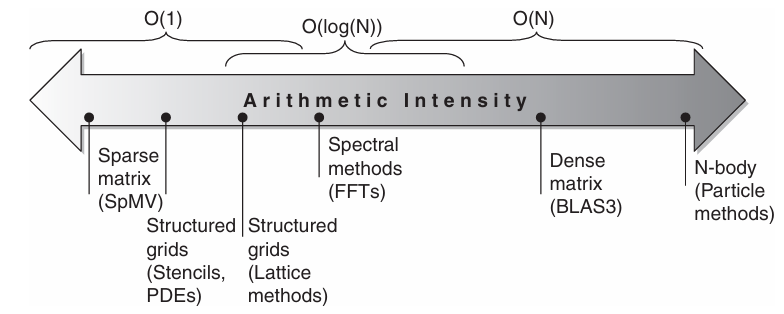

# Data-Level Parallelism in Vector, SIMD and GPU Archiectures


## Vector Architecture

Vector architectures grab sets of data elements scattered about memory, **place them into large, sequential register files**, operate on data in those register files, and then disperse the results back into memory. A single instruction operates on vectors of data, which results in dozens of register-register operations on **independent data** elements.

- These large register files act as *compiler-controlled buffers*, both to *hide memory latency* and to *leverage memory bandwidth*.

- **Vector loads and stores are deeply pipelined**, and *the program pays the long memory latency only once per vector load or store versus once per element*, thus amortizing the latency.

### VMIPS (Vectored MIPS)


The primary components of the instruction set archiecture of VMIPS are the following:

#### Vector Registers

- Each vector register is a **fixed-length bank** holding **a signle vector**. 

- VMIPS has **eight vector registers**, and **each vector register holds 64 elements**, **each 64 bits wide**

- The vector register file needs to provide enough ports to feed all the vector functional units. These ports will allow **a high degree of overlap among vector operations to different vector registers**.

- The read and write ports, which total at least 16 read ports and 8 write ports, are connected to functional unit inputs or outputs by **a pair of crossbar switches**.

#### Vector functional units

- Each unit is **fully pipelined**, and it can start a new operation on every clock cycle.

- A control unit is needed to detect hazards, both **structural hazards** for functional units and **data hazards** on register accesses.

- There are five FUs in the above figure. Mainly focus on floating-point functional units.

#### Vector load/store unit

- The vector memory unit loads or stores a vector to or from memory.

- The VMIPS vector loads and stores are **fully pipelined**, so that words can be moved between the vector registers and memory with a bandwidth of one word per clock cycle, after an initial latency.

- This unit would also normally handle **scalar loads and stores**.

#### Scalar registers

- Scalar registers can also **provide data as input to the vector functional units**, as well as **compute addresses to pass to the vector load/store unit**.

- These are the normal **32 general-purpose registers** and **32 floating-point registers of MIPS**.

- ***One input of the vector funcional units latches scalar values as they read out of the scalar register file***.

### VMIPS Vector Instructions


#### ADDVV.D and ADDVS.D

- The vector instructions **take as their input either a pair of vector registers** (`ADDVV.D`) or **a vector register and a scalar register** (designed by appending `VS` to `ADDVS.D`). 

- In the latter case, all operations use the same value in the scalar register as one input: The operation `ADDVS.D` will **add the contents of a scalar register to each element in a vector register**.

- The vector functional unit **gets a copy of the scalar value at issue time**.

- Most vector operations have a vector destination register, although a few (such as *population count*) produce a scalar value, which is stored to a scalar register.

#### LV and SV

- One operand is the **vector register** to be loaded or stored; the other operand, which is a MIPS general-purpose register, is the starting address of the vector in memory (index i).

- **vector-length Register**(`VLR`): used when the natural vector length is not 64

- **vector-mask Register**(`VM`): used when loops involve IF statements

### Advantages

**Low ennergy and design complexity**: The power wall leads architects to value architectures that can deliver high performance without the energy and design complexity costs of highly out of-order superscalar processors.

**Flexibility**: can operate on many elements simultaneously. This lets vector designs use slow but wide execution units to achieve high performance at low power.

**Scalability**: one view of a vector register size is 64 64-bit data elements, but 128 32-bit elements, 256 16-bit elements, and even 512 8-bit elements are equally valid views.

### How Vector Prcocessors Work: An Example

**SAXPY**(<u>s</u>ingle-precision <u>a</u> x <u>X</u> plus <u>Y</u>) or **DAXPY**(<u>d</u>ouble-precision <u>a</u> x <u>X</u> <u>p</u>lus <u>Y</u>) loop that forms the inner loop of the Linpack benchmark:

$$\text{Y} = \text{a} \times \text{X} + \text{Y}$$

, $\text{X}$ and $\text{Y}$ are vectors, initially resident in memory, and $\text{a}$ is a scalar.

The code for MIPS and VMIPS for the DAXPY loop. Assume the starting addresses of $\text{X}$ and $\text{Y}$ are in $\text{Rx}$ and $\text{Ry}$, respectively.

```asm
        L.D     F0, a                   ; load scalar a
        DADDIU  R4, Rx, #512            ; last address to load; a double-precision float point takes 8 bytes and there are 64 float points
Loop:   L.D     F2, 0(Rx)               ; load X[i]
        MUL.D   F2, F2, F0              ; a x X[i]
        L.D     F4, 0(Ry)               ; load Y[i]
        ADD.D   F4, F4, F2              ; a x X[i] + Y[i]
        S.D     F4, 9(Ry)               ; store into Y[i]
        DADDIU  Rx, Rx, #8              ; increment index to X
        DADDIU  Ry, Ry, #8              ; increment index to Y
        DSUBU   R20, R4, Rx             ; compute bound
        BNEZ    R20, Loop               ; check if done
```

```asm
L.D     F0, a                   ; load scalar a
LV      V1, Rx                  ; load vector X
MUL     V2, V1, F0              ; vector-scalar multiply
LV      v3, Ry                  ; load vector Y
ADDVV.D V4, V2, V3              ; add
SV      V4, Ry                  ; store the result
```

When the compiler produces vector instructions for such a sequence and the resulting code spends much of its time running in vector mode, the code is said to be **vectorized** or **vectorizable**.

Loops can be vectorized when they don't have dependences between iterations of a loop, which are called **loop-carried dependences**

In the straightforward MIPS code, every $\text{ADD.D}$ must wait for a $\text{MUL.D}$ and every $\text{S.D}$ must wait for the $\text{ADD.D}$. On the vector processor, each vector instruction will **only stall for the first element in each vector**, and then subsequent elements will flow smoothly down the pipeline. Thus, pipeline stalls are required only **once per vector instruction**, rather than ince per vector element.

Vector architects call forwarding of element-dependent operations **chaining**, in that the dependent operations are "chained" together.

### Vector Execution Time

The execution time of a sequence of vector operations primarily depends on three factors:

- the length of the operand vectors

- structural hazards among the operations

- the data dependences

#### Convoy

The set of vector instructions that could potentially execute together. You can estimate performance of a section of code by counting the number of convoys.

- The instructions in a convoy **must not contain any structural hazards**; if such hazards were present, the instructions would need to be serialized and initiated in different convoys.

- To keep the anlaysis simple, assume that a convoy of instructions must complete execution before any other instructions (scalar or vector) can begin to execute.

- Chaining allows **sequences with read-after-write dependency hazards** to be in the same convoy.

#### Early start

Chaining allows a vector operation to start as soon as the individual elements of its vector source operand become available.

- The results from the first functional unit in the chain are "forwarded" to the second functional unit.

- Recent implementations use **flexible chaining**, which allows a vector instruction to chain to essentially any other active vector instruction, assuming that we don't generate a structural hazard.

#### Chime

It is simply the unit of time taken to execute one convoy.

- A vector sequence that consists of $m$ convoys executes in $m$ chimes

- For a vector length of $n$, for VMIPS this is approximately $m \times n$ clock cycles.

- The chime approximation ignores some processor-specific overheads, many of which are dependent on vector length. Measuring time in chimes is a better approximation for long vectors than for short ones.

- We will simply assume that the convoy executes in one chime.

#### Example of laying out code sequence in convoys

Assume a single copy of each vector functional unit:

```asm
LV      V1, Rx          ; load vector X
MULVS.D V2, V1, F0      ; vector-scalar multiply
LV      R3, Ry          ; load vector Y
ADDVV.D V4, V2, V3      ; add two vectors
SV      V4, Ry          ; store the sum
```

The first convoy starts with the first $\text{LV}$ instruction. The $\text{MULVS.D}$ is dependent on the firt $\text{LV}$, but chaining allows it to be in the same convoy.

The second $\text{LV}$ instruction must be in a separate convoy since there is a structure hazard on the load/store unit for the prior $\text{LV}$ instruction (only a single copy of each vector functional unit).

- The $\text{ADDVV.D}$ is dependent on the second $\text{LV}$, but it can again be in the same convoy via chaining.

Finally, the $\text{SV}$ has a structural hazard on the $\text{LV}$ in the second convoy, so it must go in the third convoy.

```
1. LV   MULVS.D
2. LV   ADDVV.D
3. SV
```

The sequence requires three convoys. Since the sequence takes three chimes and thre are two floating-points per result, the number of cycles per FLOP is 1.5 (ignoring any vector instruction issue overhead)

$$\text{Convoys} = \text{Chimes} = 3; \text{FP}_\text{ops} = 2$$

$$\text{cycles per FLOP} = \frac{\text{chimes}}{\text{FP}_\text{ops}} = 1.5$$

- Although we allow the $\text{LV}$ and $\text{MULVS.D}$ both to execute in the first convoy, most vector machines will take two cycles to initiate the instructions.

#### Source of overhead

Another source of overhead is far more significant than the issue limitation.

The most important source of overhead ignored by the chime model is vector **start-up time**

- principally determined by the **pipelining latency of the vector functional unit**.

- The pipeline depths are 6 clock cycles for floating-point add, 7 for floating-point multiply, 20 for floating-point divide, and 12 for vector load.

### Muliple Lanes: Beyound One Element per Clock Cycle

The below figure illustrates how to improve vector performance by using parallel pipelines to execute a vector add instruction.


The vector processor (a) on the left has a single add pipeline and can complete one addition per cycle. The vector processor (b) on the right has four add pipelines and can complete four additions per cycle.

The elements within a single vector add instruction are **interleaved across the four pipelines**. The set of elements that move through the pipelines together is termed an **element group**.

The VMIPS instruction set has the property that all vector arithmetic instructions only allow element N of one vector register to take part in operations with element N from other vector registers.

- This dramatically simplifies the construction of a highly parallel vector unit, which can be structured as multiple parallel **lanes**. 


The vector register storage is divided across the lanes, with each lane **holding every fourth element of each vector register**.

The figure shows three vector functional units: an FP add, an FP multiply, and a load-store unit. 

Each of the vector arithmetic units contains four execution pipelines, one per lane, which act in concert to complete a single vector instruction.

Note how **each section of the vector register file only needs to provide enough ports for pipelines local to its lane**.

- This allocation allows the arithmetic pipeline local to the lane to complete the operation without communicating with other lanes.

- **Avoiding interlane communication** reduces the wiring cost and register file ports required to build a highly parallel exeution unit.

Note that **the scalar processor (or control processor) broadcasts a scalar value to all lanes**.

The above figure uses four lanes from one lane reduces the number of clocks for a chime from 64 to 16.

- For multiple lanes to be advantagous, both the applications and the archiecture must support long vectors.

- Otherwise, they will execute so quickly that run out of **instruction bandwidth**, requiring ILP techniques to supply enough vector instructions. 

### Vector-Length Registers: Handling Loops Not Equal to 64

**Vector-length register** (VLR): controls **the length of any vector operation**, including a vector load or store

**Maximum vector length** (MVL): determines **the number of data elements in a vector of an architecture**.

- This parameter means the length of vector registers can grow in later computer generations without changing the instruction set

#### Strip Mining

To tackle the problem where the vector is longer than the maximumn length

Generate code such that each vector operation is done for a size less then or equal to MVL.

**Create one loop that handles any number of iterations that is a multiple of the MVL and another loop that handles any remaining iterations and must be less than the MVL.**

- In practice, compilers usually create a single strip-mined loop that is parameterized to handle both portions by changing the length.

```C
// Strip-mined verison of DAXPY loop
// When j = 0, handle any remaing iterations and must be less than the MVL
// when j != 0, hanlde any number of iterations that is a multiple of the MVL
size_t low = 0;
size_t VL = (n % MVL);  /* find odd-size piece using modulo op % */
for (size_t j = 0; j <= (n / MVL); j = j + 1) { /* outer loop */
    for (size_t i = low; i < (low + VL); i = i + 1) { /* runs for length VL*/
        Y[i] = a * X[i] + Y[i]; /* main operation */
    }
    low = low + VL; /* start of next vector */
    VL = MVL; /* reset the length to maximum vector length */
}
```


All blocks but the first are of length MVL, utiling the full power of the vector processor.

Use the variable $m$ for the expression $(\text{n } \% \text{ MVL})$.

The inner loop of the preceding code is **vectorizable** with length $\text{VL}$, which is equal to either $(\text{n } \% \text{ MVL})$ or $\text{MVL}$.

The $\text{VLR}$ register **must be set twice** in the code, once at each place where the variable $\text{VL}$ in the code is assigned.

### Vector Mask Registers: Handling IF Statements in Vector Loops

From Amdahl’s law, we know that the speedup on programs with low to moderate levels of vectorization will be very limited.

The **presence of conditionals (IF statements) inside loops** and the **use of sparse matrices** are two main reasons for lower levels of vectorization.

- Programs that contain IF statements in loops cannot be run in vector mode so far because the IF statements introduce **control dependences** into a loop.

Consider the following loop

```C
for (size_t i = 0; i < 64; i = i + 1) {
    if (X[i] != 0) {
        X[i] = X[i] - Y[i];
    }
}
```

If the inner loop could be run for the iterations for which $\text{X[i] != 0}$, then the subtraction could be vectorized.

#### Vector-Mask Control

**Mask register essentially provide conditional execution of each element operation in a vector instruction.**

The vector-mask control uses a Boolean vector to control the execution of a vector instruction, just as conditionally executed instructions use a Boolean condition to determine whether to execute a scalar instruction.

**vector-mask register**

- When vector-mask register is enabled, any vector instructions executed **operate only on the vector elements whose corresponding entries in the vector-mask register are one**.

- The entries in the destination vector register that corresponding to a zero in the mask register are unaffected by the vector operation.

- Clearing the vector-mask register sets it to all ones, making subsequent vector instructions operate on all vector elements.

Assuming that the starting addresses of $\text{X}$ and $\text{Y}$ are in $\text{Rx}$ and $\text{Ry}$, respectively

```asm
LV      V1, Rx          ; load vector X into V1
LV      V2, Ry          ; load vector Y
L.D     F0, #0          ; load FP zero into F0
SNEVS.D V1, F0          ; sets VM(i) to 1 if V1(i) != F0
SUBVV.D V1, V1, V2      ; subtract under vector mask
SV      V1, Rx          ; store the result in X
```

**Compiler Explicitly Manipulate**

- Compiler writers call the transformation to change an IF statement to a straight line code sequence using conditional execution *if conversion*.

**Overhead**

- With scalar archiectures, conditionally executed instructions still require execution time when the condition is not satisifed.

- Vector instructions executed with a vector mask still take the same execution time, even for the elements where the mask is zero

- Even with a significant number of zeros in the mask, using vector-mask control may still be significantly faster than using scalar mode.

### Memory Banks: Supplying Bandwidth for Vector Load/Store Units

The start-up time for a load is the time to get the first word from memory into a register.

If the rest of the vector can be supplied without stalling, then the vector initiation rate is equal to the rate at which new words are fetched or stored.

Unlike simpler functional units, the initation rate may not necessarily be one clock cycle because memory bank stalls can reduce effective throughput.

#### Memory Banks

Allow multiple independent accesses rather than simple memory interleaving for three reasons:

1. Many vector computers support multiple loads or stores per clock, and the memory banck cycle time is usually serveral times larger than the processor cycle time. Use multiple banks and to be able to control the addresses to the banks independently.

2. Most vecor processors support the ability to load or store data words that are not sequential. In such cases, independent bank addressing, rather than interleaving, is required.

3. Most vector computers support multiple processors sharing the same memory system, so each processor will be generating its own independent stream of addresses.

#### Example

The largest configuration of a Cray T90 (Cray T932) has 32 processors, each capable of generating 4 loads and 2 stores per clock cycle. The processor clock cycle is 2.167 ns, while the cycle time of the SRAMs used in the memory system is 15 ns. Calculate the minimum number of memory banks required to allow all processors to run at full memory bandwidth.

$$32 \times (4 + 2) \times \frac{15}{2.167} \approx 192 \times 7 = 1344 \text{ Memory Banks}$$

The Cray T932 actually has only 1024 memory banks, so the early models could not sustain full bandwidth to all processors simultaneously.

A subsequent memory upgrade replaced the 15 ns asynchronous SRAMs with **pipelined synchronous SRAMs** that more than halved the memory cycle time.

Taking a higher level perspective, **vector load/store units play a similar role to prefetch units** in scalar processors in that both try to deliver data bandwidth by supplying processors with streams of data.

### Stride: Handling Multidimensional Arrays in Vector Architectures

The position in memory of adjacent elements in a vector may not be sequential.

```C
for (size_t i = 0; i < 100; i = i + 1) {
    for (size_t j = 0; j < 100; j = j + 1) {
        A[i][j] = 0.0;
        for (size_t k = 0; k < 100; k = k + 1) {
            A[i][j] = A[i][j] + B[i][k] * D[k][j];
        }
    }
}
```

We could vectorize the multiplication of each row of B with each column of D and **Strip-mine** the inner loop with $\text{k}$ as the index variable.

For vector processors without caches (we know that blocking(tilling) could improve locality in cache-based systems), we need another technique to fetch elements of a vector that are not adjacent in memory. 

#### Stride

The **distance separating elements** to be **gathered into a single register**.

In this example, matrix $\text{D}$ has a stride of 100 double words (800 bytes), and matrix $\text{B}$ would have a stride of 1 double word (8 bytes).

Thus, without reordering the loops, the compiler can't hide the long distances between successive elements for both $\text{B}$ and $\text{D}$

Once a vector is loaded into a vector register, it acts as if it had logically adjacent elements.

**Non-unit strides**: A vector processor can handle strides greater than one, using only vector load and vector store operations with stride capability.

- This ability to access nonsequential memory locations and to *reshape them into a dense structure* is one of the major advantages of a vector processor.

**LVWS and SVWS**: The vector stride, like the vector starting address, can be put in a general-purpose register.

- VVWS (load vector with stride): fetches the vector into a vector register.

- SVWS (store vector with stride): when storing a non-unit stride vector, use the instruction SVWS

#### Bank Access conflicts

**Supporting stirdes greater than one complicates the memory system**

Once we introduce non-unit strides, it becomes possible to request accesses from the same bank frequently.

When multiple accesses contend for a bank, a memory bank conflict occurs, thereby stalling one access. A bank conflict and, hence, a stall will occur if

$$\frac{\text{Number of branks}}{\text{Great common divisor(Stride, Number of banks)}} < \text{Bank busy time}$$

or

$$\frac{B}{GCD(s, B)} < T_{busy}$$

#### Example

Suppose we have 8 memory banks with a bank busy time of 6 clocks and a totall memory latency of 12 cycles. How long will it take to complete a 64-element vector load with a stride of 1? With a stride of 32?

**When stride is 1**:

$$\frac{B}{GCD(s, B)} = \frac{8}{GCD(1, 8)} = 8 > 6$$

So no bank access conflicts happem.

The total time is the *time of accessing first element from bank* plus *time of accessing flowing elements from bank* plus *memory accessing time*

$$1 + 63 \times 1 + 12 = 76 \text{ clock cycles}$$

**When stride is 32**:

$$\frac{B}{GCD(s, B)} = \frac{8}{GCD(32, 8)} = 1 < 6$$

Bank Access conflicts happen.

The total time becomes:

$$1 + 63 \times 6 + 12 = 391 \text{ clock cycles}$$

What's the **maximum stride** that avoids the bank access conflicts?

$$GCD(s, B) \leq \frac{B}{T_{busy}}$$

$$GCD(s, B) = \frac{8}{6} \approx 1$$

That means that, **stride and number of banks should be relatively prime**, and $1 \leq s < 8$

$$s_{\max} = 7$$

### Gather-Scatter: Handling Sparse Matrices in Vector Archiectures

Assuming a simplified sparse strcuture

```C
for (size_t i = 0; i < n; i++) {
    A[K[i]] = A[K[i]] + C[M[i]];
}
```

A sparse vector sum on the arrays $\text{A}$ and $\text{C}$, using index vectors $\text{K}$ and $\text{M}$ to designate the nonzero elements of $\text{A}$ and $\text{C}$. ($\text{A}$ and $\text{C}$ must have the same number of nonzero elements, $\text{n}$ of them, so $\text{K}$ and $\text{M}$ are the same size.)

#### Gather-scatter operations using index vector

The goal of such operations is to support moving between a compressed representation (i.e., zeros are not included) and normal representation (i.e, the zeros are included) of a sparse matrix.

A **gather** operation takes an **index vector** and fetches the vector whose elements are at the addresses given by **adding a base address to the offsets given in the index vector**.

After these elements are operated on in dense form, the sparse vector can be stored in expanded form by a **scatter** store, using the same index vector.

- **LVI**: load vector indexed or gather
- **SVI**: store vector indexed or scatter

#### Example VMIPS gather-scatter

$\text{Ra}, \text{Rc}, \text{Rk}, \text{Rm}$ contain the starting addresses of the vectors in the previous sequence.

```asm
LV          Vk, Rk          ; load K
LVI         Va, (Ra + Vk)   ; load A[K[]]
LV          Vm, Rm          ; load M
LVI         Vc, (Rc + Vm)   ; load C[M[]]
ADDVV.D     Va, Va, Vc      ; add them
SVI         (Ra + Vk), Va   ; store A[K[]]
```

Although indexed loads and stores (gather and scatter) can be pipelined, they typically run much more slowly than non-indexed loads or stores, since the memory banks are not known at the start of the instruction.

- Each element has an individual address, so they can't be handled in groups, and there can be conflicts at many places throughout the memory system.

**laissez faire**: a memory system can deliver better performance by desigining for this case and by using more hardware resources versus when architects have a laissez fair attitude toward such acccesses.

### Programming Vector Archiecture

An advantage of vector archiectures is that compilers can tell programmers at compile time whether a section of code will vcetorize or not, often giving hints as to why it did not vectorize the code.

Today, the main factor that affects the success with which a program runs in vector mode is the structure of the program itself: **Do the loops have true data dependences** or **can they be restructured so as not to have such dependences**

## SIMD Instruction Set Extenions for Multimedia


Typical SIMD Multimedia support for 256-bit-wide operations.

SIMD extensions have three major omissions:

- Multimedia SIMD extensions **fix the number of data operands** in the opcode, which has led to the addition of hundreds of instructions in the MMX, SSE, and AVX extensions of the x86 architecture.

- Multimedia SIMD **does not offer** the more sophistaicated addressing modes of vector archiectures, namely **strided access** and **gather-scatter accesses**.

- Multimedia SIMD usually **does not offer the mask registers** to support conditional execution of elements as in vector architectures.

These omissions make it harder for the compiler to generate SIMD code and increase the difficulty of programming in SIMD assembly language.

### MMX, SSE and AVX

#### MMX

The MMX instructions added in 1996 repurposed the 64-bit floating-point registers, so the basic instructions could perform eight 8-bit operations or four 16-bit operations simultaneously.

These were joined by parallel **MAX** and **MIN** operations, **a wide variety of masking and conditional instructions**, operations typically found in digital signal processors, and ad hoc instructions that were believed to be useful in important media libraries.

MMX reused the floating-point data transfer instructions to access memory, thus it may pollutes the FPU stack.

#### SSE (Streaming SIMD Extensions)

It successor in 1999 added separate registers that were 128 bits wide.

It also performed **parallel single-preceision floating-point arithmetic**.

SSE had **separate registers**, it needed **separate data transfer instructions**.

Intel soon added double-precision SIMD floating-point data types via SSE2 in 2001, SSE3 in 2004, and SSE4 in 2007.

Instructions with four single-precision floating-point operations or two parallel double-precision operations increased the peak floating-point performance of the x86 computers.

#### AVX (advanced vector extensions)

AVX added in 2010, doubles the width of the registers again to 256 bits and thereby offers instructions that **double the number of operations on all narrower data types**.


Packed-double for 256-bit AVX means four 64-bit operands executed in SIMD mode. As the width increases with AVX, it is increasingly important to add data permutation instructions that allow combinations of narrow operands from different parts of the wide registers. AVX includes instructions that shuffle 32-bit, 64-bit, or 128-bit operands within a 256-bit register.

The goal of these extensions has been to accelerate carefully written libraries rather than for the compiler to generate them.

### Advantages

First, they cost little to add to the standard arithmetic unit and they were easy to implement.

Second, they require little extra state compared to vector architectures, which is always a concern for context switch times.

Third, you need a lot of memory bandwidth to support a vector archiecture, which many computers don't have.

Fourth, SIMD does not have to deal with problems in virtual memory when a single instruction that can generate 64 memory accesses can get a page fault in the middle of the vector.

- SIMD extensions use separate data transfers per SIMD group of operands that are aligned in memory and so they cannot cross page boundaries.

Fifth, fixed-length "vectors" of SIMD is that it is easy to introduce instructions that can help with new media standards, such as instructions that perform permutations or instructions that consume either fewer or more operands than vectors can produce.

Finally, there was concern about how well vector architectures can work with caches.

Although most recent vector architectures have addressed all of these problems, but the legacy of past flaws shaped the skeptical attitude toward vector among architects.

### Example

Assume we added 256-bit SIMD multimedia instructions to MIPS. We add the suffix "4D" on instructions that operate on four double-precision operands at once. The starting addresses of $\text{X}$ and $\text{Y}$ are in $\text{Rx}$ and $\text{Ry}$, respectively.

```asm
        L.D         F0, a           ; load scalar a
        MOV         F1, F0          ; copy a into F1 for SIMD MUL
        MOV         F2, F0          ; copy a into F2 for SIMD MUL
        MOV         F3, F0          ; copy a into F3 for SIMD MUL
        DADDIU      R4, Rx, #512    ; last address to load
Loop:   L.4D        F4, 0 (Rx)      ; load X[i], X[i+1], X[i+2], X[i+3]
        MUL.4D      F4, F4, F0      ; aX[i], aX[i+1], aX[i+2], aX[i+3]
        L.4D        F8, 0 (Ry)      ; load Y[i], Y[i+1], Y[i+2], Y[i+3]
        ADD.4D      F8, F8, F4      ; aX[i]+Y[i], aX[i+1]+Y[i+1], aX[i+2]+Y[i+2], aX[i+3]+Y[i+3]
        S.4D        F8, 0 (Rx)      ; store into Y[i], Y[i+1], Y[i+2], Y[i+3]
        DADDIU      Rx, Rx, #32     ; increment index to X
        DADDIU      Ry, Ry, #32     ; increment index to Y
        DSUBU       R20, R4, Rx     ; compute bound
        BNEZ        R20, Loop       ; check if done
```

The changes were replacing every MIPS double-precision instruction with its 4D equivalent, increasing the **increment from 8 to 32**, and changing the registers from **F2 and F4 to F4 and F8** to get enough space in the register file for four sequential double-precision operands.

Each SIMD lane would have its own copy of the scalar a, we **copied the value of Fo into registers F1, F2, and F3** (Real SIMD instruction extensions have an instruction (*VBROADCASTSD*) to broadcast a value to all other registers in a group). Thus, the multiply does $\text{F4*F0}, \text{F5*F1}, \text{F6*F2}, \text{F7*F3}$.

While not as dramatic as the 100x reduction of dynamic instruction bandwidth of VMIPS, SIMD MIPS does get a 4x reduction: 149 versus 578 instructions executed for MIPS.

### Programming Multimedia SIMD Architectures

The easist way to use these instructions has been **through libraries** or **writing in assembly langugage**

Advanced compilers today can generate SIMD floating-point instructions to deliver much higher performance for scientific codes.

However, programmers must be sure to **align all the data in memory to the width of the SIMD unit** on which the code is run to prevent the compiler from generating scalar instructions for otherwise vectorizable code.

### The Roofline Visual Performance Model

one visual, intuitive way to compare potential floating-point performance of variations of SIMD architectures is the **Roofline Model**

#### Arithmetic Intensity (X-axis)

$$\text{Arithmetic Intenisty} = \frac{\text{\# of floating-point operations(FLOPs)}}{\text{\# of bytes accessed in main memory(Bytes)}}$$



Some kernels have an arithmetic intensity that scales with problem size, such as dense matrix, but there are many kernels with arithmetic intensities independent of problem size.

#### Peak floating-point performance (Y-axis)

Peak floating-point performance can be found using the hardware specifications. 

The general formula for peak floating-point performance is:

$$\text{FLOPS} = \text{cores} \times \text{clock frequency} \times \frac{\text{FLOPs}}{\text{cycle}}$$

**However, many of the kernels in this case study do not fit in on-chip caches**, so peak memory performance is defined by the memory system behind the caches

We need the peak memory bandwidth that is available to the processors, not just at the DRAM pins. One way to find the (delivered) peak memory perforamces is to **run the Stream benchmark**.

#### Peak memory Bandwidth (slope): 

Since the X-axis is FLOP/byte and the Y-axis is FLOP/sec, the **peak memory Bandwidth** (bytes/sec) ($\frac{\Delta Y}{\Delta X}$) is just a diagonal line at a 45-degree angle.

The lines in the graph now can be deseribed using the flowing formula：

$$\text{Attainable GFLOPs/sec} = \text{Min} (\text{Peak Memory BW} \times \text{Arithmetic Intensity}, \text{Peak Floating-Point Perf.})$$

The "Roofline" sets an upper bound on performance of a kernel depending on its arithmetic intensity.

#### Example


This roofline is for unit-stride memory accesses and double-precision floating-point performance. 

NEC SX-9 is a vector supercomputer announced in 2008 that costs million of dollars. It has a peak DP FP performance of 102.4 GFLOPS/sec and a peak memory bandwidth of 162 GBytes/sec from the Stream beachmarks. The Core i7 920 has a peak DP FP performance of 42.66 GFLOP/sec and a peak memory bandwith of 16.4 GBytes/sec. 

The dashed vertical lines at an arithmetic intensity of 4 FLOP/byte show that both processors operte at peak performance. In this case, the SX-9 at 102.4 FLOP/sec is 2.4x faster than the Core i7 at 43.66 GFLOP/sec. At an arithmetic intensity of 0.25 FLOP/byte, the SX-9 is 10x faster at 40.5 GFLOP/sec versus 4.1 GFLOP/sec for the Core i7.


#### Computationally and Memory bandwidth limitation

**Computationally limitation**: hits the flat part of the roof

**Memory bandwidth limitation**: hits the slanted part of the roof

The vertical dashed line on the right (arithmetic intensity of 4) is an example of the Computationally limitation and the vertical dashed line on the left (arithmetic intensity of 1/4) is an example of the Memory bandwidth limitation.

## Garphics Processing Units (GPU)

### Programming the GPU

#### CUDA

NVIDIA decided to develop a C-like language and programming environment that would improve the productivity of GPU programmers by attacking both the challenges of heterogenous computing and of multifaceted parallelism.

The name of their system is *CUDA*, for Compute Unified Device Architecture.

CUDA produces C/C++ for the system processor (*host*) and a C and C++ dialect for the GPU (*device*, hence the D in CUDA).

A similar programming language is OpenCL, which several companies are developing to offer a vendor-independent language for multiple platforms.

#### SIMT

NVIDIA decided that the unifying theme of all these forms of parallelism is the **CUDA Thread**.

- Using this lowest level of parallelism as the progamming primitive, the compiler and the hardware can gang thousands of CUDA Threads together to utilize the various styles of parallelism within a GPU.

- includes: *multithreading*, *MIMD*, *SIMD*, and *instruction-level parallelism*.

Hence, NVIDIA classifies the CUDA programmning model as **Single Instruction, Multiple Thread** (*SIMT*)

- these threads are blocked together and executed in groups of **32 threads**, called a **Thread Block**

- the hardware executes a whole block of threads a **multithreaded SIMD processor**

#### Syntax

- To distinguish between functions for the GPU (device) and functions for the system processor (host), CUDA uses `__device__` or `__global__` for the former and `__host__` for the latter.

- CUDA variables declared as in the `__device__` or `__global__` functions are **allocated to the GPU Memory**, which is *accessible by all multithreaded SIMD processors*.

- The extended function call syntax for the function **name** that runs on the GPU is `name<<<dimGrid, dimBlock>>>(... parameter list ...)`

    - where `dimGrid` and `dimBlock` specify the **dimensions of the code (in blocks)** and the **dimensions of a block (in threads)**

- In addition to the identifier for blocks (`blockIdx`) and the identifier for threads per block (`threadIdx`), CUDA provides a keyword for **the number of threads per block** (`blockDim`), which comes from the `dimBlock`.  

#### Example

A conventional C code for the DAXPY loop

```C
// Invoke DAXPY
daxpy(n, 2.0, x, y);

// DAXPY in C
void daxpy(int n, double a, double *x, double *y) {
    for (int i = 0; i < n; ++i) {
        y[i] = a*x[i] + y[i];
    }
}
```

Below is the CUDA version. We launch $\text{n}$ threads, one per vector element, with 256 CUDA Threads per thead block in a multithreaded SIMD Processor.

The GPU function starts by calculating the corresponding element index $\text{i}$ based on the `block ID`, the `number of threads per block`, and the `thread ID`.

As long as this index is within the array ($\text{i < n}$), it performs the multiply and add.

```cu
// Invoke DAXPY with 256 threads per Thread Block
__host__
int nblocks = (n + 256) / 256;
daxpy<<<nblocks, 256>>>(n, 2.0, x, y);

// DAXPY in CUDA
__device__
void daxpy(int n, double a, double *x, double *y) {
    int i = blockIdx.x * blockDim.x + threadIdx.x;
    if (i < n) {                                    // ensure the data is valid, then operate it
        y[i] = a*x[i] + y[i];
    }
}
```

The programmer determines the parallelism in CUDA explicity by **specifying the grid dimensions** and **the number of threads per SIMD Processor**.

By assigning a single thread to each element, there is **no need to synchronize** among threads when writing results to memory.

To simplift scheduling by the hardware, CUDA requires that **thread blocks be able to execute independently and in any order**. Different thread blocks cannot communicate directly, **although they can coordinate using atomic memory operations in Global Memory**.

### NVIDIA GPU Computational Structures


Like vector architectures, GPUs work well only with data-level parallel problems.

Both styles have gather-scatter data transfers and mask registers, and GPU processors have even more registers than do vector processors.

Since they don't have a close-by scalar processor, GPUs sometimes **implement a feature at runtime in hardware** that vector computes implement at compiler time in software.

Unlike most vector archiectures, GPUs also **rely on multithreading within a single multi-threaded SIMD processor to hide memory latency**.

#### Grid

A Grid is the code that runs on a GPU that consists of a set of *Thread Blocks*.

A concrete example:

let's suppose we want to multiply two vectors together, each 8192 elements long. 

The GPU code that works on the whole 8192 element multiply is called a **Grid** (or vectorized loop). 

To break it down ito more manageable sizes, a Grid is composed of **Thread Blocks** (or body of a vectorized loop), each with up to 512 elements.

- A SIMD instruction executes 32 elements at a time.

- With 8192 elements in the vectors, this example thus has 16 Thread Blocks (8192 / 512 = 16)

- The thread block is analogous to a strip-mined vector loop with a vector length of 32.


The hardware Thread Block Scheduler assigns Thread Blocks to multithreaded SIMD Processors and the hardware Thread Scheduler picks which thread of SIMD instructions to run each clock cycle within a SIMD processor.

**Only SIMD threads in the same Thread Block** can **communicate via Local Memory**.

- The maximum number of SIMD Threads that can execute simultaneously per Thread Block is 16 for Tesla-generation GPUs and 32 for the later Fermi-generation GPUs

#### Multithreaded SIMD Processor and Thread Block Scheduler

A **Thread Block is assigned to a processor that executes that code** is called Multithread SIMD processor, by the **Thread Block Scheduler**.

The Thread Block Scheduler has some similarities to a control processor in a vector archiecture.

- It **determines the number of thread blocks** needed for the loop and keeps allocating them to different multithreaded SIMD Processors until the loop is completed.

- In this example, it would send 16 Thread Blocks to multithreaded SIMD processors to compute all 8192 of this loop.

SIMD Prcocessors are **full processors with separate PCs** and are programmed using threads.

**A GPU is a multiprocessor composed of multithread SIMD Processors**.


This diagram shows 16 multi-threaded SIMD Processors.

- The thread block scheduler is highlighted on the left.

- The GTX 480 has a 6 GDDR5 ports, each 64 bits wide, supporting up to 6 GB of capacity

- The host interfaces is PCI Express 2.0 x 16. 

- **Giga Thread** is the name of **the scheduler that distributes thread blocks to multiprocessors**

- Each multiprocessors has **its own SIMD Thread Scheduler**.

#### Thread of SIMD instructions and SIMD Thread Scheduler

The machine object that the hardware creates, manages, schedules, and executes is a **thread of SIMD instructions**.

It is a traditional thread that **exclusively conatins SIMD instructions**.

These threads of SIMD instructions **have their own PCs** and they run on a multithreaded SIMD Processor.

The **SIMD Thread Scheduler** includes a **scoreboard** that lets it know which threads of SIMD instructions are ready to run, and then it sends them off to a dispatch unit to be run on the multithreaded SIMD Processor.


This a simplified block diagram of a multithreaded SIMD Processor.

- It is similar to a Vector Processor, but it has many parallel functional units instead of a few that are deeply pipelinedm, as does a Vector Processor.

- It has 16 SIMD lanes. The SIMD Thread Scheduler has, say 48 independent threads of SIMD instructions that it schedules with a table of 48 PCs.

GPU hardware has two levels of hardware schedulers

- the **Thread Block Scheduler** (*Giga Thread*) that assigns Thread Blocks (bodies of vectorized loops) to multi-threaded SIMD Processors

    - ensures that thread blocks are assigned to the processors whose **local memories have the corresponding data**

- the **SIMD Thread Scheduler** (*Warp Scheduler*) within a SIMD Processor, which schedules when threads of SIMD instructions should run.

#### SIMD Lanes

Since the thread consists of SIMD instructions, the SIMD Processor must have parallel functional units to perform the operation.

They are called as SIMD Lanes, and they are quite similar to the Vector Lanes.

The number of lanes per SIMD processor varies across GPU generations.

**With Fermi, each 32-wide thread of SIMD instructions is mapped to 16 physical SIMD Lanes**

- each SIMD instruction in a thread of SIMD instructions **takes two clock cycles** to complete.

- each thread of SIMD instructions is **executed in lock step** and **only scheduled at the beginning**.

- Staying with the analogy of a SIMD Processor as a vector processor, you could say it has 16 lanes (i.e, wide), the vector length would be 32, and the **chime** is 2 clock cycles (i.e, shallow).

- This **wide** but **shallow** nature is why we use the term SIMD Processor instead of vector processor


This shows the SIMD Thread Scheduler (**Warp Scheduler**) picking threads of SIMD instrcutions in a different order over time.

- The scheduler **selects a ready thread of SIMD instructions** and **issues an instruction synchronously** to all the SIMD Lanes executing the SIMD thread

- that's why each thread of SIMD instructions is executed in lock step but only scheduled at the beginning.

- Because threads of SIMD instructions are independent, the scheduler may select a different SIMD thread each time.

The assumption of GPU architects is that GPU applications have **so many threads of SIMD instructions** that multithreading can **both hide the latency to DRAM** and **increase utilization of multithreaded SIMD Processors**.

#### Registers

To hold memory elements, a SIMD Processor has an impressive 32,768 32-bit registers.

- These registers are divided logically across the SIMD lanes.

- Each SIMD Thread is limited to no more than 64 registers

Since **Fermi has 16 physical SIMD Lanes**, **each contains 2048 registers** (32 x 64).

- GPUs will use simpler memory structures but **divide them into banks to get sufficient bandwith** instead of designing registers with many read and write ports.

To handle the 32 elements of each thread of SIMD instructions with 16 SIMD Lanes, the CUDA Threads of a Thread block collectiverly can **use up to half of the 2048 registers**

To be able to execute many threads of SIMD instructions, each is **dynamically allocated** a set of of the physical registers on each SIMD Processor when threads of SIMD instructions are created and freed when the SIMD Thread exits.

### NVIDIA GPU Instructon Set Architecture

#### PTX (Parallel Thread Execution)

PTX provides a stable instruction set for compilers as well as compatibility across generations of GPUs.

PTX instructions describe the operations on a single CUDA thread, and usually map one-to-one with hardware instructions, but one PTX can expand to many machine instructions, and vice versa.

PTX uses **virtual registers**, so the compiler figures out how many physical vectors a SIMD thread needs, and then an optimizer divides the available register storage between the SIMD threads.

- The optimizer also *eliminates dead code*, *folds instructions together*, and *calculates places* where branches might diverge and places where diverged paths could converge.

#### ISA 

While there is some similarity between the x86 microarchitectures and PTX, in that both translate to an internal form (microinstructions for x86), the difference is that this translation happens **in hardware at running during execution on x86** versus **in software and load time on a GPU**.

The format of a PTX instruction is

```asm
opcode.type d, a, b, c;
```

where `d` is the **destination operand**; `a`, `b` and `c` are **source operands**; and the operation type is one of the following:


Source operands are *32-bit* or *64-bit* registers or a *constant value*. *Destinations are registers*, *except for store instructions*.


**Set predicate instructions**

- All instructions can be predicated by 1-bit predicate registers, which can be set by a set predicate instruction ($\text{setp}$). 

**Control flow instructions**

- The control flow instructions are functions $\text{call}$ and instruction $\text{return}$, thread $\text{exit}$, $\text{branch}$, and **barrier synchronization** for threads within a thread block ($\text{bar.sync}$)

- Placing a predicate in front of a branch instruction gives the conditional branches.

**Type Assignment**

- The compiler or PTX programmer declares virtual registers as 32-bit or 64-bit typed or untyped values.

- e.g., $\text{R0, R1, ...}$ are for 32-bit values and $\text{RD0, RD1, ...}$ are for 64-bit registers.

- Recall that the **assignment of virtual registers to physical registers** occurs at **load time with PTX**

#### Example

```asm
shl.u32         R8, blockIdx, 9     ; Thread Block ID * Block size (512 or 2^9)
add.u32         R8, R8, threadIdx   ; R8 = i = my CUDA Thread ID
sh1.u32         R8, R8, 3           ; byte offset
ld.global.f64   RD0, [X+R8]         ; RD0 = X[i]
ld.global.f64   RD2, [Y+R8]         ; RD2 = Y[i]
mul.f64         RD0, RD0, RD4       ; Product in RD0 = RD0 * RD4 (scalar a)
add.f64         RD0, RD0, RD2       ; Sum in RD0 = RD0 + RD2 (Y[i])
st.global.f64   [Y+R8], RD0         ; Y[i] = sum(X[i] * a + Y[i])
```

the CUDA programming model **assigns one CUDA Thread to each loop iteration** and offers **a unique identifier number** to each *thread block* ($\text{blockIdx}$) and one to each CUDA *Thread* within a block ($\text{threadIdx}$)

It creates 8192 CUDA Threads and uses the unique number to address each element in the array, so there is **no incrementing or branch code**.

Unlike vector archiectures, GPUs *don't have separate instructions* for *sequential data transfers*, *strided data transfers*, and *gather-scatter data transfers*. **All data transfers are gather-scatter**

- To regain the efficiency of sequential (uni-stride) data transfers, GPUs include **special Address Coalescing hardware** to recognize when SIMD Lanes with a thread of SIMD instructions are collectively issuing sequential addresses.

- That runtime hardware then notifies the Memory Interface Unit to request a block transfer of 32 sequntial words.

- To get this important performance improvement, the GPU programmer must ensure that **adjacent CUDA Threads access nearby addresses at the same time that can be coalesced into one or a few memory or cache blocks**

### Conditional Branching in GPUs

In addition to explicit predicate registers, GPU branch hardware uses **internal masks**, **a branch synchronization stack**, and **instruction markers** to manage when a branch diverges into multiple execution paths and when the paths converge.

#### PTX assembler level

Control flow of one CUDA thread is described by the PTX instructions branch, call, return, and exit, plus individual per-thread-lane predication of each instruction, specified by the programmer with per-thread-lane 1-bit predicate registers.

- The PTX assembler analyzes the PTX branch graph and optimizes it to the fastest GPU hardware instruction sequence.

#### GPU hardware instruction level

Control flow includes branch, jump, jump indexed, call, call indexed, return, exit, and **special instructions that manage the branch synchronization stack**.

GPU hardware provides each SIMD thread with its own stack

- a stack entry contains **an identifier token**, **a target instruction address**, and **a target thread-active mask**

- GPU special instructions that push stack entries for a SIMD thread

- GPU special instructions and instruction markers that pop a stack entry or unwind the stack to a specified entry and branch to the target instruction address with the target thread-active mask.

- GPU hardware instructions also have individual per-lane prediction (enable/disable), specified with a 1-bit predicate register for each lane.

The PTX assembler typically optimizes a simple outer-level IF/THEN/ELSE statement coded with PTX branch instructions to just predicated GPU instructions, without any GPU branch instructions.

#### Branch Synchronziation Stack

A more complex control flow typically results in a **mixture of predication and GPU branch instructions** with special instructions and markers that **use the branch synchronization stack to push a stack entry** when some lanes branch to the target address, while others fall through.

- NVIDIA says a **branch diverges** when this happens (**some lanes branch to the target address, while others fall through**).

- This mixture is also used when a SIMD Lane executes a synchronization marker or **converges**, which **pops a stack entry and branches to the stack-entry address with the stack-entry thread active mask**.

The PTX assembler **identifies loop branches** and **generates GPU branch instructions** that **branch to the top of the loop**, along with special stack instructions to **handle individual lanes breaking out of the loop** and converging the SIMD Lanes when all lanes have completed the loop.

- GPU indexed jump and indexed call instructions push entries on the stack so that when all lanes complete the switch statement or function call the SIMD thread converges.

#### Branch Predicate

The PTX branch instruction depends on the **predicate** ($\text{setp}$)

If the PTX assembler generates predicated instructions with no GPU branch instructions, it uses **a per-lane predicate register** to enable or disable each SIMD Lane **for each instruction**.

The SIMD instructions in the threads inside the THEN part of the IF statement broadcast operations to all the SIMD Lanes.

- Those lanes with the predicate set to one perform the operation and store the result

- The other SIMD Lanes don't perform an operation or store a result.

For the ElSE statement, the instructions use the complement of the predicate (relative to the THEN statement)

- so the SIMD Lanes that were idle now perform the operation and store the result

- while their formerly active sibling don't.

At the end of ELSE statement, **the instructions are unpredicated so *the original computation* can proceed**. Thus, for equal length paths, an IF-THEN-ELSE operates at 50% efficiency.

If statements can be nested, hence the use of a stack, and the PTX assembler typically generates a mix of predicated instructions and GPU branch and special synchronization instructions for complex control flow.

- deep nesting can mean that most SIMD Lanes are idle during execution of nested conditional statements.

- doubly nested IF statements with equal-lenth paths run at 25% efficiency, triply nested at 12.5% efficiency.

- The analogous case would be a vector processor operating where only a few of the mask bits are ones.

#### Branch synchronization

The PTX assembler sets a "branch synchronization" marker on appropriate conditional branch instructions that **pushes the current active mask on a stack inside each SIMD thread**.

If the conditional branch diverges (some lanes take the branch, some fall through), it **pushes a stack entry** and **sets the current internal active mask** based on the condition.

A branch synchronization marker **pops the diverged branch entry** and **flips the mask bits** before the ELSE portion.

At the end of IF statement, the PTX assembler **adds another branch synchronization marker** that **pops the prior active mask off the satck into the current active mask**.

- If all the mask bits are set to one, then the branch instruction at the end of the THEN skips over the instructions in the ELSE part.

#### Example of Branch Synchronization

```C
if (X[i] != 0) {
    X[i] = X[i] - Y[i];
} else {
    X[i] = Z[i];
}
```

Assuming that R8 already has the scaled thread ID, with $\text{*Push, *Comp, *Pop}$ indicating the branch synchronization markers inserted by the PTX assembler that **push the old mask**, **complement the current mask**, and **pop to restore the old mask**

```asm
        ld.global.f64       RD0, [X+R8]         ; RD0 = X[i]
        setp.neq.s32        P1, RD0, #0         ; P1 is predicate register 1
        @!P1,               bra ELSE1, *Push    ; Push old mask, set new mask bits
                                                ; if P1 false, go to ELSE1
        ld.global.f64       RD2, [Y+R8]         ; RD2 = Y[i]
        sub.f64             RD0, RD0, RD2       ; Difference in RD0
        st.global.f64       [X+R8], RD0         ; X[i] = RD0
        @P1                 bra ENDIF1, *Comp   ; complement mask bits
                                                ; if P1 true, go to ENDIF1
ELSE1:  ld.global.f64       RD0, [Z+R8]         ; RDO = Z[i]
        st.global.f64       [X+R8], RD0         ; X[i] = RD0
ENDIF1: <NEXT INSTRUCTION>, *Pop                ; pop to restore old mask
```

### NVIDIA GPU Memory Structures


#### Private Memory(Local Memory)

It is private to a **single CUDA Thread**.

Each SIMD Lane in a multithread SIMD Processor is given a **private section of off-chip DRAM**.

It is used for the **stack frame**, **spiling registers**, and for **private variables** that don't fit in the registers.

SIMD Lanes **do not** share Private Memories.

Recent GPUs cache this Private Memory in the L1 and L2 caches to aid register spilling and to speed up function calls.

#### Local Memory(Shared Memory)

It is shared by all threads of SIMD instructions within **a thread block** (body of a vectorized loop) (a SIMD processor)

- It is the **on-chip memory** that is local to each multithread SIMD Processors.

The multithreaded SIMD Processor **dynamically allocates** portions of the Local Memory to a thread block when it creates the thread block, and frees the memory when all the threads of the thread block exit.

The portion of Local Memory is private to that thread block.

#### GPU Memory(Global Memory)

It is shared by **all Grids** (vectorzied loops) (all SIMD processors)

- It is the **off-chip DRAM** shared by the whole GPU. 

The system processor, called the **host**, **can read or write GPU Memory**. **Local Memory is unavilable to the host, as it is privated to each multithreaded SIMD processor**. Private Memories are unavailable to the host as well.

#### GPU Caches

GPUs traditionally use **smaller streaming caches** and **rely on extensive multithreading of threads of SIMD instructions** to hide the long latency to DRAM, since their working sets can be hundreds of megabytes.

- Given the use of multithreading to hide DRAM latency, the chip area used for caches in system processors is spent instead **on computing resources** and on **the large number of registers** to **hold the state of many threads of SIMD instructions**.

The latest GPUs and vector processors have added caches.

- The recent Fermi architecture has added caches

- But they are thought of as either bandwidth filters to reduce demands on GPU memory 

- Or as accelerators for the few variables whose latency cannot be hidden by multithreading.

Thus, local memory for stack frames, function calls, and register spilling is a good match to caches, since latency matters when calling a function.

Caches also save energy, since on-chip cache access take much less energy than accesses to multiple, external DRAM chips.

**Data transfer instructions coalesce**

PTX data transfer instructions coalesce individual parallel thread requests from the same SIMD thread together into a single memory block request when the addresses fall in the same block.

### Innovations in the Fermi GPU Archiecture

To increase hardware utilization, each SIMD Processor has **two SIMD Thread Schedulers and two instruction dispatch units**.

The dual SIMD Thread Scheduler **selects two threads of SIMD instructions** and issues one instruction from each to **two sets of 16 SIMD Lanes**, **16 load/store units**, or **4 special function units.**

Thus, **two threads of SIMD instructions are scheduled every two clock cycles to any of these collections.**


- Each SIMD Lane has **a pipelined floating-point** unit, **a pieplined inetger unit**, some **logic for dispatching instructions** and **operands to these units**, and **a queue for holding results**.

- The four Special Function units (SFUs) calculate functions such as squar roots, reciprocals, sines and cosines.

#### Features that make GPUS much closer to mainstream system processors

**Fast Double-Precision Floating-Point Arithmetic**

Fermi matches the relative double-precision speed of conventional processors of roughly half the speed of single precision versus a tenth the speed of single precision in the prior Tesla generation. The peak double-precision performance grew from 78 GFLOP/sec in the predecessor GPU to 515 GFLOP/sec when using multiply-add instructions. 

**Caches for GPU Memory**

While the GPU philosophy is to have enough threads to hide DRAM latency, there are variables that are **needed across threads, such as local variables**.

Fermi includes both an **L1 Data Cache** and **L1 Instruction Cache for each multithreaded SIMD Processor** and **a single 768 KB L2 cache shared by all multithreaded SIMD Processors in the GPU**.

- reduce bandwidth pressure on GPU Memory

- save energy by staying on-chip rather than going off-chip to DRAM

**L1 cache actually cohabits the same SRAM as Local Memory**.

- Fermi has a mode bit that offers the choice of using 64 KB of SRAM as a 16 KB L1 cache with 48 KB of Local Memory or as a 48 KB L1 cache with 16 KB of Local Memory.

GTX 480 has an inverted memory hierarchy

- The size of the **aggregate register file is 2MB**

- the size of all the L1 data cahces is between 0.25 and 0.75 MB (depending on whether they are 16KB or 48KB)

- the size of the L2 cache is 0.75MB

**64-Bit Addressing and a Unified Address Space for all GPU memory**

This innovation makes it much easier to provide the pointers needed for C and C++.

**Error Correcting Codes**

Use error correcting codes to detect and correct errors in memory and registers

**Fast Context Switching**

Given the large state of a multithreaded SIMD Processor, Fermi has hardware support to switch contexts much more quickly.

Fermi can switch in less than 25 microseconds, about 10x faster than its predecesssor can.

**Fast Atomic Instructions**

First included in the Tesla archiecture, Fermi improves performance of Atomic instructions by 5 to 20x, to a few microseconds.

**A special hardware unit associated with the L2 cache, not inside the multithreaded SIMD Processors, handles atomic instructions**

### Similarities and Differences between Vector Architectures and GPUs


GPUs typically have 8 to 16 SIMD Lanes.

The **control processor** supplies 

- **scalar operands for scalar-vector operations**

- **increments addressing for unit and non-unit stride accesses to memory**

- **performs other accounting-type operations**

Peak memory performance only occurs in a GPU when the **Address Coalescing Unit** can discover localized addressing.

- Similarly, **peak computational performance** occurs when all internal mask bits are set identically.

**SIMD Processor has one PC per SIMD thread** to help with multithreading.

### Similarities and Differences between Multimedia SIMD Computers and GPUs


The multiple SIMD processors in a GPU use a singke address space, but the **caches are not coherent** as they are in traditional multicore computers. (It deals the cache coherent in software)

Unlike **GPUs, multimedia SIMD instructions do not support gather-scatter memory accesses**.

### Summary

GPUs are really just multi-threaded SIMD processors.

- they have more processors, more lanes per processor, and more multithreading hardware than do traditional multicore computers.

For example, the Fermi GTX 480 has 15 SIMD processors with 16 lanes per processor and hardware support for 32 SIMD threads.

Fermi even embraces **instruction-level parallelism by issuing instructions from two SIMD threads to two sets of SIMD lanes**.

They also have **less cache memory** - Fermi's L2 cache is 0.75 MB - and it is not coherent with the distant scalar processor.


NVIDIA use SIMT, single instruction multiple-thread, rather than SIMD, to describe a streaming multiprocessor.

SIMT is preferred over SIMD because the per-thread branching and control flow are unlike any SIMD machine.

## Detecting and Enhancing Loop-Level Parallelism (LLP)

Discuss compiler technology for discovering the amount of parallelism that we can exploit in a program as well as hardware support for these compiler techniques

Finding and manipulating loop-level parallelism is critical to expoliting both DLP and TLP, as well as the more aggressive static ILP approaches (e.g., VLIW).

Loop-level parallelism is normally analyzed at the source level or close to it, while most analysis of ILP is done once instructions have been generated by the compiler.

Loop-level analysis involves **determing what dependences exist among the operands in a loop across the iterations of that loop**.

- For now, we will consider only data dependences, which arise when **an opereand is written at some point and read at a later pointer**(Read-after-Write, true dependence).

**Loop-carried dependence**

Determing **whether data accesses in later iterations are dependent on data values produced in earlier iterations**

```C
for (size_t i = 999; i <= 0; i--) {
    x[i] = x[i] + s;
}
```

In this loop, the two uses of x[i] are dependent, but this dependence is **within a single iteration and is not loop carried**.

```C
for (size_t i = 0; i < 100; i++) {
    A[i+1] = A[i] + C[i];       /* S1;      ADD R3, R0, R2*/ 
    B[i+1] = B[i] + A[i+1];     /* S2;      ADD R4, R1, R3*/
                                /* MOV1;    ADD R0, R3, #0*/
                                /* MOV2;    ADD R1, R4, #0*/
}
```

Assume that $\text{A, B, C}$ are distinct, nonoverlapping arrays.

There are two different dependences:

1. $\text{S1}$ uses a value computed by $\text{S1}$ in an earlier iteration, since iteration $\text{i}$ computes $\text{A[i+1]}$, which is read in iteration $\text{i+1}$. The same is true of $\text{S2}$ for $\text{B[i]}$ and $\text{B[i+1]}$

- this dependence is **loop-carried**.

- This dependence **forces successive iterations of this loop to execute in series**.

2. $\text{S2}$ uses the value $\text{A[i+1]}$ computed by $\text{S1}$ in the same iteration.

- This dependence is **within an iteration** and is not **loop carried**

- If this is the only dependence, multiple iterations of the loop could execute in parallel.

- **Loop-unrolling was able to expose the parallelism**.

Another example

```C
for (size_t i = 0; i < 100; i++) {
    A[i] = A[i] + B[i];         /* S1;      ADD R0, R0, R1*/
    B[i+1] = C[i] + D[i];       /* S2;      ADD R4, R2, R3*/
}                               /* MOV1;    ADD R1, R4, #0*/
```

Statement $\text{S1}$ uses the value assigned in the preivous iteration by statement $\text{S2}$, so there is a **loop-carried** dependence between $\text{S2}$ and $\text{S1}$

**Despite this loop-carried dependence, this loop can be made parallel**

Unlike the earlier loop, **this dependence is not circular**

- statement $\text{S1}$ depends on itself

- statement $\text{S1}$ depends on last iteration $\text{S2}$

- $\text{S2}$ **doesn't depend on** $\text{S1}$

**A loop is parallel if it can be written without a cycle in the dependences**

- the absence of a cycle means that the dependences give a partial ordering on the statements

1. There is no dependence from S1 to S2. If there were, then there would be a cycle in the dependences and the loop would not be parallel.

- Since this other dependence is absent, **interchanging the two statements will not affect the execution of S2**.

2. On the first iteration of the loop, statement $\text{S2}$ depends on the value of $\text{B[0]}$ computed *prior* to initiating the loop.

These two observations allow us to replace the loop above with the following code sequence:

```C
A[0] = A[0] + B[0];
for (size_t i = 0; i < 99; i++) {
    B[i+1] = C[i] + D[i];               /* ADD R1, R2, R3*/
    A[i+1] = A[i+1] + B[i+1];           /* ADD R0, R0, R1*/
}
B[100] = C[99] + D[99];
```

The dependence between the two statements **is no longer loop carries**, so that iterations of the loop may be overlapped, provided **the statements in each iteration are kept in order**

Our analysis needs to begin by finding all loop-carried dependences.

- This dependence information is *inexact*

- Performing this optimzation requires knowing that the **two references are always to the same memory address** and that **there is no intervening access to the same location**.

- Normally, data dependence analysis only tells that one reference *may* depend on another

- a more complex analysis is required to determine that two references **must be** to the excat same address.


**Recurrence**

Often loop-carried dependences are in the form of a **recurrence**.

- A recurrence occurs when a variable is defined **based on the value of that variable in an earlier iteration**.

```C
for (size_t i = 1; i < 100; i++) {
    Y[i] = Y[i - 1] + Y[i];
}
```

Detecting a recurrence can be important for two reasons

- some architectures (especially vector computers) have special support for executing reccurence

- in an ILP context, it may still be possible to exploit a fair amount of parallelism.

### Finding Dependences

Since scalar variable references explicitly refer to a name, they can usually be analyzed quite easily with **aliasing** because of pointers and reference parameters causing some complications and uncertainty in the analysis.

Nearly all dependence analysis algorithms work on the assumption that array indices are **affine**.

- In simplest terms, a one-dimensional array index is affine if it can be written in the form $a \times i + b$, where $\text{a}$ and $\text{b}$ are constants and $\text{i}$ is the loop index variable.

- The index of a multidimensional array is affine if the index in each dimension is affine.

- Sparse array access, which typically have the form x[y[i]], are one of the major examples of non-affine accesses.

Determing whether there is a dependence between two references to the same array in a loop is thus equivalent to

- **determining whether two affine functions can have the same value for different indices between bounds of the loop**.

For example, suppose we have stored to an array element with index value $a \times i + b$ and loaded from the same array with index value $c \times i + d$, where $i$ is the for-loop index variable that runs from $m$ to $n$. A dependence exists if two conditions hold:

1. There are two iteration indices, $j$ and $k$, that are both within the limits of the loop.

- i.e., $m \leq j \leq n$, $m \leq k \leq n$

2. The loop stores into an array element indexed by $a \times j + b$ and later fetches from that **same array element** when it is indexed by $c \times k + d$.

- i.e, $a \times j + b = c \times k + d$

Many programs, however, contain primarily simple indices where a, b, c and d are all constants. For these cases, it is possible to devise reasonable compile time tests for dependence.

#### GCD test

As an example, a simple and sufficient test for the absence of a dependence is the *great common divisor (GCD)* test.

It is based on the observation that **if a loop-carried dependence exists, then GCD(c, a) must divide (d - b)**.

***Example**

```C
for (size_t i = 0; i < 100; i++) {
    X[2*i + 3] = X[2*i] * 5.0;
}
```

$$\text{a = 2, b = 3, c = 2, d = 0}$$

$$GCD(c, a) / (d - b) = 2 / -3 \text{ is not divided}$$

No dependence is possible.

Note, there are cases where the GCD test succeeds but no dependence exits.

- This can arise, e.g., **the GCD test does not consider the loop bounds**.

#### Recognize and eliminate name dependences

In addition to detecting the presence of a dependence, a compiler wants to classify the type of dependence.

This classification allows a compiler to recognize name dependences and eliminiate them at compile time by **renaming and copying**

**Example**

```C
for (size_t i = 0; i < 100; i = i + 1) {
    Y[i] = X[i] / c;    /* S1 */
    X[i] = X[i] + c;    /* S2 */
    Z[i] = Y[i] + C;    /* S3 */
    Y[i] = c - Y[i];    /* S4 */
}
```

1. There are **true dependences** from $\text{S1}$ to $\text{S3}$ and from $\text{S1}$ to $\text{S4}$ because of Y[i].

- There are not loop carried, so they don't prevent the loop from being considered parallel.

- These dependenences will force $\text{S3}$ and $\text{S4}$ to wait for $\text{S1}$ to complete.

2. There is an **antidependence** from $\text{S1}$ to $\text{S2}$, based on $\text{X[i]}$

3. There is an **antidependence** from $\text{S3}$ to $\text{S4}$ for $\text{Y[i]}$

4. There is an **output dependence** from $\text{S1}$ to $\text{S4}$, based on $\text{Y[i]}$

The following version of the loop eliminates these false (or pseudo) dependences

```C
for (size_t i = 0; i < 100; i++) {
    T[i] = X[i] / c;    /* Y renamed to T to remove output dependence */
    X1[i] = X[i] + c;   /* X renamed to X1 to remove antidependence */
    Z[i] = T[i] + c;    /* Y renamed to T to remove antidependence */
    Y[i] = c - T[i];
}
```

After the loop, the variable $\text{X}$ has been renamed $\text{X1}$. In code that follows the loop, the compiler can simply replace the name $\text{X}$ by $\text{X1}$.

- In this case, **renaming does not require an actual copy operation**

- As it can be done by substiuting names or by register allocation.

In other cases, however, renaming will require copying.

### Eliminating Dependence Computations

One of the most important forms of dependent computations is a recurrence.

A **dot product** is a perfect example of a reccurence:

```C
for (size_t i = 9999; i >= 0; i--) {
    sum = sum + x[i] * y[i];    /* MUL R1, R2, R3 */
                                /* ADD R0, R0, R1*/
}
```

This loop is not parallel bacause it has a loop-carried dependence on the variable sum (**sum is a variable not an element in array**).

We can, however, transform it to a set of loops, **one of which is completely parallel** and **the other that can be partly parallel**.

The first loop will execute the completely parallel portion of this loop:

```C
for (size_t i = 9999; i >= 0; i--) {
    sum[i] = x[i] * y[i];
}
```

Notice that sume has **expanded from a scalar into a vector quantity** (a transformation called **scalar expansion**).

This transformation makes this new loop completely parallel.

When we are done, however, we need to **do the reduce step, which sums up the elements of the vector.**

```C
for (size_t i = 9999; i >= 0; i--) {
    finalsum = finalsum + sum[i];
}
```

Although this loop is not parallel, it has a very specific structure called a **reduction**

Reductions are common in linear algebra and, and they are also a key part of the primary parallelism primitive MapReduce used in warehouse-scalr computers.

In general, any function can be used as a reductin operator, and common cases include operators such as max and min

**Reductions** are sometimes handled by special hardware in a vector and SIMD archiecture that allows the reduce step to be done much faster than it could be done in scalar mode.

These work by implementing a technique similar to what can be done in a multiprocessor environment.

While the general transformation works with any number of processors, suppose for simplicity we have 10 processors.

In the first step of reduing the sum, each processor executes the following (with *p* as the processor number ranging from 0 to 9)

```C
for (size_t i = 999; i >= 0; i--) {
    finalsum[p] = finalsum[p] + sum[i+1000*p];
}
```

This loop, which sums up 1000 elements on each of the ten processors, is completely parallel. A simple scalar loop can then complete the summation of the last ten sums. Similar approaches are used in vector and SIMD processor

## Crosscutting Issues

If we can lower the voltage while dropping the clock rate, we can actually reduce energy as well as the power for the computation while maintaining the same peak performance.

Hence, **DLP processors tend to have lower clock** rates than system processors, which rely on high clock rates for performance.

Compared to out-of-order processors, **DLP processors can have simpler control logic** to launch a large number of operations per clock cycle.

- E.g., the control is identical for all lanes in vector processors, and **there is no logic to decide on multiple instruction issue** or **speculative execution logic**.

Vector archiectures can also make it easier to turn off unused portions of the chip.

### Banked Memory and Graphics Memory

The importance of substantial memory bandwith for vector architecture to support unit stride, non-unit stride, and gather-scatter accesses.

To achieve their high performance, GPUs also require substantial memory bandwith.

Special DRAM chips designed just for GPUs, called **GDRAM** for *graphics DRAM*, help deliver this bandwith.

#### GDRAM

GDRAM chips have higher bandwidth often at lower capacity than conventional DRAM chips.

To deliver this bandwidth, GDRAM chips are often soldered directly onto the same board as the GPU rather than begin placed into DIMM modules that are inserted into slots on a board, as is the case for system memory.

DIMM modules allow for much greater capacity and for the system to be upgraded, unlike GDRAM. This limited capacity - about 4GB in 2011 - is in conflict with the goal of running bigger problems, which is a natural use of the increased computational power of GPUs.

To deliver the best possible performance, GPUs try to take into account all the features of GDRAMs. They are typically arranged internally as 4 to 8 banks, with a power of 2 number of rows (typically 16.384) and a power of 2 number of bits per row (typically 8192)

Given all the potential demands on the GDRAMs from both the computation tasks and the graphics acceleration tasks, the memory system could see a large number of uncorrelated requrests.

To cope, the GPU's memory controller maintains separate queues of traffic bound for different GDRAM banks, waiting until there is enough traffic to justify opening a row and transferring all requested data at once.

This delay improves bandwidth but stretches latency, and the controller must ensure that no processing units starve while waiting for data, for otherwise neighboring processors could become idle.

Gather-scatter techniques and memory-bank-aware access techniques can deliver substantial increases in performance versus conventional cache-based archiectures.

#### Strided Access and TLB Misses

One problem with strided accesses is how they interact with the translation lookaside buffer (TLB) for virtual memory in vector archiectures or GPUs.

GPUs use TLBs for memory mapping.

Depending on how the TLB is oragnized and the size of the array being accessed in memory, it is even possible to get one TLB miss for every access to an element in the array.

