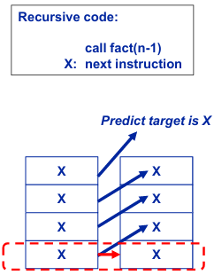
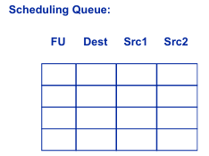
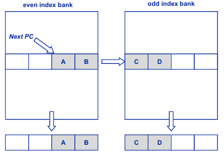
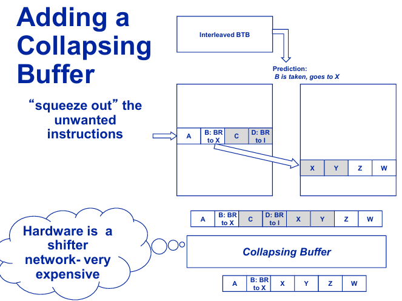
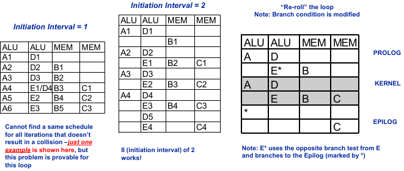
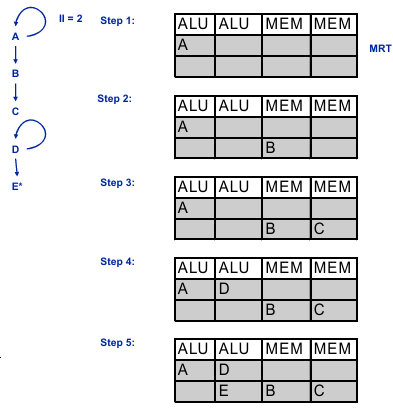

# Pipelining

## 1. 5-stages pipelines: IF, ID, EX, MEM, and WB

### Tiny ISA

Fixed 32-bit encoding per instruction

- Next PC = PC + 4 is always the next instruction

32, 32-bit registers, pluse PC, IR, MAR, MDR

**Arithmetic (e.g. ADD, AND, OR, SUB, etc)**


Format: *ADD Rdest, Rsrc1, Rsrc2*

```asm
Regs[dest] = Regs[src1] + Regs[src2]
```

**Load Word**


Format: *LW Rdest, Imm(Rsrc1)*

```asm
Regs[dest] = Memory[Regs[src1] + signextend(Imm)]
```

**Store word**

same encoding as LW

Format: *SW Rdest, Imm(Rsrc1)*

```asm
Mem[Regs[src1] + signextend(Imm)] = Regs[dest]
```

**Branches**


Format: *B<cond> Rsrc1, Imm*

if (Regs[src1] == 0) then **PC = NPC + signextend(Imm)**

"Imm" here is sometimes called "Pcoffset"

e.g.
```asm
BEQZ R3, Label 
``` 

i.e., if Rges[R3] == 0, PC goes to Label

### Multi-cycles Pipeling

Datapath


MIPS Pipeline


### Analysis

All instructions include 5 stages (Except branch & store)

**IF, ID, EX, MEM, WB**

- branch only needs *IF, ID, EX*

- store only needs *IF, ID, EX, MEM*

- **NOTE: not for every operations (e.g. ADD R2, R1, R0) needs MEM, but inclue it for simplicity and balance**

CPI = 5

## 2. Pipeline speedup calculation

Isolate each of IF, ID, EX, MEM, WB *with latches*

When instruction $i$ is in WB, $i+1$ is in MEM, etc.

Graphically:


Piepline diagrams


### CPI = 1 + stalls, where stall is average stall cycles per instruction

$$\text{CPI}_\text{pipe} = \text{CPI}_\text{nostall} + \text{(avg stalls cycles per instruction)} = 1 + \text{stalls}$$

, where 'stalls' is an abbrev for avg stall cycles per instuction

For a pipeline of $n$ stages for a long program

$$\text{speedup} = \frac{\text{execution time}_\text{unpipelined}}{\text{execution time}_\text{pipelined}} = \frac{\text{IC} \times \text{CPI}_\text{unpipe} \times \text{CT}}{\text{IC} \times \text{CPI}_\text{pipe} \times \text{CT}} = \frac{\text{CPI}_\text{unpipe}}{\text{CPI}_\text{pipe}} = \frac{n}{1 + \text{stalls}}$$

Ideal case, $T_{latch} = 0$, and ignore pipeline fill time

- For computer engineers: **The latch (level-triggered) could instead be a flip-flop (edge-triggered)**


### Principle that Program Characteristics + Pipeline Hazards => Stalls

Not all program charactersitics lead to hardware hazards!

Not all hardware hazards lead to stalls!


## 3. Structural hazards, what they are, how to avoid them

In the cycle 4, 

- instruction A needs to fetch memory to write into **data**

- instruction D needs to fetch memory to decode the **instruction**

- PC couldn't point to two positions for different operations at the same times.

Then it has to **stall instruction D at cycle 4** 

**Solution**: *a unified data and instruction cache (two caches)*


## 4. Control Hazards & Solutions

NPC = PC + 4 not always the brightest choice

E.g., the `BEQZ R1, G` may invalidate the consecutive instruction `B`, even though the instruction `B` has been fetched and decoded.


### Delay slots

Reducing branch penality **via the compiler**: *Delay Slots*

**Compiler** will change the meaning of a branch so that next instruction after branch holds someting useful


*Add n slots to cover n holes* (move $n$ instructions that always conducted before the branch, now after the branch)

ISA is changed to mean "n instructions after any branch are always executed"

**Problem**:

- ISA feature that encodes pipeline structure: Difficult to maintain across generations

- Typically can fill:

    - 1 slot 70-80% of time

    - 2 slots about 30% of time

    - $>2$ slots almost never (forget about it!)


### Squash slots w/likely bits

If you can't fill slot(s) from before the branch, use instructions from either:

- *Target of branch (if frequently taken)*

- *Fall-through of branch (if frequently not-taken)*

E.g., fill from target (branch is frequently taken)


**Disadvantags**: Only works if slot instruction is **safe** to execute (i.e, no exceptions occur) when branch goes the opposite (infrequent) direction

Each branch instruction now has two opcodes: `BEQZ-likely` and `BEQZ-unlikely`


**If compiler thinks branch is frequently taken**:

- Compiler sets *likely bit* = 1 (use `BEQZ-likely`)

- Compiler fills "squash slots" *from target*

- Hardware knows to *squash* slot(s) if branch *not-taken*

**If compiler thinks branch is frequently not-taken**:

- Compiler sets *likely bit* = 0 (use `BEQZ-unlikely`)

- Compiler fills "squash slots" from *fall-through*

- Hardware knows to *squash* slot(s) if branch *taken*

### Methods for setting likely bit

Likely bit is essentially a *static branch prediction*

- Compiler makes a prediction that is fixed for that branch

- Likely bit = 1 means predict taken

- Likely bit = 0 means predict not-taken

Static branch prediction methods (compiler branch prediction)

- **Heuristics**

    - Common one: Backward taken (sign bit = 1) / Forward not taken (sign bit = 0)

    - Could just use the sign bit of branch offset => eliminate likely bit from the instruction encoding!

- **Profiling**

    - Run program once, see what the branches do, recompile and set likely bits

### Reducing Branch Stalls: The 3 W's

**What about a deeper pipeline?**


Next generation processor wants deeper pipeline

- Old "delay slot" code no longer binary compatible!

Solution: Do away with delay slots and squashing branches (These go into the dustbin of history!)

**The 3 W's**

Issues with *Whether to* branch:

- (For conditional branches) Predict if it will branch or not, *before execution*

Issues with *Where to* branch to:

- Predicting where the branch will go to (if taken)

Issues with *Which* instructions are branches:

- When to detect an undecoded instructin is a branch

Optimal: **try to determine all three in IF1 stage**

### Issues in WHICH and WHERE-TO branch (target prediction)

**Branch target buffer (BTB)**

Instead of the tag comparison, just **hash the PC**.

This works because a lookup of the wrong entry just causes a misprediction (i.e, a performance hit but the code still works)

E.g., use middle bits from PC, e.g., if table is 512 entries, use bits PC[12:4]


**Hardware return address stack**

Predicting *Where-to* with returns

Problem: A lot of branches are return instructions - BTB fails on these because **target addresss is dependent on call location** - it keeps changing

- Holding the last target address is a poor predictor unless the call site is always the same!

Solution: Keep a hardware "stack" of return addresses (RAS: return address stack)

- Push return address when a "call" instruction is seen

- Pop buffer on returns to get prediction

- Empirically need 4 to 8 entries for integer code


Problem of RAS: stack is a *fixed size*, not $\infty$

Two (empirical) program behavior scenarios:

1. Shallow call depth $\le N$

2. Very *deep* call depth $>> N$ 

A hardware stack of depth N will do a good job in scenario 1.

When does scenario 2 happen?

- It's most common in *recursive code*

- In recursive code, the stack grows very deep

- But, the stack conatins **the same value (e.g. X)**

    - stack would be full of many copies of X
    
Solution: *Always Copy the bottom of the hardware stack once Pop*



### Issues in WHETHER-TO branch (direction prediction)

**Hardware branch prediction**

OFTEN is a separate table, the branch prediction buffer:

only answers the "WHETHER branch is taken or not" question

Typically it has not tags and conflicts are allowed

#### 1. 1-bit (valid bit in BTB)

Predicting conditional branches

- And sometimes unconditional branches if needed before the instruction's opcode is decoded

- BTB does the equivalent of "whatever happen last" or a 1-bit scheme


#### 2. Smith 2-bit counter

Smith n-bit "bimodal" counter predictor


Why it works:

- Conditional branches at the end of a loop are taken often but only not take once

    - "T T T T T N T T T T T N ..." (T: Taken; N: not taken)

    - Counter would be 01 11 11 11 11 10 11 11 11 11 10

    - The infrequent N does not change the prediction

- Conditional branches that guard an error condition are rare:

    - if (error) { handle error}

    - "N N N N N N N t N N N N N ..."

    - The rare T does not change the prediction

- Smith called this property **inertia**

Variants of the Smith counter were the best predictors

- *Variation was the inital state choice*

e.g. 


#### 3. Geselect

**Improving the Smith Counter**

Idea: *Capture correaltions between different branches*


#### 4. Gshare

Hash index and GHR with $\text{GHR} \text{ XOR } \text{Index}$


#### 5. Yeh/Patt

Idea: *Associate predictions with branch histories, not branch address*


#### 6. Perceptron

$$y = x_nw_n + ... + x_2w_2 + x_1w_1 + w_0$$

, where input $x_0 = 1$, and $w_0$ is bias independent of history

$$NT = -1 \text{ and } T = 1$$ 


**Training perceptron**

```pseudo
if prediction != actual OR |y| < theta then
    for (i = 0; i <= m; i++)
        wi = wi + (actual) * xi
```

, wher $x_0 = 1$, and "actual" is what branch actually did (NT: -1, T: 1)

(Empirically, theta = 1.93 * (length of GHR) + 14)


#### 7. Hybird


Both predictors supply a prediction -- pipeline uses only one

Chooser ("confidence predictor") updated based on which predictor was correct

- Increasement chooser counter if #1 was correct, decrement if #2 was correct.

## 5. Data Hazards & Solutions

### Program data depedence types:

**True dependencies: pure (flow) depedencies**

```asm
ADD R1, R2, R3
SUB R4, R5, R1
```

Stall if pipeline has *RAW* hazards

**Anti-dependence**

```
ADD R3, R2, R1
SUB R1, R4, R5
```

Stall if piepeline has *WAR* hazards

Due to reuse and solved by *removed by using another register*

**Output-dependence**

```
ADD R1, R2, R3
SUB R1, R4, R5
```

Stall if pipeline has *WAW* hazards

Due to reuse and solved by *removed by using another register*

### Pipline hazard types: RAW, WAR, WAW

Hazards reduce the potential speedup of pipelining

- Dependencies between instructions prevent their overlapped execution

Kinds of data hazards

**Read After Write (RAW)**

- Caused by pure dependence

**Write after Read (WAR)**

- Caused by anti-dependence

**Write After Write (WAW)**

- Caused by output-dependence

**Read after Read (RAR)**

- Really a *structural hazard* on read ports

### Avoiding RAW hazards via piepeline by bypass/forwarding 

Data Hazards

```asm
A: ADD R1, R2, R3
B: SUB R4, R5, R1
C: AND R6, R1, R7
D: OR  R8, R1, R9
E: XOR R10, R1, R11
```


**Data Forwarding/Register File Bypass**


Data hazards removed with bypass


Here is an example that *Do not need bypass #3 if the register file is written to one half cycle before it is read from*


Here, only bypass #1 and bypass #2 are needed.


### Remaining RAW hazards: Load/use

**Load-Use Data Hazard (one sepcial case of WAR) cannot be solved via bypass**

Loads cause 1-cycle stall (cache hit)

Can "feature" the hazard by telling programmer that load values are not avaiable until AFTER the next instruction - called a **Load Delay Slot**


### When WAR and WAW hazards happen: instructions allowed to go out of order

**WAR (Write-after-read)**

```asm
A ADD R1, R2, R3
B ADD R2, R4, R5
```

Hazard if B writes R2 before A reads R2

This happens when you **modify example pipeline** so that cache misses *do not* stll instruction fetch


**WAW (Write-after-write)**

```
A ADD R1, R2, R3
B ADD r1, r4, r5
```

Hazard if B writes R1 before A writes R1

Result: later instructions see wrong value in the register

Occurs if instructions can write register file **out-of-order** (using the same pipeline that does not stall fetch on cache miss)


**Handling WAR/WAW hazards**

1. Stall the later instruction (**stalls in WB stage**)

2. Compiler: **don't reuse registers** (not always possible)

3. Hardware: **register renaming**

# Instruction Level Parallelism (ILP)

## Limits of Pipelining

$\text{CPU}_\text{time} = \text{IC} \times \text{CPI} \times \text{CT}$

### Scalar pipelining

- CPI $\ge$ 1 (Flynn's bottleneck)

- reduce CT further, will increase instructions per second

### Problem: limits of (single instruction per cycle) pipelining

1. Continue to reduce CT, but can only break logic up so far

2. **Latch overhead** and **clock skew** start to dominate

    - Overhead becomes a larger component of cycle

    - Pipelining eventually becomes inefficient

3. Deep pipelines are ineffective when there are hazards

## Superscalar

### Supersaclar processing

$\text{scalar} = 1 \text{ instruction}/\text{cycle}$

Superscalar: N instructions / cycle

- Increase **bandwidth** at each stage of the pipeline

```
IF  ID  EX  MEM WB
IF  ID  EX  MEM WB
    IF  ID  EX  MEM WB
    IF  ID  EX  MEM WB  
        IF  ID  EX  MEM WB
        IF  ID  EX  MEM WB
```

Supersalar applies to any multiple-issue machine 

- Superscalar also implies **dynamic scheduling**

**Static scheduled**, multiple-issue machines possible

- ISA can **express parallel groups** - "very long instruction words"

- compiler **groups multiple independet instructions into a larger group**

### View of superscalar processor

**Instruction Fetch (IF)**

**Decode & Dispatch**

**Execute (EX)**

**Write Back (WB)**


**Dispatch and schedule units** maintain **queues**

### Functional Units (FU)

Typical latencies and why:

| Type         | Latency    | Why                                       |
|--------------|------------|-------------------------------------------|
| Integer ADD  | 1          |  The ALU is critical                      |
| FP MUL       | 3          | **Stage 1: Denormalize; Stage 2: add exp, multi mantissas; Stage 3: Normalize** |
| FP ADD       | 2          | **Stage 1: Denormalize; Stage 2: Add and normalize (1 cycle)** |
| Load (LW)    | 2          | The cache **pipeline**                        |
| Store (SW)   | 1          | **Store buffering**                           |
| Divide       | Who cares? | Rarely divide                             |

### A classifiction of approaches

Fire (issue) (F) either in-order (I) or out-of-order (O)

Complete either in-order (I) or out-of-order (O)

**FICI** (Fire In-order Complete In-order) are pieplines like the 5-stage pipeline

The **Cray-1 (simple interlocking)** was **FICO** (Fire In-order Complete Out-of-order)

The **IBM 360/91** was **FOCO**

FOCI isn't a useful configuration

## A dynamic scheduling algorithm: Simple interlocking (FICO)

### Regsiter File

- *Key*: **Register_Number**

- *Value*: **(busy, value)**

![Register Files (Regs[])](./ILP_images/image_40.png)

### FU Scorebard

- *Key*: **FU_identifier**

- *Value*: **busy**


### Scheduling Queue

- *Tuple 0*: **FU**

- *Tuple 1*: **Dest**

- *Tuple 2*: **Src1**

- *Tuple 3*: **Src2**



### Algorithm:

i. **Dispatch/Scheduling unit (combined unit)**

```python
# Scan SchedulingQueue In FIFO order
for Inst in SchedulingQueue:
    if not Regs[Inst.Src1].Busy and not Regs[Inst.Src2].Buy and 
        not Regs[Inst.Dest].Busy and 
        not Scoreboard[Inst.FU].Busy:
        Socreboard[Inst.FU].Busy = True # Mark FU busy in Scoreboard
        Regs[Inst.Dest].Busy = True # Dest Inst's dest reg as busy
        # Issue instruction to function unit Inst.FU
    else:
        break # exit loop, halt issuing
```

ii. **Execution unit**, *at completion of instruction Inst*

```python
Regs[Inst.Dest].Busy = False # Clear busy bit of dest reg of inst
if Inst.FU.pipeline_advances_and_now_first_stage_is_free():
    Socreboard[Inst.FU].Busy = False # Clear the scoreboard bit for Inst.FU
```

### FICO example

Assume that there are multiple ALUs and FPUs available at the same time.

Each time, there are 2 most instructions can be fetched.


Two points needs attention:

- DISP can "see" **in the same cycle** via bypass logic when EX clears a busy bit "on a register" (in this case, R1's busy bit)

- At Cycle 4, **Inst D has to wait for Inst B to finish and causes Inst E, F, G to wait** (though they use independent dest registers in instuction B and D), which is a bad attribute (limitation) of FICO

## How FICO enfores dependencies

### Flow dependence

Decode/dispacth unit sets the first Inst's dest reg busy will **halt firing** when excution unit checks second inst's src reg.


### Anti-dependence

Second Inst will write its dest reg after second Inst excutes.

First Inst's src reg's old value **has been read** during the first instruction is scheduled and dispatched.


### Output dependence

Similary to Flow dependence, Decode/dispatch sets busy will **halt firing** when excution unit.


## Tomasulo's Algorithm (FOCO)

Used only in IBM 360/91 floating-point unit

- Because many long-latency operations

- Needed dynamic scheduling: mitigate long stalls

ISA specificed only 4 floacting-pint registers

- Need register renaming: with only 4 regsiters, false dependecies pop up quickly

- Renaming was a requirement!

### Tomasulo Hardware View:

**Scheduling queue (of reservation stations) (RS)**

- *Tuple 0*: **FU**

- *Tuple 1*: **Dest Reg #**

- *Tuple 2*: **Dest Reg Tag**

- *Tuple 3*: **Src #1 Ready**

- *Tuple 4*: **Src #1 tag**

- *Tuple 5*: **Src #1 value**

- *Tuple 6*: **Src #2 Ready**

- *Tuple 7*: **Src #2 tag**

- *Tuple 8*: **Src #2 value**

**Register file (RF)**

- *Key*: **Rigster #**

- *Value*: **(ready, tag, value)**

**Common Data Bus (CDB)**

- *Tuple 0*: **Tag**

- *Tuple 1*: **Value**

- *Tuple 2*: **Register #**

### General Idea behind Tomasulo algorithm

*Dispatch*: For each inst, insert it into **scheduling queue**:

- **Look up src regs for value *or* tag**

- **Assigns a tag to dest reg and marks it not ready**

*Scheduling*: **manages the scheduling queue**:

- **Listens to bus to update ready bits/values**

- **Fires Insts in scheduling queue that have both source regs ready and required FU free**

*Complete*:

- **broadcasts result on bus**

- **frees slot in sched queue**

*Reg file*:

- **updates value and marks reg ready** if bus tag matches reg entry

### Tomasulo Algorithm Details

For each cycle of execution:

i. **Dispatch Unit (DispatchQueue)**

```python
for Inst in DispatchQueue:
    if not ScheduledQueue.isFull():
        ScheduledQueue.add_to_first_slot(Inst)
        DispatchQueue.delete(Inst) # Inst is now "dispatched"
        RS = ScheduledQueue.get_first_free_slot() # RS = reservation station entry = ScheduledQueue entry
        RS.FU = Inst.FU
        RS.Dest = Inst.Dest
        for i in range(2):  # src reg 0 and 1
            if Regs[Inst.src[i]].Ready:
                RS.Src[i].Value = Regs[Inst.src[i]].Value
                RS.Src[i].Ready = True
            else:
                RS.Src[i].Tag = Regs[Inst.src[i]].Tag # Copy the tags from RF 
                RS.Src[i].Ready = False
        Regs[Inst.Dest].Tag = unique_tag_id # tag (rename) the destination in RF
        RS.DestRegTag = Regs[Inst.Dest].Tag
        Regs[Inst.Dest].Ready = False # value ready only after execution
    else:
        break # exit loop, stop dispatching if scheduling queue is full
```

ii. **Scheduling Unit (Reservation Station) (RS)**

**wake-up**: when more than one instruction is ready, pick between them is called "select" (here we're using FIFO as a select algorithm)

```python
for RS in ScheduledQueue:
    for i in range(2): # src reg 0 and 1
        if CDB.Tag == RS.Src[i].Tag: # boardcast on CDB matches stored tag
            RS.Src[i].Ready = True
            RS.Src[i].Value = CDB.Value
    if RS.Src[0].Ready and RS.Src[1].Ready and # WAKEUP: if all registers are ready ...
        not Scoreboard[RS.FU].Busy
        Scoreboard[RS.FU].Busy = True # reserve the FU and issue
        # Issue the instruction at RS on FU
```

iii **Execution unit (FU)**

```python
if FU.pipeline_advances_and_now_first_stage_is_free():
    Scoreboard[FU].Busy = False
# Completion of Inst
if not CDB.Busy:
    CDB.Busy = True
    CDB.Tag = Inst.Tag
    CDB.Value = Inst.Value
    CDB.Reg = Inst.Dest
    if not Inst.FU.is_pipelined(): # FPU, LSU take more than one cycle
        Scoreboard[Inst.FU].Busy = False
    ScheduledQueue.delete(Inst)
```

iv. **Register File (RF)**

```python
if CDB.Busy and CDB.Tag == Regs[CDB.Reg].Tag:
    Regs[CDB.Reg].Ready = True  # Update the RF contents
    Regs[CDB.Reg].Value = CDB.Value
    CDB.Busy = False
```

### Tomasulo Example

**1 ALU (Algorithm and Logic Unit)**

- 1 stage and 1 cycle per stage

**1 LSU (Load-store Unit)**

- Using a Load-store buffer (load-store queue/LSQ) to keep misses in so that **LSU doesn't stall**.

- 2 stages, 1 cycle per stage

- **Miss repair handled in background in 5 cycles**

**No Bypass (for now)**

```asm
LW R0, 0(R3)    // misses in cache
ADD R2, R0, R1
LW R0, 4(R3)    // hits in cache
ADD R3, R0, R1
```

**Cycle 0**:

Instructions A, B, C, D already in Dispatch Queue

Dispatch them 1 by 1

Nothing in schedling queue, so noting to check

Nothing in execute, so nothing to check

Registe File will tag regsiters


**Cycle 1**:

*Schedule*:

- **Wakeup and select finds RS0 is ready** and **fires to LSU**, **RS2 is ready, but does not fire** due to structural hazard (only 1 LSU) and FIFO scheduling heuristic

**Cycle 2**:

*Schedule*:

- **Wakeup and select finds RS2 is ready and fires to LSU**

*Exectue*:

- **Instruction A from RS0 is in array access**

**Cycle 3**:

*Schedule*:

- No instructions can be issused

*Execute*:

- **Instruction A from RS 0 is in tag compare and misses**

- **Instruction C from RS 1 is in array access**

**Cycle 4**:

*Schedule*:

- No instructions can be issued

*Execute*:

- **Instruction A is in LSQ (Load-Store Queue) pending miss repair**

- **Instruction C from RS 1 is in tag compare and hits**

**Cycle 5**

*Schedule*:

- No instructions can be issued

*Execute*:

- **Instruction A is in LSQ, pending miss repair**

- **Instruction C arbitrates for CDB and sets the data**

**Cycle 6**

*Schedule*:

- **CDB.Tag matches RS3, and marks src1 are ready, updates value**

- **RS3'S sources are ready, ALU is not busy, so fires instruction D**

*Reg File*:

- **CDB.tag matches tag for R0 and updates regfile value**

*Execute*:

- **Instruction A is in LSQ, pending miss repair**

*CDB*:

- **marked no longer busy for this cycle (beginning of cycle)**


**Cycle 7**

*Execute*

- **Instruction A is in LSQ, pending miss repair**

- **Instruction D completes**

**Cycle 8**

*Execute*

- **Instruction A is in LSQ, miss repair completes**

- **Instruction D sets CDB**

**Cycle 9**

*Reg File*:

- **CDB.tag matches for R3 and updates regfile value**

*Execute*:

- **Instruction A sets CDB for next cycle**

*CDB*:

- **marked no longer busy for this cycle (beginning of cycle)**


**Cycle 10**

*Schedule*

- **CDB.Tag matches RS1, and marks scr1 as ready, updates value**

- **RS1's sources are ready, ALU is not busy, so fires instruction B**

*Reg File*

- **CDB.tag doesn't match tag for R0**

*Execute*

- **Nothing to do**

*CDB*

- **Marked no longer busy for this cycle (beginning of cycle)**


**Cycle 11**

*Schedule*

- **Nothing to do**

*Execute*

- **Instruction B completes**

**Cycle 12**

*Schedule*

- **Nothing to do**

*Execute*

- **Instruction B sets CDB**

**Cycle 13**

*Schedule*

- **Nothing to do**

*Reg File*

- **CDB.tag matches for R2, updates regfile value**

*CDB*

- **marked no longer busy for this cycle (beginning of cycle)**


### Adding Bypass

**When an instruction completes, it sets the CDB in the same cycle**

**In schedule, CDB updates are applied before wakeup/select (already the case)**

Allows for removal of many cycles in this example

- *Cycles 4 and 5 merge. 11 and 12 merge*

- *Cycle 7, 8, 9 now take only 2 cycles*

Can even **let schedule read the CDB after the CDB is set in the same cycle**

- *Cycles 4-6 merge, 11-13 merge*

### Tomasulo problems / solutions

CDB limits number of instruction that can complete per cycle to one instruction

- Solutions: **Have N CDBs**. Called "result buses". Now can **complete N instructions per cycle**.

The scheduling queue needs a fully associative lookup for each result bus

- Very expensive

## Alternative Implementation: Physical regs and RAT

Instead of TAGs, use **real registers**

- Extend the register file with and *PHYSICAL (UNARCHITECTED) registers* (**Pregs**) in addition to *traditional (architected) registers*, called "**Aregs**"

- Use a TABLE to map most recent Preg to Aregs, called *Register Alias Table (RAT)*

**Modified Scheduling Queue (RS)**

- *Tuple 0*: **FU**

- *Tuple 1*: **Dest Preg #**

- *Tuple 2*: **Src #1 Preg #**

- *Tuple 3*: **Src #2 Preg #**

**Register Alias Table (RAT)**

- *Key*: **Areg**

- *Value*: **Preg**

**Register File (RF)**

- *Key*: **Preg #**

- *Tuple 0*: **ready**

- *Tuple 1*: **value**

**Results Buses (CDB)**

- *Tuple 0*: **Preg #**

- *Tuple 1*: **Value**


### Pregs & RAT General Idea

At *dispatch* of instruction "I"

- **D = the Areg dest register of I: pick an unused Preg index "P"**

- **Set RAT[D] = P**

At *scheduling* unit for entry RS:

- **Wake up RS if register for each source of RS is ready**

- **Scheduler (or FU) reads the register file for value**

On *instruction completion* of I:

- **Write the result into Preg in the physical register file part and mark it as "Ready"**

The **Areg portion of the register file is used when freeing Pregs**

### Tomasulo with Pregs & RAT algorithm

For each cycle of execution ... 

i. **Dispatch Unit (DispatchedQueue)**

```python
for I in DispatchedQueue:
    if not ScheduledQueue.isfull() and Pregs_are_Free():
        ScheduledQueue.add_to_first_free_slot(I)
        DispatchedQueue.delete(I) # Instruction I is now "dispatched"
        RS = ScheduledQueue.get_first_free_slot()
        RS.FU = I.FU
        for i in range(2):
            RS.Src[i] = RAT[I.Src[i]]
        RAT[I.Dest] = get_a_free_Preg() # rename the dest
        RS.Dest_Preg_index = RAT[I.Dest]
        Regs[RAT[I.Dest]].Ready = False
    else:
        break # exit loop, stop dispatching if scheduling queue is full or there is no free PReg
```

ii. **Scheduling Unit (ScheduledQueue)**

```python
for RS in ScheduledQueue:
    if Regs[RS.Src[0]].Ready and Regs[RS.Src[1]].Ready # WAKEUP: if all registers are ready
        and not Scoreboard[RS.FU].Busy:
        Scoreboard[RS.FU].Busy = True # reserve the FU and issue
        # Issue the instruction at RS on FU
```

iii. **Execution Unit (FU)**

```python
if FU.pipeline_advances_and_now_first_stage_is_free():
    Scoreboard[FU].Busy = False
# At completetion of instruction I
if not CDB.Busy: # Broadcast the instruction results
    CDB.Busy = True
    CDB.Value = I.Value
    CDB.Preg = I.Dest_Preg
    if not I.FU.is_pipelined():
        Scoreboard[I.FU].Busy = False
    ScheduledQueue.delete(I)
```

iv. **Regsiter file (Regs)**

```python
if CDB.Busy:
    Regs[CDB.PReg].Ready = True # Update the RF contents
    Regs[CDB.PReg].Value = CDB.Value # Update the Preg
    CDB.Busy = False
```

### Pregs/RAT vs. Tomasulo

**Pregs/RAT has no associative lookup in the scheduling queue** (or anywher else), no "broadcast" to listen to

But **Tomasulo doesn't need to check the register file for all source registers, for each reservation station, on every cycle**

### Freeing Pregs without ROB

Add a `use` counter and a `pending_free` flag to Preg reg file

*Dispatch Inst*

- **For each source reg**, `Regs[RAT[src]].use += 1`

- **When assigning a Preg to a Dest_Areg, first set old Preg to pending free**:
    
    - `Regs[RAT[Dest_Areg]].pending_free = True`

    - Then set **new** `Preg.pending_free = False`

*Complete Inst*

- **Decrement the counter for each of Inst's source reg's Preg**, `Regs[RAT[src]].use -= 1`

Each cycle, at reg file, for all Pregs, if Preg has Pending_free = True and use = 0, free Preg

- if `Preg.pending_free = True` and `Preg.use == 0`: `Preg.Ready = True`

## State Update Design


Problem: **No consistent state**

- OS needs "resume PC" to restart process after TLB miss is handled

- Also called: **Imprecise Interrupts**

Definitions:

- **Fault**: An excepting instruction that should be retried after exception is fixed

    - e.g., TLB miss in this example, so that can reload value from R3

- **Trap**: An excepting instruction that should *not* be retried after exception.

    - e.g., divided by zero, which is meaningless

- **Exception handler**: routine that fixes exceptions

- **An architecture state**:

    - *register contents*

    - *memory contents*

    - *PC value*

### Solution #0: Checkpoint repair


**Periodically mark** an **instruction barrier** (IB1) at **dispatch**

All instructions that complete that are before IB1 **write to both messy and Backup 1**

Once all instructions before IB1 have completed, **copy Backup 1 to Backup 2, Messy to Backup 1, set IB2 = IB1, and pick a new IB1**

Note that all loads and stores are buffered until backup 1 copied to backup 2

**If an exception occurs, copy Backup 2 to messy and resume at IB2 for Backup 2 after exception**

- may have to re-execute some instructions between IB and where the exception occurred

Not: for a TRAP, set a new IB1 right before the TRAP and don't handle the trap untill Backup 1 is complete

### Solution #1: Reorder Buffer with Bypass (ROB w/bypass)

ROB Structure:

- Tuple 0: **tag**

- Tuple 1: **value**

- Tuple 2: **regno**

- Tuple 3: **ready**

- Tuple 4: **exception**

- Tuple 5: **pc**


**Add comparators** to **search reorder buffer for src regs**

- The search uses source register numbers of the dispatching instruction: *replaces register file lookup in basic Tomasulo*

- Search from newest to oldest ROB entry

- If no match, get the value from the register file

Advantages: **No longer have to wait until retirement for destination register to be updated**

Register file **only stores the values, no additional meta data**

Problem:

- Comparators are expensive

- ROB now similiar to fully-associative cache: a cycle time stretcher

### Tomasulo & ROB w/bypass algorithm

For each cycle of execution ...

i. **Dispatch Unit**

```python
for I in DispatchedQueue:
    if not ScheduledQueue.isfull():
        ScheduledQueue.add_to_first_free_slot(I)
        DispatchedQueue.delete(I) # Instruction I is now "dispatched"
        RS = ScheduledQueue.get_first_free_slot()
        RS.FU = I.FU
        RS.DestReg = I.Dest
        for i in range(len(source_reg)):
            found_in_rob = False
            for j in range(tail, head, -1): # from tail to head, search for src reg in ROB, assume ROB is a fixed length list with a flexible size (tail - head)
                if ROB[j].regno == RS.Src[j]:
                    found_in_rob = True
                    if ROB[j].Ready:
                        RS.Src[i].Value = ROB[j].Value
                        RS.Src[i].Ready = True
                    else:
                        RS.Src[i].Tag = ROB[j].Tag
                        RS.Src[i].Ready = False
            if not found_in_rob: # no write of reg in ROB, get the value from the register file (because instruction retired long ago!)
                RS.Src[i].Value = Regs[RS.Src[i]].Value
                RS.Src[i].Ready = True
        ROB[tail].Tag = unique_tag_id # tag(rename) the dest, could just use the ROB index ('tail') as tag#
        ROB[tail].Regno = I.Dest
        ROB[tail].Ready = False
        ROB[tail].Exception = False
        tail += 1
```

ii. **Execution Unit (FU)**

```python
# At instruction completion of instruction I at index 'index' in the ROB
ROB[index].Value = I.value
ROB[index].Ready = True
if execption_occurs(I):
    ROB[index].Exception = True
```

iii. **State Update Unit (SU)**

```python
if not ROB[head].Exception:
    Regs[ROB[head].Regno].Value = ROB[head].Value
else: # Exception occurred
    resume_pc = ROB[head].pc
    tail = head # flush the ROB, the entries between head and tail are invalidated
    call_exception_handler() # based on different handler point
    if is_trap(ROB[head].Exception): # trap
        pc = resume_pc + 4
    else: # fault
        pc = resume_pc
```

### Solution #2: ROB w/Future File


Changes vs. ROB w/bypass are:

- *Keep the original Tomasulo register file* (called "messy")

- *Completing instructions broadcast on CDB* and *update the messy RF* as in original Tomaulso Algorithm

- *Dispatch checks "messy" register file* (also called Future File) just like original Tomasulo algorithm.

- *Before exception handling*, **architectural register file** is **copied to messy register file**.

The most commonly implemented scheme.

### ROB w/Future File: Pregs/RAT version


i. **When instruction reaches head of ROB, copy Preg to corresponding Areg**

ii. **On exception, change RAT to point to corresponding Aregs**

### Freeing PRegs via ROB

At *DISPATCH* of instruction "I"

- Allocate slot in ROB for "I" at tail of ROB

- `ROB[tail].Prev_preg = RAT[I.Dest_areg]` (Rest of Dispatch is the same as prior PReg/RAT)

On **instruction retirement** of "I" at head of ROB

- Mark ROB[head].Prev_preg as free, `ROB[head].Pre_preg = NULL`

- Or add the Preg into Preg free list

### Freeing PRegs via ROB Algorithm

For each cycle of excution ...

i. **Dispatch Unit**

```python
for I in DispatchedQueue:
    if not ScheduledQueue.isfull() and Pregs_are_Free():
        ScheduledQueue.add_to_first_free_slot(I)
        DispatchedQueue.delete(I) # Instruction I is now "dispatched"
        RS = ScheduledQueue.get_first_free_slot()
        RS.FU = I.FU
        for i in range(2):
            RS.Src[i].reg_index = RAT[I.Src[i]]
        ROB[tail].Dest_Areg = I.Dest
        ROB[tail].Prev_Preg = RAT[I.Dest]
        RAT[I.Dest] = get_a_free_Preg() # rename the dest
        RS.Dest_Preg = RAT[I.Dest]
        Regs[RAT[I.Dest]].Ready = False
        ROB[tail].Ready = False
        ROB[tail].Exception = False
        tail += 1
    else:
        break # exit loop, stop dispatching if scheduling queue is full or there is no free PReg
```

ii. **State Update Unit (SU)**

```python
# At instruction retire
if not ROB[head].exception:
    Regs[ROB[head].Dest_Areg].Value = ROB[head].Value
    if not is_Areg(ROB[head].Prev_Preg):
        Preg_free_set.append(ROB[head].Prev_Preg) # mark ROB[head].Prev_preg as free
else: # Exception occurred
    resume_pc = ROB[head].pc
    tail = head # flush the ROB, the entries between head and tail are invalidated
    call_exception_handler() # based on different handler point
    for Areg in range(len(Aregs)):
        RAT[Areg] = Areg # On exception, change RAT to point to corresponding Aregs (copy)
    if is_trap(ROB[head].Exception): # trap
        pc = resume_pc + 4
    else: # fault
        pc = resume_pc
```

## Speculative Execution


Add brach prediction to fetch unit

Could delay dispatch until a branch's behavior is know, OR ...

When branch is predicted, begin executing instructions speculatively until outcome is known.

Need a technique to recover from miss-speculation so speculative instructions do not hurt processor state ... (e.g,. the ROB in the graph)

### Miss-speculation recovery

Conceptually like "mini-exceptions"

**ROB recovery**

- *Flush all instructions* from *branch to tail* of reorder buffer

- No need to wait until branch is retired

- Resume execution at corrected path of branch

**Checkpoint repair recovery**

- On branch prediction, start a new IB (instruction barrier) and copy Messy to Backup 1.

- On mis-speculation recovery, *do not write back results of any instructions after IB*.

- Instead, just *copy Backup 1 to Messy* and *resume executing instructions after the branch*.

### Alternative to speculation: Multipath Execution

**If a branch is hard to perdict, execute both paths and squash one**

Downsides: always **wasting space**, actual path competes with squashed path for resource (FUs)


Read world example: Intel Core 2


## High-Level Inst Fetch Issues

Challenges:

i. Need to fetch more than one instruction per cycle to keep superscalar pipeline fed

ii. Instruction Cache is **single ported** —— can't read more than one block a cycle

iii. Branches occur every 5 instructions, on average, thus need to predict branches for multiple instructions per cycle

Solutions:

**Collapsing buffer**

- uses **a banked cache** and **banked branch predictor** plus **a combining network**

**Trace cache**

- **remembers a path** through the code across multiple branches

### Instruction fetch and the Icache


Superscalar fetch needs multiple (e.g., four) instructions per cycle

Traditional cache: fetching A, B, C, D would take *four cache accesses*

Better approach: **fetch a whole block at a time from the Icache (no word select mux)**

**Problem: unaligned accesses**


Solution: *dual-port the Instruction Cache* in order to *read out two consective cache lines*

Merge needed instructions together to get 4 instruture/cycles bandwidth

**EXPENSIVE: true dual-porting increases Instruction Cache area significantly**

**Fake: dual porting via dividing the cache into two banks**



**Banked Sequential**

- Select to *start fetching in bank even or odd by using the least significant bit of the cache index* (msb = 0: even, else odd)

**Next Problem: Predicting Branches**


if *either B or D is (predicted) taken*, want XYZW or IJKL block next, not EFGH block

Also, if *both B and D* predicted taken, want XYZW, not IJKL

- Why? because B's branch prediction has a "higher priority" than D's branch prediction

**Interleaved BTB w/Smith counters** *(works with any branch predictor)


Banks of BTB accessed in parallel

1-cycle trip time across "carry chain"

Overall scheme name: **"Banked cache w/BTB"**

### Pipeling Icache Timing and Branch Penality


Branch prediction penality:

- adds two stage to Ifetch

- so **2** cycles (=*Array + Align*) + (*stages from decode to when branch direction is resolved*)

### Add a Collapsing Buffer

- banked cache

- banked branch predictor

- combining network



### Effects of compiler optimizations on superscalar instruction fetch

Instruction Layout **enhances** Icache performance

- Use instruction layout from **cache miss rate reduction**

- profiling


### Modification: Add a "trace cache"


**Cache the output of the collapsing buffer as *traces***

**Look up (target of previous trace address, branch prediction) in trace cache**

**If a trace doesn't exist, use collapsing buffer Instruction cache to build new trace**

### The limits of Superscalar

Empirically, parallelism is proportional to the $log_2(\text{scheduling queue size})$

Scheduling queue size is proportional to cycle time and power.

These two are conflicting goals


Impact of complexity

- Added hardware complexity may increase cycle time

- Added hardware complexity uses power - may exceed power envelope

## Very Long Instruction Word (VILW)


Given that determining independence between instructions (i.e., ILP) is a problem, then *Feature it* in the ISA

**Perform all dependence checking before run-time**

### Data Dependence graphs

Data struture used by compiler for scheduling

Nodes of graph are instructions

Arcs of graph represent dependencies


### Compiler Scheduling

*Optimal scheduling takes $O(2^n)$ time steps for $n$ operations worst case*

Solution: use *heuristic approach*

- Most common approach is *list scheduling*

**List Scheduling** steps:

i. Build data dependence graph

ii. Sort graph into linear ordering (*priority list*) using heuristics (e.g. highest-level-first)

iii. Insert instructions form list into schedule subject to data dependencies and resource constraints

### Example VLIW scheduling

Original operations

```asm
A: LW R2, X
B: LW R3, Y
C: LW R4, Z
D: ADD R1, R2, #1
E: MUL R2, R3, R3
F: MUL R5, R1, R3
G: ADD R5, R5, #1
H: SW R5, X
I: ADD R6, R2, R4
```

**Data Dependence Graph (DDG)**


*LW* takes 2 cycles, *MUL* takes 3 cycles, *ADD* and *SW* takes 1 cycle

**List Scheduling**

Finding *Dependencies height*:

i. *Start from the **bottom of DDG** Assign these Operations a height equal to **the latency of the operation***

ii. *Operation X has height = **max(all successor ops)** + the **latency of operation** X*


Get the List ordered by dependence height

**A -> B -> D -> F -> E -> C -> G -> H -> I** (or  I -> H)

### Example VLIW machine code


### Encoding the MultiOp: Getting rid of *nops*

When nothing to do in regular ISAs, insert a *nop*

- But very wasteful for VLIWs!

**Horizontal *nops***

- Add *an opcode field* to every op
    
    - encode ops as though they are RISC instructions

- Use *"stop" bit*

    - when stop = 1, this op ends the MutliOp

- Need a *distribution network* in hardware to send ops to their correct units

**Vertical *nops***

- Option 1: Insert them (they may be rare)

- Option 2: Use *"pause" field* in op encoding

    - pause = *n* means wait *n* cycles before beginning the next MultiOp

    - But, every *Op* encoding must have a pause field, even though only its the *MultiOp* that requires one

- Option 3: Use *in-order interlock* *busy bits* on each register

    - If all source registers of all ops in the MultiOp are not busy, then issue the MutliOp, else issue nothing and wait a cycle

### Example with tail and pause


Now the code has been rearranged in the List Scheduling way

"Tail" just works like "stop" bit, to mark the end of MultiOps


### VLIW semantics: parallel reads

*All source of all ops in a multiop are read at the beginning of the cycle*

*All writes to destinations happen at the end of a cycle*

Consequence: **swap** contents of R1 and R2 with one VLIW code

```
ADD R1, R2, #0 | ADD R2, R1, #0
```

Valid MultiOP, but Invalid RISC sequence

e.g., Assume MUL takes three cycles, and ADD takes one cycle. R1, R2 and R3 = 2 initially

```
ADD R4, R1, R3 | MUL R1, R2, R3 // R4 = 4 
ADD R5, R1, R3                  // R5 = 4
ADD R6, R1, R3                  // R6 = 4
ADD R7, R1, R3                  // R7 = 6
```

## Instruction Scheduling

**Local vs. Global**

- *Local*:

    - BB (Basic Block) code only

    - Missed opportunities because of rarely taken (not taken) branches

- *Global Instruction scheduling*:

    - Taking branches into account: *speculate* on instruction execution

**Acyclic vs. Cyclic global instruction Scheduling**

- *Acyclic*: used for straight line code or complex loops

- *Cyclic*: used for loops

### Control flow graphs & Basic Blocks

```C
do {
    if (A[R5] > 0)
        A[R5] = 0;
    else
        A[R5] = A[R5] * 2;
    R5--;
} while (R5 > 0);
```

**Basic block**

- Longest span of sequential instructions

```asm
Loop:  LW R4, A(R5)         // A
       BGRT R4, #0, THEN
ELSE:  MUL R4, R4, #2       // B
       SW R4, A(R5)
       BR AFTER
THEN:  AND R0, R0, 0        // C
       SW R0, A(R5)
AFTER: ADD R5, R5, -1       // D
       BRGT R5, #0, Loop
```

**Control Flow Graph (CFG)**

- Graph of basic blocks with all possible transitions


## Global acyclic scheduling models

Problem:

- Parallelism in basic blocks is limited (1.5 - 2 empirically), causing many slots in a block's schedule to go to empty

Approach:

- **build larger blocks of instructions before list scheduling**

Techniques:

- Trace scheduling

- Superblock Scheduling

- Prediction/if-conversion

- Hyperblock Scheduling

- Treegion Scheduling

### Trace Scheduling

Definition of "trace":

- Linear regions of BBs(Basic Blocks) in code that tend to sequentially together

- A set of basic blocks that form a path through the code

Approach:

i. Form traces by following heavily weighted blocks or arcs through code

ii. Perform liveness analysis at the BB level

iii. Schedule the traces

iv. Add *compensation code for side entrances* and *side exits* using liveness information


Traces are **A -> B -> D** and **C** (only one block)

Schedule A, B, D (above, left)

Schedule C has some complications:

- **Side exit problem**: Because B1 moved before `br to C`: the schedule for C **needs to 'undo' the B1 op's effect**

- **Side entrance problem**: Because D1 moved above the entrance to C, the schedule for C **will need a copy of D1**

### Superblock scheduling


**Remove all side entrance problems by duplicating D**

Larger scheduling scopr for B-D and C-D'

**Still have the side exit problem** for instructions from B scheduled before the "BR C"

### Problems with Linear Region Scheduling

Close calls are dangerous (if two traces have similar calling-frequence, like here, one trace is 0.6 probability, another is 0.4 probability)


The compiler tends to group A/B/D instead of A/C/E, but A/C/E's entire performance is actually better.

**Solution**:

1. Use non-linear regions

2. Move profile usage from region formation to scheduling

### Treegions scheduling


**Single-entry**, **multiple-exit**, **acyclic region**

- Each node in a treegion is a basic block

Advantages over linear regions

- Larger scheduling scope

- No (or little) profile data required to form

Limiations:

- No side entrances

**Dominator Parallelism for Tail Duplication**


A dominates D in original code

if Ops in D are equivalent to D', then ops speculated D-B-A that are identical to ops speculated D'-C-A are also *redundant*

**Treegion scheduling can remove such tail duplicates**

### Prediction/if-conversion

Add **1-bit "predicate registers"** to ISA

**All operations in VLIW MultiOp have a predicate field**

**Operations with false pred.execute as *nops***

Can be used to achieve multipath execution


```asm
Loop:  LW R4, A(R5)
       BRGT R4, #0, THEN
ELSE:  MUL R4, R4, #2
       SW R4, A(R5)
       BR AFTER
THEN:  SW #0, A(R5)
AFTER: ADD R5, R5, -1
       BRGT R5, #0, Loop
```

Now becomes:

```asm
Loop:   LW   R4, A(R5), P0        ; P0 = always true
        CMPP.GT P1, R4, #0, P0    ; if R4 > 0 → P1=1 (set P1 register to result of comparison <cond>(GT))
        NOT  P2, P1               ; P2 = !P1 (equal to else branch)
        MUL  R4, R4, #2, P2       ; only if P2 == 1
        SW   R4, A(R5), P2        ; only if P2 == 1
        SW   #0, A(R5), P1        ; only if P1 == 1
        ADD  R5, R5, -1, P0       ; always
        BRGT R5, #0, Loop, P0     ; always  
```

### Hyperblock schedling


Add 1-bit *predicate registers* to instruction format

No branches (except for back edge), no patchup code

## Cyclic Scheduling: Loop unrolling

```asm
LOOP:   A: ADD R2, R2, #1
        B: LW R3, 0(R2)
        C: SW R0, 0(R3)
        D: ADD R10, R10, #1
        E: BRGTZ R10, LOOP
```

Becomes

```asm
LOOP:   A: ADD R2, R2, #1
        B: LW R3, 0(R2)
        C: SW R0, 0(R3)
        D: ADD R10, R10, #1
        E*: BRLEZ R10, EXIT
        A*: ADD R2, R2, #1
        B*: LW R3, 0(R2)
        C*: SW R0, 0(R3)
        D*: ADD R10, R10, #1
        E': BREGTZ R10, LOOP
EXIT:
```

Resources: 2 adder/branch units, 2 memory units, Add latency=1, Memory latency=2


### Cyclic scheduling: software pipelining

Goal: **Keep same schedule per iertation**

Saves **work scheduling, where scheduling is** $O(N^2)$



### Iterative Modulo Scheduling

The number of cycles between the start of each iteration is termed the **Initiation Interval (II)**

The **Minimum Initiation Interval (MII)** is the theoretically lowest Initiation Interval (II) possible

- Two bounds to this: Resource-constrained MII (ResMII) and recurrence-constrained MII (RecMII)

- **MII = max(ResMII, RecMII)**

Core algorithm:

```python
II = MII
# iterativeSchedule() is a special version of list scheduling that tries all alternatives
while (iterativeSchedule(II) != True):
    II = II + 1
```

### Finding ResMII

Simplistic approximation:

- Count the most heavily used resource for the loop body

- That means the FU type that is used the most

- Divide this by the number of resources and round up

- E.g

    - Loop body contains 5 ADDs and 3 MULs

    - Hardware has 2 adders and 3 multipliers

    $$\lceil 5/2 \rceil = 3$$

    $$\lceil 3/3 \rceil = 1$$

    - Hence, ResMII = 3

Real-word complications

- Opcodes map to several alternatives (e.g, shifter or multiplier can perform some multiplications)

- Most instructions require reservation of more than a single resource (e.g. operand and result buses)

### Finding RecMII

**Circular dependence** (recurrence) between iterations limits initiation interval (II)


**Each cycle's length = sum latencies of ops in the cycle**

$$\text{RecMII} = \max_{\text{i in all cycles}} \text{cycle length}_\text{i}$$

### Modulo Reservation Table

Schedule the loop in a reservation table (empty schedule) of height = II

Say II = 3, and there are four resources, MRT(Modulo Reservation Table) is a 3x4 array

Scheduling is then done as follows:

1. Peform list scheduling

2. Attempt to schedule an operation at all possible times $\geq$ (T mod II)

3. If there is a conflict, try different list ordering

### Example

```asm
Loop:   A: ADD R2, R2, 1
        B: LW R3, 0(R2)
        C: SW R0, 0(R3)
        D: ADD R10, R10[1], #1
        E: BRGTZ R10, LOOP
```

Resource: 2 adder/branch unit, 2 memory units
There are 3 ADD/Branch, and 2 Memory Operations

$\text{ResII} = \max(\lceil 3/2 \rceil, \lceil 2/2 \rceil) = 2$

Add latency = 1
Memory latency = 2
True dependence: A->B->C, D->E

$\text{RecII} = \max(\text{len}(\text{A to A}), \text{len}(\text{D to D})) = 1$

$\text{MinII} = \max(\text{ResII}, \text{RecII}) = 2$




Transmeta Crusoe processors

Four issue VLIW of:

- Mem, ALU/FP/MM, ALU w/immediate

- Mem, ALU/FP/MM, ALU, Branch

- Or two "short" molecules:

    - MEM, ALU/FP/MM

    - ALU, ALU/FP/MM

    - ALU w/immediate

    - ALU, Branch

- Interrupt boundaries are marked with "commit" bits (Mark where can accpect interrupts or execptions)

    - Because of the dynamic transaltion and instruction speculation, need to point out where is the safe recovery point.

Adanvtage:

**Dynamic translation of x86 to VLIW via software**

- it uses 16MB translation area, which is invisible to users, and OSes

- Peforms interpretation and cache up the results for repeating use

### VLIW compiler with a superscaler


Superscalar hardware **has little work to do** except **when VLIW compiler guessed wrong about latencies** (e.g. on a load miss)

So can use simpler FICO instead of complex Tomasulo tag or RAT-based FOCO

## Four approaches to extracting Instruction-level parallelism (ILP)

All hardware: **Superscalar**

Compiler specifies which instructions depend on each other: **Dataflow** (DDG)

Compiler specifies which instructions are independent: **Independence architecture** ("horizontal archiecture" or EPIC (Explicity Parallel Instruction Computing))

Comipler specifies independence and resource usgae in time: **VLIW**

