# Multiprocessors and Multithreads

## Multiprocessor Classifications (brief introduction)

**Flynn Taxonomy (MIMD vs. SIMD)**

- Classifies: how they are programmed

- Hybrid idea: SPMD

**Memory model**

- Shared

- Not shared (message passing)

**Interconnect model**

- Bus: bus is a broadcast all can see what everyone is accessing

- point to point *is not* globally observable

## Message passing vs. Shared memory (brief intro)

**Shared Memory**

Each thread sums a sub-array from global memory

**Each thread acquires a lock** and **updates the global sum**

```pseudo
lock(&global_lock);
sum += partial_sum;
unlock(&global_lock);
```

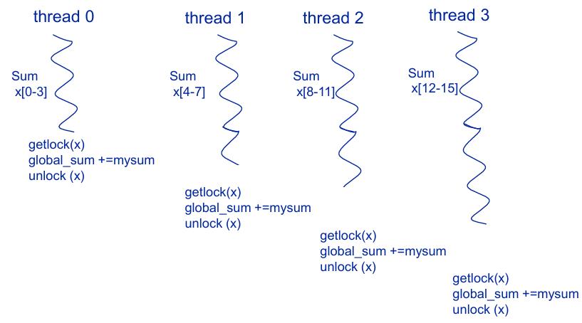

Master thread displays result.

**Message passing**

**Each thread sums its local sub-array** and **sends a message to master thread** that prints result.

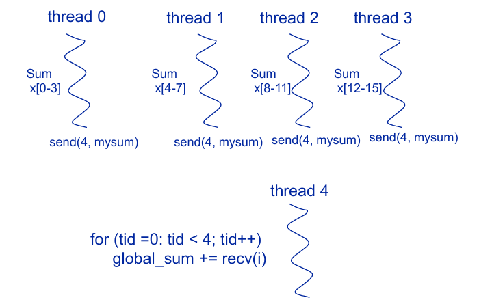

### Shared Memory vs. Message Passing

Message passing machines:

- Typically uses "off-the-shelf" machines

- Programming is difficult

- **Synchronization is part of send/receive**

Shared Memory machines:

- Needs architecture support

- Easier to program, but need synchronization instructions (**locks or barriers**)

- Multi-core almost always uses a shared memory

### Memory Access Latency Types

**Symmetric Multiprocessors** (SMP) when interconnect is a bus

**Uniform Memory Access** (UMA) is more general term for SMP

- All memory locations have the same latencies (really, 'similar latencies')

Problem: **Memory Contention**

- All processor share the one memory thus memory bandwidth becomes a bottleneck

- UMA is used only for smaller multiprocessors: 2, 4, or 8 processors

Non-uniform Memory Access is called isn't UMA

## Shared Memory: Cache Coherence

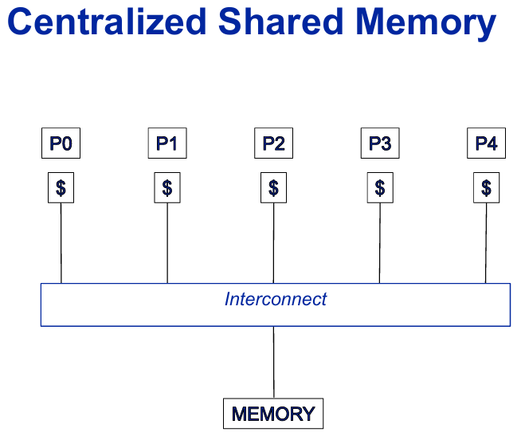

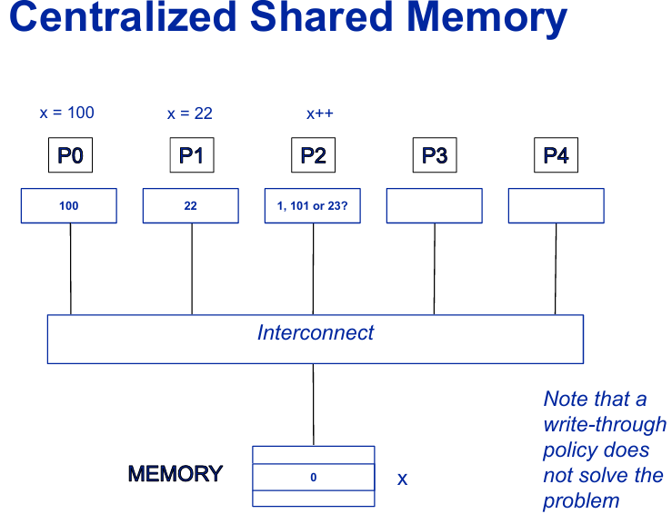

**Cache Coherence Problem**

Shared memory easy without caches

<u>Caches store their own easily get inconsistent</u>

## Cache Coherence Definition

A memory system is coherent if

- **Read what is written**: A read of X on P1 returns the last value P1 wrote to X <u>if no other preceossor has written to x in between</u>.

- **Coherent writes happen eventually**: If P1 writes to X and P2 reads X *after a sufficient time*, and there are no other writes to X in between, <u>then P2's read returns value written by P1</u>

- **Causality of writes preserved**: Writes to X are <u>seen in the same order by all Ps</u>

## Schemes for Cache Coherence

Shared Caches

- Trivially enforces coherence

- Not scalable: must be the only level of caching

Directory-based

Snooping

## System view for Snoopy Coherence

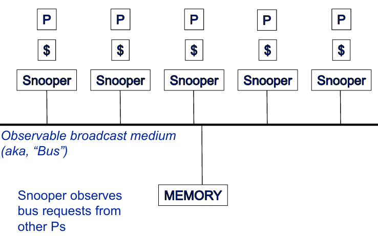

### MSI Snoopy Protocol

State of block B in cache can be:

- **Invalid**: B is not cached in cache

    - To read or write, must make a request on the bus

    - The valid (*v*) bit for each block

- **Modified**: B is dirty in cache

    - <u>*Cache has the block, no other cache has the block* </u>and <u>*cache must update memory when it displaces B*</u>

    - Can read or write B without going to the bus

    - The dirty (*d*) bit for each block.

- **Shared**: B is clean in cache

    - <u>*Cache has the block, other caches have the block*</u> and <u>*C need not update memory when it replaces B*</u>

    - Can read B without going to bus

    - <u>*To write, must send an upgrade request to the bus*</u>

    - Case where *v = 1, d = 0*

State of block B in cache can be

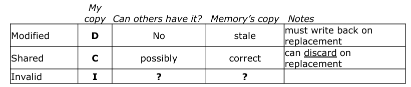

### Bus actions

A P's cache coherence requests can be

1. **GetS**: Read miss, this is a "get with intent to share"

2. **GetM**: This is a "read may modify" meaning after I'm done, the block may be dirty

3. **Wirteback**: Write a block back

Snooper bus actions can be

**Abort**: This is when the snooper needs a requestor to retry their request later.

**Intervene**: This means <u>the snooper will respond to a request instead of the memory</u>.

### Cache to Cache transfers: Abort vs. Intervene

Problem:

- P1 has block B in M state

- P2 wants to read B, sends a GetS on bus

- If P1 does nothing, memory will supply the data to P2

- <u>What does P1 do?</u>

Solution 1: **ABORT and requestor retries**

- **P1 issues an ABORT**, **issues a write back**

- **P2 later retries GetS** and **gets data from memory**

- Too slow (two memory latencies to move data from P1 to P2)

Solution 2: **INTERVENTION**

- **P1 indicates it will supply the data** ("INTERVENE" bus signal)

- <u>Memory sees that, does not supply the data, and waits for PE1's data</u>

- P1 starts sending the data on the bus, memory is udpated

- **P2 snoops the transfer during the write-back and gets the block.**

### MSI state diagram: PE's perspective

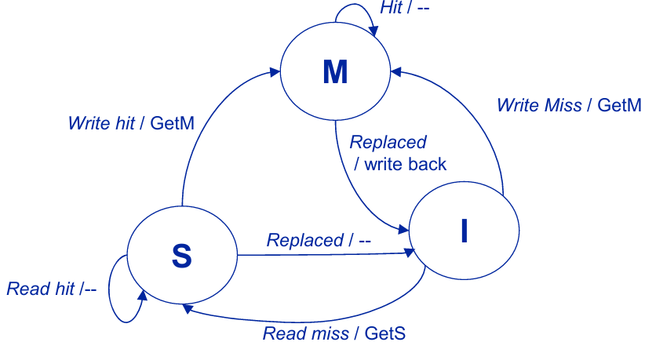

### MSI state diagram: Snooper's perspective

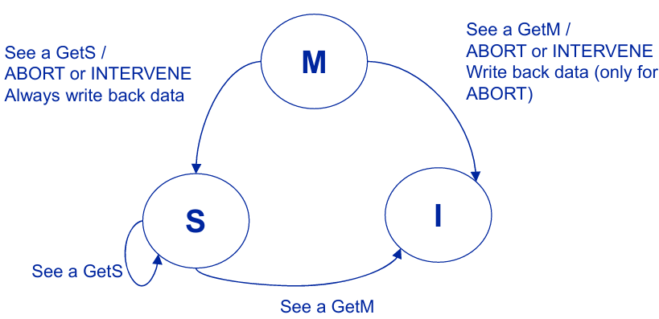

### Example for MSI with ABORT

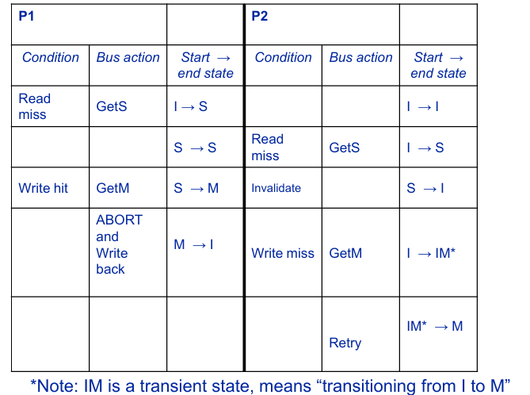

### Example for MSI with INTERVENTION

The last two rows will become one row

|      Condition      |     Bus action      |   Start -> End state  |       Condition       |   Bus action  |   Start -> End state  |
|---------------------|---------------------|-----------------------|-----------------------|---------------|-----------------------|
|  See others P Get M  | Intervention & write back    |  M -> I  | Write Miss | Get M   |   I -> M  |

### Other states: The advantage of an Exclusive state

Situation: P1 makes a GetS request <u>NO ONE ELSE makes a GetS request</u>

Next, P1 wants to modify the data, but no one else has the data so why it still needs cares!

Solution: **Exclusive**(E), A state that means P1 has the only, clean copy besides memory.

Allows P1 to <u>silent upgrade</u> to M.

### Cache-To-Cache Transfers, part 2

**Intervention works if a cache has data in M or E state**

- Nobody else has correct data, so it's clear which P is supposed to respond

- <u>But after 1 transfer, P can no longer supply data (because it transitions to S)</u>

What if a cache has requested data in S state and others have it in S, which should supply the data?

- Solution 1: let memory supply the data (bad solution)

- Solution 2: whoever wins arbitration supplies the data (but interconnect must be a bus)

- Solution 3: **OWNER/FORWARDER**: indicates the P is the <u>transfer agent</u> and supplies data. The difference: **O** is for dirty data, **F** is for clean data.

### How to Detect Other Shares

Needed for **E-state**, **O-state**, or **F-state**

- P1 wants to read B, puts GetS on bus, receives data

- How does P1 know if its B should be in S or E state?

Solution: "HIT" line

- Always O, except when a snooper from another Proc pulls it to 1 (called "hardwired or")

- When, e.g., P2 snoops PE1's request, if P2 has the block in its cache, it pulls "HIT line" to 1

- P1 to S if "HIT" is 1, to E if "HIT" is 0

### The state of things: M, O, E, S, I, F

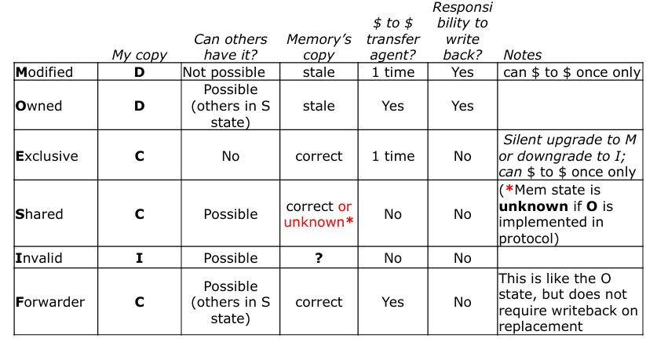

Other notes

- E is good because of the silent upgrade to M

- O, F (and write-update policies) are good if there is a long latency penalty to access memory.

- In MOESIF, **can only get to O from M**, **can only get to F from E**

### Another view

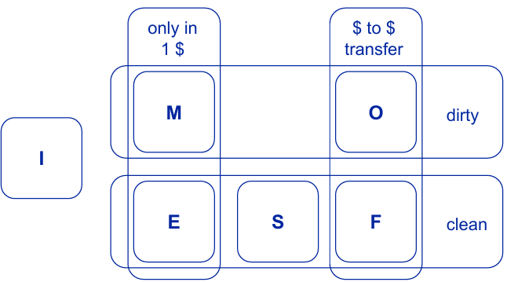

Permission strength for a write-invalidate protocol is:

$$M > E, O > F > S > I$$

or cache is allowed to ...

M: read or write > E: read but silent upgrade on write (tie with) O: dirty but read-only, cache-cache transfer agent > F: read-only, cache-cache transfer agent > S: read only > I: no permissions

### State vs. Protocols

States != Protocols

States are the "destination", protocol defines "how to get there"

A protocol can support some state => state transitions but not others

## Kinds of sharing patterns

**Private**: never shared

**Read-only**: Data never written to, so always in state S (e.g. program constants)

**Migratory**: Modified data moves from core to core, but not shared (e.g., the variable in a critical section)

**Producer/Consumer**: PEx writes the data, PEy reads it, usually repeated many times (special case of migratory)

**Wirte-shared**: Multiple writes by many Ps (as opposed to 1 write by a pacticular P). Example: test and set primitive

**General**: Everything else

### False sharing

Granularity of sharing can cause a problem

- Two variables, x and y are stored in the same block-sized region of memory

- x is read only, y is migratory (i.e., modified by many procs)

- Behavior of x must match y, even though it's read-only

- Causes performance hit for x

- Called "False Sharing"

- Gets worse as block size is increased

- Compulsory, Conflict, Capacity and **Coherence** kinds of misses.

## Directory Based Cache Coherence

The BIG PROBLEM: what if there is no shared broadcast medium (no bus)?

- Can't Snoop

- Can't even guarantee write access ordering (**causality of write**)!

- Solution: **Directory**

### Directory:

1. Keeps track of ALL Ps that have a block-sized region of memory

2. Use messages to maintain coherence

Can be used with ANY network topology

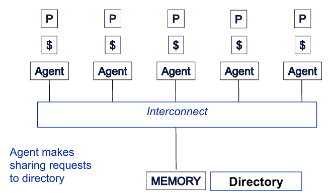

### What is in the directory?

Bit vector for each potential cache block

- Records if block is dirty, and which caches have a copy of the block


**State storage in directories**

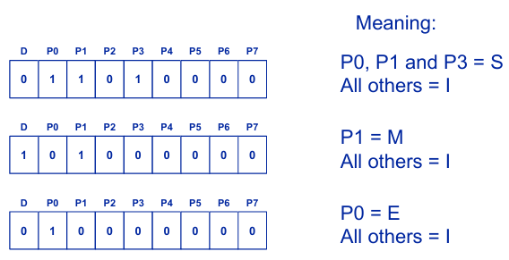

**Example of adding O/F to state**

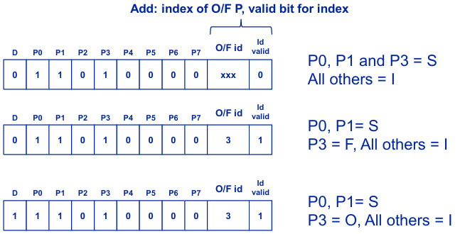

### Messages for MSI for Dir. Coherence

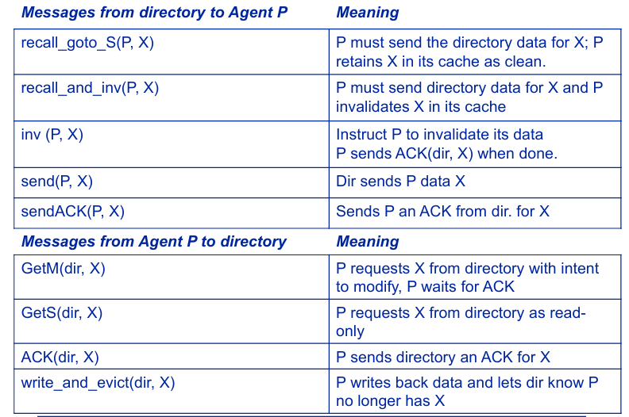

**MSI: GetS(dir, X)  sent from P**

```python
if X.state.dirty:
    Q = find_the_processor_that_has_data_X(X) # Find Q such that has data X, X.state[Q] == 1
    memory[X] = recall_goto_S(Q, X) # Q sends directory data X; Q retains X in its cache as clean (diretory/memory updates data X) 
    send(P, memory[X]) # now directory sends P data X (as we don't have shared broadcast medium, only memory/directory can send data)
    X.state.dirty = 0 # Since we haved stored the latest updated data, mark data X as clean
else:
    send(P, memory[X]) # now directory sends P data X
# No matter X is dirty or not, directory does
X.state[P] = 1 # mark P has the data X
```

**MSI: GetM(dir, X) sent from P**

```python
# Firstly, invalidate all other processors except P
for Q in processors:
    if Q == P or X.state[Q] != 1:
        continue
    # Now Q != P and Q has the data X
    if X.state.dirty:
        recall_and_inv(Q, X) # Q send directory data X, then Q invalidates X in its cache
    else:
        inv(Q, X) # instruct Q to invalidates its data; Q sends directory ACK for X when invalidation is done
        wait_for_ACK(Q, X) # directory wait Q to invalidate its data X
    # No matter X.state.dirty is dirty or not, directory does
    X.state[Q] = 0 # Mark Q has no data X any more

# Now directory should send P data X
if X.state[P]:
    sendACK(P, X) # directory sends P an ACK for X instead of data X
else:
    send(P, Memory[X]) # directory sends P data X
    X.state[P] = 1 # mark P has the data X
# No matter P has data X or not, directory does
X.state.dirty = 1 # Because of GetM, will make X dirty
```
### Key Issues/problems

**Directory becomes the bottleneck**

- Need a distributed directory

**Overhead for state bits**

- Scales with the size of memory and the size of directory (i.e, the number of processors)

$$\text{Directory Size} = (P + \text{stateinfo})\times (\frac{M}{2^B})$$

where $P$ is number of processors, $M$ is size of Memory, and $2^B$ is the block size of the cache

$\text{stateinfo}$ is related to the protocol states (MOESIF)

- $MESI = 1 (\text{dirty bit})$

- $MOESIF = 1 (\text{dirty bit}) + 1 (\text{O/F bit}) + \lceil \log_{2}P \rceil$ (index to store which of P procs has block in O/F plus valid bit for this index)

### Reducing storage overhead

Overhead not too bad for medium-scale multiprocessors

- Example: 30 Prcocs with 4GB of memory and with 64-byte cache blocks and MOESIF protocol -> 4% memory overhead

One way to reduce the storage overhead is to increase blocksize (2^B)

- results in **false sharing**

- increased coherence traffic

Change directory entry to limit sharers (non-"full map" ways)

## Limited Pointer Schemes

Since data is expected to be in only a few caches at any one time, a limited number of pointers per directory entry should suffice

Overflow strategy:

- What happen when the number of sharers exceeds the number of pointers?

Many different schemes based on different overflow stragtegies.

Limited pointers have processor "ids" or "pointers", instead of per-Processor bit vectors.

### Some Examples

**Dir-i-B (Boradcast)**: **i "pointers" (ids)**, **1 invalidate-broadcast bit**

- Beyound i pointers, set the invalidate-broadcast bit ON

- Storage needed per entry

$$\text{storage size} = i \times (\lceil \log_{2}P \rceil + 1) + (1 + 1) + \lceil \log_{2} P \rceil + 1$$

where, $i \times (\lceil \log_{2}P \rceil + 1)$ becauses of $i$ Processors and need a valid per id

$i + 1$ because of 1 bit for dirty bit and 1 bit for invalidate-broadcast bit

$\lceil \log_{2} P \rceil + 1$ becasue of O, F need id plus and a valid bit

**Dir-i-NB (No Broadcast)**

- When sharers exceed i, $randomly$ invalidate one of the existing sharers.

- Significant degradation expected for *widely-shared mostly-read* data

## Coherence write policies

**Write-Update** (broadcast on writes)

- A write to shared data is broadcast so as to update all copies.

- All subsequent reads will return the new written value

- All see the writes in the order of broadcasts One bus == one order seen by all

- Difficult to verify implementation correctness!

**Write-Invalidate** (most common)

- Write to shared data forces invalidation of all other cached copies

- Subsequent reads miss and fetch new value

- Writes ordered by invalidations on the bus

### Write-Update vs. Invalidate

A burst of writes by a processor to one address

- Write-Update: each write causes send of an update

- Write-Invalidate: only the first invalidation may be needed

Writes to different words of a block (false sharing)

- W-Update: update sent for each word

- W-Invalidate: possibly only the first invalidation is needed.

Procedure-consumer sharing pattern

- W-Update: producer sends an update, consumer reads new value from its cache

- W-Invalidate: producer invalidates consumer's compy, consumer's read misses and has to request the block

Which is better depends on application

- But write-invalidate is simpler and implemented in most MP-capable processors today

## Chip Multicore tradeoffs 

### "Last Level Private" caching

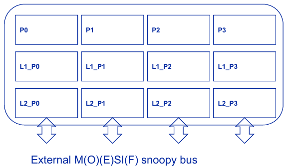

Problems:

- Need high bandwidth off-chip

- L2 caches can have redundant information - not a good use of chip resources

- Only scales as well as any snoopy bus scheme (not well!)

### "Last Level shared" caching

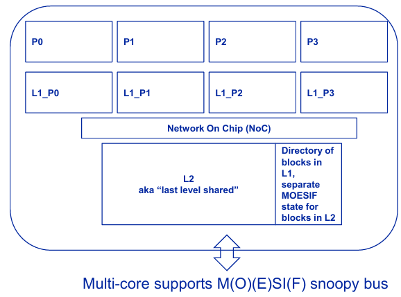

Because existing multi-cores are built as "drop-in" replacements for uni-cores, they must maintain a glueless MP bus protocol

To keep internal caches coherent, use a shared cache directory scheme

Problem: L2 cache becomes a bottleneck

### LLS: Non-Unifrom Cache Access

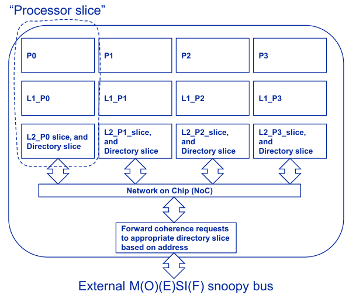

L2 cache is LLS, but it is "sliced" between Ps (and so is the directory)

L1 miss to X sends message to L2 slice in *hash (X, N)* where N is the number of Ps (example, hash is X mod N)

### LLP vs. LLS (Last Level Private)

LLS (Last Level Shared)

- Benefits: only one copy of the data on the chip

- Problems: LLS is either a hotspot, or it's banked (NUCA). In NUCA, L2 hit times can vary widely (data in wrong corner of chip)

LLP (Last Level Private)

- Benefits: No "data in the wrong corner of the chip" problem

- Problems: Multiple copies of data is wastful

### Summary: coherence tool kit

Snooping

- Has limited scalability because requires a bus

Memory based (or shared cache based) directories:

- Reducing overhead using limited pointer

- Still have scaling issues

Likely Hybird: hierarachy of schemems

- Used in today's multicore systems

# Synchronization and Consistency

## The disadvantage of shared memory

Shared memory is a blessing in that it allows parallel, simultaneous access to data by multiple threads

- Not possible in message passing

It's a curse because allowing this means two threads need to coordinate their actions

## Types of synchronization

Generally, there are two general types of coordination that programmers require

**Barries**

- Makes sure all threads are at the same place before proceeding

- Note that not all threads in a program have to "participate" in a given barrier

**Mutex**

- Makes sure only one thread can access a critical region

Turns out they can each use the same underlying infrastructure

## Primitives vs. programming models

Generally, programmers use mutex via an API (e.g., pthreads)

The API itself is implemented using **primitives**

- Either an OS function

- or a hardware feature

But note: the primitives used by a model may themselves be models that use other primitives

No clear/hard/fast definition of which is which

## Mutex synchornization

**getlock(lock)**

- Blocks until "lock" is acquired

- Guarantees all other threads waiting on "lock" must wait

- unlock(lock) lets next thread go

```pseudo
getlock(lock)
// critical section goes here
unlock(lock)
```

### How to implement getlock() --- use test and set (TS)

<u>TS(X) means atomically set location x to a 1</u> and <u>return the prior value stored at x</u>

Using TS to implement getlock/unlock:

```pesudo
getlock(x){
    while (TS(x) == 1)
    ; // a "spinlock"
}
```

unlock(x) { x = 0;}

**Implementing TS with atomic swap**

```pesudo
TS(int x) {
    oldval = SWAP(x, 1); // atomic swap
    return oldval;
}
```

Architecture must provide for an atomic SWAP instruction that swaps memory with a value, returning the prior value of memory

### Problems with TS

When processor P requests the block that holds the lock, it performs a GetM

Each processor is performing GetMs

- Huge amount of either invalidations or cache to cache transfers

But NO ONE is changing the value of the lock! (all overwriting it with a "1")

Better if every processor is performing GetS

### Test-and-Test-and-Set (TTS)

```pesudo
TTS(int x) {
    oldval = x; // the read of x
    if (oldval == 0) oldval = SWAP(x, 1);
    return oldval;
}
```

Use in lock, same as before ...
```pesudo
while (TTS(lock) == 1);
```

Good: All threads are doing GetS instead of GetM

Bad: There is still a rush of invalidations when SWAP does occur (and lock is set to 0)

### Another synch primitive --- LL/SC

**LL = "Load Linked"**

Load linked loads a location and watches the location

```asm
LL R1, addr // means R1 = Mem[add] & link = addr; 'link' is an internal regsiter
```

<u>If $ block for addr is **invalidated**, then link register is set to 0</u>

**SC = "Store Conditional"**

Store conditional **Only updates memory** if the value ("link") hasn't changed, and returns sucees/failure in source register

```ams
SC R1, addr // means if link == addr:
                        Mem[addr] = R1
                        R1 = 1
                     else:
                        R1 = 0
```

Link check is easy to implement

**getlock(x) with LL/SC**

```pesudo
getlock(x)
    do {
        try = 1;
        LL check, X // load link from addr X, set link register to X
        SC try, X // Try to store a 1 if Link == X, else try = 0
    } while (check != 0 || try == 0)
```

### Tree locks (aka tournament locks)

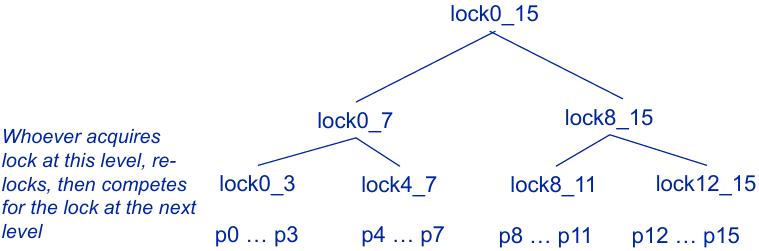

Spinning (GetS) limited to a smaller subset

Invalidations don't flodd the network

### Fetch and Op

New synchronization primitive

Place <u>special purpose hardware</u> at memory unit to do the following atomically

```pesudo
fetchAndOp(x, c){
    x = x op c; // atomic!
    return(x); // example op is '+'
}
```

**Parallel FOR loops using F&A**

```c
#pragrma parallel for
size_t i;
for (i = 0; i < N; i++) {
    A[i] = B[i] * C[i];
}
```

Can be implemented as:

```pesudo
fork(K);    // fork K worker threads
// each thread:
while (iLocal = (fetchAndAdd(i) != N))
    A[iLocal] = B[iLocal] * C[iLocal];
join();
```

## Safe Barrier Synchornization

```c
// On startup, initially
ctr = 0;
toggle = 0;
done = !test;

barrier(int N) {
    if (FetchAndAdd(ctr, 1) < N) {
        temp = test;    // copy it to avoid race condition
        while (done != temp)
        ; // spin waiting to be released
    } else {
        ctr = 0;        // Reset counter
        done = test;    // Release threads
        test != test;   // set up for next time
    }
}
```

### Barrier support in hardware

Use "1-hot" id wires, one for each processor

- e.g. for 4, P0 is 0001, P1 is 0010, P2 is 0100, P3 is 1000

Algorithm:

- Processor arrives at barrier and drives the processor's 1-hot id onto bus

- Spin untill bus shows all 1...1

### An alternative to the madness

Get rid of locks entirely --- Use Transactions

Idea: processor X begins a transaction by checkpointing memory

- It modifies whatever it wants

- When the transaction ends, it checks for any conflicts (i.e, what it read or modified != what is there now)

- If conflict, retry transaction

Can be implemented in software with huge cost

- Helped if the L1 cache can be locked so it does not update main memory until end of transaction, but not enough

Hardware support is an active research area

## Memory Consistency

Coherence is about ordering of parallel accesses to <u>the same address</u>

Consistency is about ordering of parallel accesses <u>between different addresses</u>

### Strict Consistency

The result of any execution should be same as if

1. The accesses executed by each PE were kept in-order (<>no read or write reordering</u>)

2. The accesses between different PEs are ordered by <u>a global time clock</u>

3. The same ordering is seen by all PEs

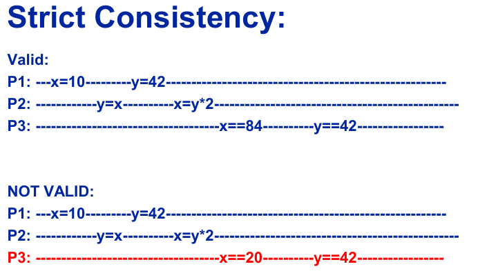

### Sequential Consistency Def.

The result of any execution should be the same as if

1. The accesses executed by each PE were kept in-order (no read or write reordering), and

2. The accesses among different PEs were arbitrarily interleaved

3. <u>The same interleaved order</u> is seen by all PEs

Common example: pthreads on a uniprocessor

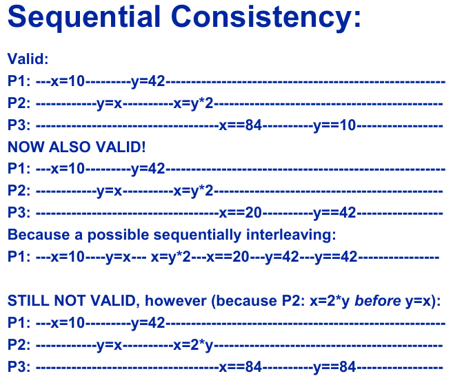

### Sequential Consistency Implementation

A simple implemenatation

- A P waits until all other reads/writes are (from it or all other Ps) are complete

A better implementation

- P reads/writes, but detects and fixes potential violations of sequenctial consistency

### Relaxed Consistency Models

Sort accesses into these categories:

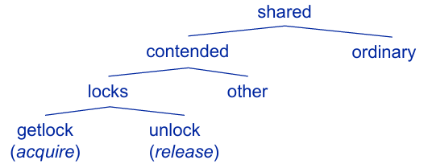

**Four kinds of memory accesses**

Contended vs. ordinary

- Contended: the var is being written by multiple PEs,

- Ordinary: read only

Under 'contended': locks vs. other non-lock vars

Under 'locks': getlock (lock acquire) vs. unlock (lock release)

### Relaxed Consistency Models

**Data Races**

When data accesses to same variable in different PEs are not protected by locks

Most well-written programs are data-race-free via mutex, barrier

**Kinds of relaxed consistency**

Weak Consistency, Release Consistency, Processor Consistency, Lazy Release Consistency, Scope

When there are data races, the more relaxed the model, the weirder the program behavior

### Fences

**Store fence**: All stores before fence complete before fence itself executes

- Means all other Ps see this P's stores

**Load fence**: All loads after fence wait to issue until fence completes

- Means this P sees the stores from other Ps

**Mem fence**: combination of both

### Weak Consistency

1. Accesses to locks (getlock or unlock) are sequentially consistent (i.e. they are global ordered)

2. All accesses in the whole system must complete before a lock access (i.e, P's do mem fence before getlock or unlock)

3. getlock and unlock take time: No shared data access(read or write) by any P are allowed until all **pending synchronization accesses have completed (i.e, the lock is acquired or released)**

**Advantages and disadvantages**

Good is:

- Hardware can reorder anything between getlock .. unlock: Don't have to broadcast changes at all until the synchronziation accesses take place

- This reduces the amount of communication needed

Why is it bad?

- All global reads/writes before a getlock or unlock must update every P

But we only "care" about accesses that are "guarded" by synchronization (i.e, the critical section variables)

