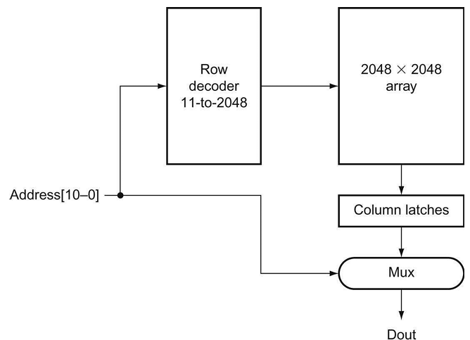
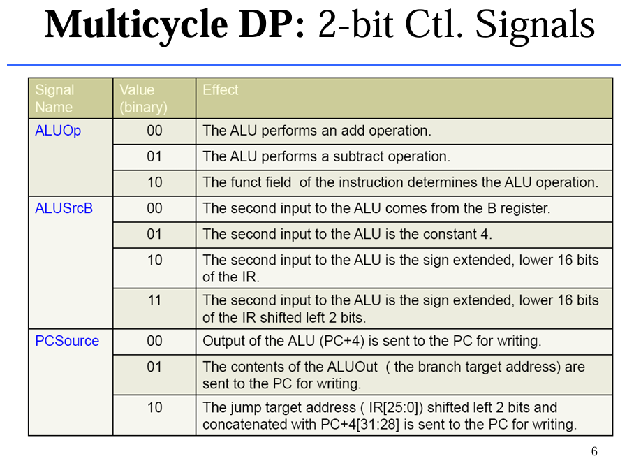

# Basics of Logic Design

## Constructing A Basic Arithmetic Logic Unit

### Fully Adder

$$\text{Carryout} = (\text{a} \cdot \text{CarryIn}) + (\text{b} \cdot \text{CarryIn}) + (\text{a} \cdot \text{b})$$

$$\text{Sum = a ⊕ b ⊕ c} = \bar{\text{a}} \cdot \bar{\text{b}} \cdot \text{CarryIn} + \bar{\text{a}} \cdot \text{b} \cdot \bar{\text{CarryIn}} + \text{a} \cdot \bar{\text{b}} \cdot \bar{\text{CarryIn}} + \text{a} \cdot \text{b} \cdot \text{CarryIn}$$

### ALU that performs AND, OR, addition, subtraction


- By **selecting $\bar{b}$ (Binvert=1)** and **setting CarryIn to 1** in *the least significant bit of the ALU*, we get two's complement substraction of b from a instead of addition of b to a.

- $$\text{a} + \bar{\text{b}} + 1 = \text{a} + (\bar{\text{b}} + 1) = \text{a} + (-\text{b}) = \text{a} - \text{b}$$

### ALU that performs NOR, NAND


- By selecting $\bar{\text{a}}$ (Ainvert=1) and $\bar{\text{b}}$ (Binvert=1), we get a NOR b instead of a AND b.

$$\bar{\text{a} + \text{b}} = \bar{\text{a}} \cdot \bar{\text{b}}$$

$$\bar{\text{a} \cdot \text{b}} = \bar{\text{a}} + \bar{\text{b}}$$

### SLT (set less than)

Operation produces 1 if rs1 < rs2, and 0 otherwise

`slt` will set all but the least significant bit to 0, with the least significant bit set according to the comparison.

We call the new input *Less* and use it only for `slt`


- 1-bit ALU that performs AND, OR, and addition on a and b or /b

- It includes a direct input that is connected to perform the set on less than operation


- 1-bit ALU for the most significant bit

- It has a direct output from the adder for the less than comparison called **Set**

What happens if we substract b from a? If the difference is negative, then $\text{a} < \text{b}$ since

$$(\text{a} - \text{b}) < 0 => ((a - b) + b) < (0 + b) => a < b$$

A 1 if $\text{a} - \text{b}$ is negative and a 0 if it's positive.

- This desired result corresponds exactly to the **sign bit values**

- 1 means neagtive and 0 means positive

**Connct the sign bit from the adder output to the least significant bit** to get set less than.

- This works under the circumstance where the substraction does not overflow


- The less inputs are connected to 0 except for the least significant bit, which is connect to the *Set* output of the most significant bit

Everytime we want the ALU to substract, we set both **CarryIn** and **Binvert** to 1.

- For adds or logical operations, we want both control lines to be 0.

- We can therefore simplify control of the ALU by combining the CarryIn and Binvert to a single control line called **Bnegate**

### BEQ (Branch if Equal)

$$(\text{a} - \text{b} = 0) => a = b$$

The simplest way is to **OR all the outputs together** and then **send that signal through an invertor**.

$$\text{zero} = \bar{\text{Result63} + \text{Result62} + ... + \text{Result2} + \text{Result1} + \text{Result0}}$$


- This adds a Zero detector

### The values of Control lines


- The values of the three ALU control lines, *Ainvert*, *Bnegative*, *Operation (2-bit)*

### The symbol commonly used to represent an ALU


## Faster Addition: Carry Lookhead

The key to speeding up addition is **determining the carry in to the high-order bits sooner**.

There are a variety of schemes to anitcipate the carry so that the worset-case scenario is a function of the $\log2$ of the number of bits in the adder

- These anticpatory signals are faster becasue they go through fewer gates in sequence, but it takes many more gates to anticipate the proper carry.

### Fast Carry Using "Infinite" Hardware

Abbreviation $\text{c}i$ represents $\text{CarryIn}i$:

$$\text{c2} = (\text{b1} \cdot \text{c1}) + (\text{a1} \cdot \text{c1}) + (\text{a1} \cdot \text{b1})$$

$$\text{c1} = (\text{b0} \cdot \text{c0}) + (\text{a0} \cdot \text{c0}) + (\text{a0} \cdot \text{b0})$$

Substituting the definition of $\text{c1}$

$$\text{c2} = (\text{a1} \cdot \text{a0} \cdot \text{b0}) + (\text{a1} \cdot \text{a0} \cdot \text{c0}) + (\text{a1} \cdot \text{b0} \cdot \text{c0}) + (\text{b1} \cdot \text{a0} \cdot \text{b0}) + (\text{b1} \cdot \text{a0} \cdot \text{c0}) + (\text{b1} \cdot \text{b0} \cdot \text{c0}) + (\text{a1} \cdot \text{b1})$$

You can imagine how the equation expands as we get to higher bits in the adder

- it grows rapidly with the number of bits. 

This complexity is reflected in the cost of the hardware for fast carry, making this simple scheme prohibitively expensive for wideadders.


### Fast Carry Using the First Level of Abstraction: Propagate and Generate

**Carry-Lookhead adder** relies on levels of abstraction in its implementation

$$\text{C}_{i+1} = (\text{b}_i \cdot \text{c}_i) + (\text{a}_i \cdot \text{c}_i) + (\text{a}_i \cdot \text{b}_i)$$

$$= (\text{a}_i \cdot \text{b}_i) + (\text{a}_i + \text{b}_i) \cdot \text{c}_i$$

If we were to rewrite the equation for c2 using this formula, we would see more repeated patterns:

$$\text{c2} = (\text{a1} \cdot \text{b1}) + (\text{a1} + \text{b1}) \cdot \text{c1}$$

$$= (\text{a1} \cdot \text{b1}) + (\text{a1} + \text{b1}) \cdot ((\text{a0} \cdot \text{b0}) + (\text{a0} + \text{b0}) \cdot \text{c0})$$

#### Generate (gi) and propagate (pi)

$$\text{g}_i = \text{a}_i \cdot \text{b}_i$$

$$\text{p}_i = \text{a}_i + \text{b}_i$$

Then,

$$\text{c}_{i+1} = \text{g}_i + \text{p}_i \cdot \text{c}_i$$

#### Case Illustration

Suppose $\text{g}_i$ is 1.

$$\text{C}_{i+1} = \text{g}_i + \text{p}_i \cdot \text{c}_i = 1 + \text{p}_i \cdot \text{c}_i = 1$$

Now, suppose $\text{g}_i$ is 0 and $\text{p}_i$ is 1.

$$\text{C}_{i+1} = \text{g}_i + \text{p}_i \cdot \text{c}_i = 0 + 1 \cdot \text{c}_i = \text{c}_i$$

***$\text{CarryIn}_{i+1}$ is a 1 if either $\text{g}_i$ is 1 or both $\text{p}_i$ is 1 and $\text{CarryIn}_i$ is 1***

We can express the CarryIn signals more economically

$$\text{c1} = \text{g0} + (\text{p0} \cdot \text{c0})$$

$$\text{c2} = \text{g1} + (\text{p1} \cdot \text{g0}) + (\text{p1} \cdot \text{p0} \cdot \text{c0})$$

$$\text{c3} = \text{g2} + (\text{p2} \cdot \text{g1}) + (\text{p2} \cdot \text{p1} \cdot \text{g0}) + (\text{p2} \cdot \text{p1} \cdot \text{p0} \cdot \text{c0})$$

$$\text{c4} = \text{g3} + (\text{p3} \cdot \text{g2}) + (\text{p3} \cdot \text{p2} \cdot \text{g1}) + (\text{p3} \cdot \text{p2} \cdot \text{p1} \cdot \text{g0}) + (\text{p3} \cdot \text{p2} \cdot \text{p1} \cdot \text{p0} \cdot \text{c0})$$

These equations just represent common sense: **CarryIni is a 1 if some earlier adder generates a carry and all intermediary adders propagate a carry**

### Fast Carry Using the Second Level of Abstraction

To perform carry lookahead for **4-bit adders**, we need to propagate and generate signals at this higher level.

$$\text{P0} = \text{p3} \cdot \text{p2} \cdot \text{p1} \cdot \text{p0}$$

$$\text{P1} = \text{p7} \cdot \text{p6} \cdot \text{p5} \cdot \text{p4}$$

$$\text{P2} = \text{p11} \cdot \text{p10} \cdot \text{p9} \cdot \text{p8}$$

$$\text{P3} = \text{p15} \cdot \text{p14} \cdot \text{p13} \cdot \text{p12}$$

That is, **the “super” propagate** signal for the 4-bit abstraction (Pi) is true only if each of the bits in the group will propagate a carry.

$$\text{G0} = \text{g3} + (\text{p3} \cdot \text{g2}) + (\text{p3} \cdot \text{p2} \cdot \text{g1}) + (\text{p3} \cdot \text{p2} \cdot \text{p1} \cdot \text{g0})$$

$$\text{G1} = \text{g7} + (\text{p7} \cdot \text{g6}) + (\text{p7} \cdot \text{p6} \cdot \text{g5}) + (\text{p7} \cdot \text{p6} \cdot \text{p5} \cdot \text{g4})$$

$$\text{G2} = \text{g11} + (\text{p11} \cdot \text{g10}) + (\text{p11} \cdot \text{p10} \cdot \text{g9}) + (\text{p11} \cdot \text{p10} \cdot \text{p9} \cdot \text{g8})$$

$$\text{G3} = \text{g15} + (\text{p15} \cdot \text{g14}) + (\text{p15} \cdot \text{p14} \cdot \text{g13}) + (\text{p15} \cdot \text{p14} \cdot \text{p13} \cdot \text{g12})$$

For **the “super” generate signal** (Gi), we care only if there is a carry out of the most significant bit of the 4-bit group.

- if generate is true for that most significant bit

- it also occurs if an earlier generate is true *and* all the intermediate propagates, including that of the most significant bit, are also true

$$\text{C1} = \text{G0} + (\text{P0} \cdot \text{c0})$$

$$\text{C2} = \text{G1} + (\text{P1} \cdot \text{G0}) + (\text{P1} \cdot \text{P0} \cdot \text{c0})$$

$$\text{C3} = \text{G2} + (\text{P2} \cdot \text{G1}) + (\text{P2} \cdot \text{P1} \cdot \text{G0}) + (\text{P2} \cdot \text{P1} \cdot \text{P0} \cdot \text{c0})$$

$$\text{C4} = \text{G3} + (\text{P3} \cdot \text{G2}) + (\text{P3} \cdot \text{P2} \cdot \text{G1}) + (\text{P3} \cdot \text{P2} \cdot \text{P1} \cdot \text{G0}) + (\text{P3} \cdot \text{P2} \cdot \text{P1} \cdot \text{P0} \cdot \text{c0})$$

Then the equations at this higher level of abstraction for the carry in for each 4-bit group of the 16-bit adder (C1, C2, C3, C4) are very similar to the carry out equations for each bit of the 4-bit adder (c1, c2, c3, c4)

**Four 4-bit ALUs using carry lookahead to form a 16-bit adder**


- The carries (C1, C2, C3, C4) come from the carry-lookahead unit, not from the 4-bit ALUs

#### Example 1

$$\text{a}: \text{0001 1010 0011 0011}_\text{two}$$

$$\text{b}: \text{1110 0101 1110 1011}_\text{two}$$

The corresponding generation ($\text{g} = \text{a} \cdot \text{b}$) and propogation ($\text{p} = \text{a} + \text{b}$) is

$$\text{g}i: \text{0000 0000 0010 0011}$$

$$\text{p}i: \text{1111 1111 1111 1011}$$

The "super" propogates ($\text{P3, P2, P1, P0}$) are simply the AND of the lower-level propagates:

$$\text{P0} = \text{p3} \cdot \text{p2} \cdot \text{p1} \cdot \text{p0} = 1 \cdot 0 \cdot 1 \cdot 1 = 0$$

$$\text{P1} = \text{p7} \cdot \text{p6} \cdot \text{p5} \cdot \text{p4} = 1 \cdot 1 \cdot 1 \cdot 1 = 1$$

$$\text{P2} = \text{p11} \cdot \text{p10} \cdot \text{p9} \cdot \text{p8} = 1 \cdot 1 \cdot 1 \cdot 1 = 1$$

$$\text{P3} = \text{p15} \cdot \text{p14} \cdot \text{p13} \cdot \text{p12} = 1 \cdot 1 \cdot 1 \cdot 1 = 1$$

The "super" generates ($\text{G0, G1, G2, G3}$) are more complex, so use the following equations:

$$\text{G0} = \text{g3} + (\text{p3} \cdot \text{g2}) + (\text{p3} \cdot \text{p2} \cdot \text{g1}) + (\text{p3} \cdot \text{p2} \cdot \text{p1} \cdot \text{g0}) = 0 + (1 \cdot 0) + (1 \cdot 0 \cdot 1) + (1 \cdot 0 \cdot 1 \cdot 1) = 0 + 0 + 0 + 0 = 0$$

$$\text{G1} = \text{g7} + (\text{p7} \cdot \text{g6}) + (\text{p7} \cdot \text{p6} \cdot \text{g5}) + (\text{p7} \cdot \text{p6} \cdot \text{p5} \cdot \text{g4}) = 0 + (1 \cdot 0) + (1 \cdot 1 \cdot 1) + (1 \cdot 1 \cdot 1 \cdot 0) = 0 + 0 + 1 + 0 = 1$$

$$\text{G2} = \text{g11} + (\text{p11} \cdot \text{g10}) + (\text{p11} \cdot \text{p10} \cdot \text{g9}) + (\text{p11} \cdot \text{p10} \cdot \text{p9} \cdot \text{g8}) = 0 + (1 \cdot 0) + (1 \cdot 1 \cdot 0) + (1 \cdot 1 \cdot 1 \cdot 0) = 0 + 0 + 0 + 0 = 0$$

$$\text{G3} = \text{g15} + (\text{p15} \cdot \text{g14}) + (\text{p15} \cdot \text{p14} \cdot \text{g13}) + (\text{p15} \cdot \text{p14} \cdot \text{p13} \cdot \text{g12}) = 0 + (1 \cdot 0) + (1 \cdot 1 \cdot 0) + (1 \cdot 1 \cdot 1 \cdot 0) = 0 + 0 + 0 + 0 = 0$$

Finally, Carryout15 is

$$\text{C4} = \text{G3} + (\text{P3} \cdot \text{G2}) + (\text{P3} \cdot \text{P2} \cdot \text{G1}) + (\text{P3} \cdot \text{P2} \cdot \text{P1} \cdot \text{G0}) + (\text{P3} \cdot \text{P2} \cdot \text{P1} \cdot \text{P0} \cdot \text{c0}) = 0 + (1 \cdot 0) + (1 \cdot 1 \cdot 1) + (1 \cdot 1 \cdot 1 \cdot 0) + (1 \cdot 1 \cdot 1 \cdot 0 \cdot 0) = 0 + 0 + 1 + 0 + 0 = 1$$

#### Example 2

For the Ripple-carry adder, a single carry bit is calcualted by $\text{c}_{i+1} = \text{a}_i \cdot \text{b}_i + \text{a}_i \cdot \text{b}_i + \text{b}_i \cdot \text{c}_i$, and it needs **two gate delays** (one AND and one OR) to get next carry. 

- So the number of gate delays between a carry in to the least significant bit and the carry out of the most significant for the 32-bit ripple-carry adder will be $16 \times 2 = 32$

Four 4-bit ALUs using carry lookahead, the carry out of the most significant bit is just C4.

- The $\text{p}$ and $\text{g}$ cost one gate delay. ($\text{g} = \text{a} \cdot \text{b}$, one AND gate delay; $\text{p} = \text{a} + \text{b}$ , one OR gate delay)

- The $\text{P}$ cost 2 gate delays. ($\text{P} = \text{p} \cdot \text{p}$, another one AND gate delay)

- The $\text{G}$ cost 3 gate delays. ($\text{G} = \text{g} + (\text{p} \cdot \text{g})$, another two OR and AND gate delays)

- The final $\text{C}$ cost 5 gate delays. ($\text{C} = \text{G} + (\text{P} \cdot \text{G})$, another two OR and AND gate delays)

- The formula is $1 + 2 + 2 = 5$

Hence, for the path from carry in to carry out, the 16-bit addition by a carry-lookahead adder is six times faster, using this very simple estimate of hardware speed.

If using the 4-bit ALU to calculate 32 addition (8 4-bit ALU needs), then the gate delays will be $1 + 2 + 2 + 2 = 7$

- Using divided-level methods

- 8 4-bit block for P, G (2 gate delays)

- 2 16-bit block for P, G (2 gate delays)

- 1 global block for Carry (2 gate delays)

- local calculation for p, g (1 gate delay)

## Clocks

Clocks are needed in sequential logic to decide when an element that contains state should be updated.

A clock is simply a free-running signal with a fixed **cycle time**

- The clock frequency is simply the inverse of the cycle time

**Edge-triggered clocking**

- A clocking scheme in which all state changes occur on a clock edge

**Clocking medthodology**

- The approach used to determine when data are valid and stable relative to the clock

In an edge-triggered methodology, either the rising edge or the falling edge of the clock is active and causes state changes to occur.

The clock edge acts as a sampling signal, causing the value of the data input to a state element to be sampled and stored in the state element.

- Using an edge trigger means that the sampling process is essentially instantaneous, eliminating problems that could occur if signals were sampled at slightly different times.

### Synchronous system

The signals that are written into state elements must be valid when the active clock edge occurs.

A signal is valid if it is stable (i.e., not changing), and the value will not change again until the inputs change.

- Since combinational circuits cannot have feedback, if the inputs to a combinational logic unit are not changed, the outputs will eventually become valid.

**Example**


To ensure that the values written into the state elements on the active clock edge are valid, the clock must **have a long enough period so that all the signals in the combinational logic block stabilize**, and then the clock edge samples those values for storage in the state elements.

- This constraint sets a lower bound on the length of the clock period, which must be long enough for all state element inputs to be valid

Some state elements will be written on every clock edge, while others will be written only under certain conditions (such as a register being updated)

- In such cases, we will have an explicit write signal for that state element.

- The write signal must still be gated with the clock so that the update occurs only one the edge if the write signal is active

One other advantage of an edge-triggered methodology is that it is possible to have a state element taht is used as both an input and output to the same combinational logic block.


- Consider the case where the amount of combinational logic before and after a state element is small enough so that each could operate in one-half clock cycle, rather than the more usual full edge clock cycle.

- Then the state element can be written on the clock edge corresponding to a half clock cycle, since the inputs and outputs will both be usable after one-half clock cycle.

- One common place where this technique is used is **Register Files**, where simply reading or writing the register file can often be done in half the normal clock cycle.

**Register File**

- A state element that consists of a set of registers that can be read and written by supplying a register number to be accessed.

## Memory Elements: Flip-Flops, Latches

All memory elements store state: **the output from any memory element depends both on the inputs** and **on the value that has been stored inside the memory element**

Thus all logic blocks containing a memory element contain state and are sequential

### Flip-Flop and Latches

**Same**

- In both flip-flops and latches, the output is equal to the value of the stored state inside the element.

- Unlike the S-R latch (**unclocked**) described above, all the latches and flip-flops we will use from this point on are clocked, which means that they have a clock input and the change of state is triggered by that clock.

**Difference**

- In a clocked latch, the state is changed whenever the appropriate inputs change and the clock is asserted.

- In a flip-flop, the state is changed only on a clock edge.

**D latch**

- A D latch has two inputs and two outputs. The inputs are the data value to be stored (called *D*) and a clock signal (called *C*) that indicates when the latch should read the value on the D input and store it.

- The outputs are simply the value of the internal state (Q) and its complement ($\bar{Q}$).

- When the clock input C is asserted, the latch is said to be *open*, and the value of the output (Q) becomes the value of the input D.

- When the clock input C is deasserted, the latch is said to be closed, and the value of the output (Q) is whatever value was stored the last time the latch was open.

- It sometimes called a *transparent latch*


- A NOR gate acts as an inverter if the other input is 0.

- Thus, the cross-coupled pair of NOR gates acts to store the state value unless the clock input, C, is asserted in which cases the value of input D replaces the value of Q and is stored.

- The value of input D must be stable when the clock signal C changes from asserted to deasserted.


- When the clock, C, is asserted, the latch is open and the Q output immediately assumes the value of the D input.

**D Flip-flop**

- A flip-flop with one data input that stores the value of that input signal in the internal memory when the clock edge occurs.

- Flip-flops are not *transparent*: their outputs change *only* on the clock edge


- This a D flip-flop with a falling-edge trigger

- The first latch, called the *master*, is open and follows the input D when the clock input, C, is asserted.

- When the clock input, C, falls, the first latch is closed, but the second called the *slave*, is open and gets it input from the output of the master latch


- When the clock input (C) changes from asserted to deasserted, the Q output stores the value of the D input

- In a clocked latch, the stored value and output, Q, both change whenever C is high, as opposed to only when C transitions.

### Setup Time and Hold Time

- Because the D input is sampled on the clock edge, it must **be valid for a period of time immediately before** and **immediately after the clock edge**.

- The minimum time that the input must be valid before the clock edge is called the **setup time**

- The minimum time during which it must be valid after the clock edge is called the **hold time**

- Thus the inputs to any flip-flop (or anything built using flip-flops) must be valid during a window that begins at time $t_{setup}$ before the clock edge

- and ends at $t_{hold}$ after the clock edge.


- The input must be stable for a period of time before the clock edge, as well as after the clock edge

- Failure to meet the $t_{setup}$ and $t_{hold}$ requirements can result in a situation where the output of the flop-flop may not be predictable.

- Hold times are usually very small compared to setup time

### Register Files

A register file can be implemented with **a decoder for each read or write port** and **an array of regsiters built from D flip-flops**.


- The control input is Write

Because **reading a register does not change any state**, we need only **supply a register number as an input**, and **the only outpu will be the data contained in that register**.


- The register read number signal is used as the multiplexor selector signal.

For writing a register we will need three inputs: **a register number**, **the data to write**, **a clock that controls the writing into the register**

We can do writing by using a decoder to generate a signal that can be used to determine which regsiter to write.


- All three inputs (the register number, the data, and the write signal) will have setup and hold-time constraints that ensure that the correct data are written into the register file.

If the same regsiter is read and written during a clock cycle

- you can implement **RAW-bypass** in the WB/Reg outside the Register File

- or implement an explicit comparison using **comparator** to detect whether the same register is read and written and **multiplexor** to control the output data inside the Register File

- or sequential tricky **half-clock cycling** to make writing data at the rising edge and read data at the falling edge

## Memory Elements: SRAMs and DRAMs

### SRAMs

SRAMs are simply integrated circuits that are memory arrays with (usually) a single access port that can provide either a read or a wirte.

An SRAM chip has a specific configuration in terms of the number of addresable locations, as well as the width of each addressable location.

- For example, a 4Mx8 SRAM provides 4M entries, each of which is 8 bits wide

- Thus it will have 22 address lines (since $4\text{M} = 2^{22}$), an 8-bit data output line, and an 8-bit single data input line.

As with ROMs, the number of addressable locations is often called the **height**, with the number of bits per unit called the **width**

For a variety of technical reasons, **the newest and fastest SRAMs are typically available in narrow configuration**: x1 and x4


- 1K = $2^{10}$, 1M = $2^{20}$

- 2M = $2^{21}$, so there are 21 address lines

- 16 data inputs and 16 data outputs

Three control lines: **Chip select**, **Output enable**, **Write enable**

- To initiate a read or write access, the Chip select signal must be made active. 

- For reads, we must also activate the Output enable signal that controls whether or not the datum selected by the address is actually driven on the pins.

    - The Output enable is useful for **connecting multiple memories (Memory Banks) to a single-output bus** and **using Output enable to determine which memory drives the bus**.

    - The **SRAM read access time** (RAT) is usually specified as the delay from the time that Output enable is true and the address lines are valid until the time that the data are on the output lines.

- For writes, we must supply the data to be written and the address, as well as signals to cause the write to occur

    - When both the Write enable and Chip select are true, the data on the data input lines are written into the cell specified by the address. 
    
    - There are **setup-time** and **hold-time requirements** for **the address** and **data lines**, just as there were for D flip-flops and latches.

    - The **Write enable signal is not a clock edge but a pulse with a minimum width requirement**.

    - The time to complete a write is specified by *the combination of the setup times, the hold times, and the Write enable pulse width*.

#### Three-state buffer (Tristate buffer)

For large SRAMs, rather than use a giant multiplexor, large memories are implemented with a shared output line, called a **bit line**

- which multiple memory cells in the memory array can assert.

To allow **multiple sources to drive a single line**, a *three-state buffer* (or *tristate buffer*) is used.

A three-state buffer has two inputs: **A data signal** and **An Output enable** and a single output

- which has in one of three states: **asserted**, **deasserted**, or **high impedance**

The output of a tristate buffer is equal to the data input signal, either asserted or deasserted, if the Output enable is asserted

and if Output enable is deasserted, the output of a tristate buffer in a **high-impedence state** that allows another three-state buffer whose Output enable is asserted to determine the value of a shared output.


- **Only one of the four Select inputs can be asserted**

- A three-state buffer with a deasserted Output enable has a high-impedance output that allows a three-state buffer whose Output enable is asserted to dirve the shared output line.

The use of **a set of distributed three-state buffers** is a more efficient implementation than **a large centralized multiplexor**

The three-state buffers are incorporated into the flip-flops that form the basic cells of the SRAM.


- The activated cells use a three-state output connected to the vertical bit lines that supply the requested data

- The address that selects the cell is sent on one of a set of horizontal address lines, called **word lines**

- For simplicity, the Output enable and Chip select signals have been omitted, but they could easily be added with a few AND gates.

#### Multiple-step decode

With the utility of tristate buffer, we elinates the need for an enormous multiplexor.

It still requires a very large decoder and a correspondingly large number of word lines.

To circumvent this problem, **large memories are organized as rectangular arays** and **use a two-step decoding process**


- Typical organization of a 4Mx8 SRAM as an array of 4Kx1024 arrays

- The first decoder generates the addresses for eight 4Kx1024 arrays (weight becomes bit lines)

    - This is actually **row decoder** (12 bit -> 4096 rows) for eight bit lines simultanenously

- Then a set of multiplexors is used to select 1 bit from each 1024-bit-wide array

    - This is actually **column decoder** (10 bit -> 1024 columns) for eight bit lines simultaneously

- This is a much easier design than a single-level decode that would need either an enormous decoder or a gigantic multiplexor.

- In practice, a modern SRAM of this size would probabaly use an even larger number of blocks, each somewhat samller.

### Synchronous RAM

Traditional RAM read is aysnchronous, as it doesn't need clock to synchronize the output, and works like ROM.

Recently we have seen the development of both **synchronous SRAMs (SSRAMs)** and **synchronous DRAMs (SDRAMs)**. 

The key capability provided by synchronous RAMs is the ability to **transfer a burst of data** from **a series of sequential addresses** within an array or row.

The **burst** is defined by **a starting address**, **supplied in the usual fashion**, and **a burst length**.

The speed advantage of synchronous RAMs comes from the ability to transfer the bits in the burst **without having to specify additional address bits**.

Instead, **a clock is used to transfer the successive bits in the burst**.

- The elimination of the need to specify the address for the transfers within the burst significantly improves the rate for transferring the block of data

### DRAM

In a static RAM (SRAM), the value stored in a cell is kept on a pair of inverting gates, and as long as power is applied, the value can be kept indefinitely.

In a dynamic RAM (DRAM), the value can be kept in a cell is stored as a charge in a capacitor. A single transistor is then used to access this stored charge, either to read the value or to overwrite the charge stored there.

To refresh the cell, we merely read its contents and write it back.

DRAMs also use a **two-level decoding** structure, and this allows us to refresh an entire row (which shares a word line) with *a read cycle* *followed immediately by a write cycle*

Typically, refresh operations consume 1% to 2% of the active cycles of the DRAM, leaving the remaining 98% to 99% of the cycles available for reading and writing data.

#### How does a DRAM read and write the signal stored in a cell

The transistor inside the cell is a *switch*, called a **pass transistor**, that allows the value stored on the capacitor to be accessed for either reading or writing.

The pass transistro acts like a switch: when the signal on the word line is asserted, the switch is closed, connecting the capacitor to the bit line.


If the operation is a write, then the value to be written is placed on the bit line.

- If the value is a 1, the capacitor will be charged.

- If the value is a 0, then the capacitor will be discharged.

Reading is slightly more complex, since the **DRAM must detect a very small charge stored in the capacitor**

- Before activating the word line for a read, the bit line is charged to the voltage that is halfway between the low and high voltage.

- Then, by activating the word line, the charge on the capacitor is read out onto the bit line.

- This causes the bit line to move slightly toward the high or low direction, and *this change is detected with a sense amplifier*, which can detect small changes in voltage.

#### DRAM two-level decoding structure

DRAMs use a two-level decoder consisting of a *row access* followed by a *column access*.

The row access chooses one of a number of rows and activates the corresponding word line. The contents of all the columns in the active row are then stored in **a set of latches**. The column access then selects the data from the column latches. 

To save pins and reduce the package cost, the same address lines are used for both the row and column address; a pair of signals called **RAS (Row Access Strobe)** and **CAS (Column Access Strobe)** are used to signal the DRAM that either a row or column address is being supplied.

Refresh is performed by **simply reading the columns into the column latches and then writing the same values back**. Thus, an entire row is refreshed in one cycle. 



- The row access uses 11 bits to select a row, which is then latched in 2048 1-bit latches

- A multiplexor chooses the output bit from these 2048 latches.

- The RAS and CAS signals control whether the address lines are sent to the row decoder or column multiplexor.

64Mx4 DRAM(64M = $2^{26}$) actually accesses 8K(8K = $2^{13}$) bits on every row access and then throws away all but four of those during a column access (4 bit lines).

Nowadays, the address inputs were clocked, leading to the dominant form of DRAM in use today: synchronous DRAM or SDRAM.

- SDRAM have been the memory chip of choice for most cache-based main memory systems

- SRAMs provide fast access to a series of bits within a row by sequentially transferring all the bits in a burst under the control of a clock signal.

- DDRRAMs (Double Data Rate RAMs) can transfer data on both the rising and falling edge of an externally supplied clock.

### Error Correction

One simple code that is heavily used is a **parity code**.

- In a parity code the number of 1s in a word is counted; the word has **odd parity** if the number of 1s is odd and even otherwise.

- When a word is written into memory, the parity bit is also written (1 for odd, 0 for even). Then, when the word is read out, the parity bit is read and checked.

- If the parity of the memory word and the stored parity bit do not match, an error has occurred.

- An extra bit is attached to the word and is made either 0 or 1 so that the total number of 1 in that word is always even (even parity).


A **1-bit parity scheme**(**Error detection Code**) can detect at most 1 bit of error in a data item and allow correction of an error.

A parity code cannot tell which bit in a data item is in error.

For large main memories, many systems use a code that allows the detection of up to 2 bits of error and the correction of a single bit of error.

### Hamming code (This part is very important)

A 1-bit parity code is a *distance-2* code, which means that if we look at the data plus the parity bit, no 1-bit change is sufficient to generate another legal combination of the data plus parity.

To detect more than on error or correct an error, we need a *distance-3 code*, which has the property that any legal combination of the bits in the error correction code and the data has at least 3 bits differing from any other combination.


- This is a hamming code for 4-bit word with 3-bit code

- $2^r \ge n + r + 1$, where $r$ is code bit, and n is the data bit

- A 64-bit word needs 7 bits code and 128-bit word needs 8 bits code


## Timing Methodologies

### Edeg-sensitive Clocking

In particular, if we assume that all clocks arrive at the same time, we are guaranteed that a system with edge-triggered registers between blocks of combinational logic can operate correctly without races if we simply make the clock long enough.

A **race** occurs when the contents of a state element depend on the relative speed of different logic elements.

In an edge-triggered design, the clock cycle must be long enough to accommodate the path from *one flip-flop* through *the combinational logic* to *another flip-flop* where it must satisfy the setup-time requirement.

$$t_\text{prop} + t_\text{combinational} + t_\text{setup}$$

For the worst-case values of these three delays, which are defined as follows:

- $t_\text{prop}$ is the time for a signal to propagate through a flip-flop; it is also sometimes called clock-to-Q.

- $t_\text{combinational}$ is the longest delay for any combinational logic (which by definition is surrounded by two flip-flops)

- $t_\text{setup}$ is the time before the rising clock edge that the input to a flip-flop must be valid


- In an edge-triggered design, the clock must be long enough to allow signals to be valid for the required setup time before the next clock edge

*We make one simplifying assumption: the **hold-time** requirements are satisfied, which is almost never an issue with modern logic.*

#### Clock Skew

Clock skew is the difference in absolute time between when two state elements see a clock edge.

Clock skew arises because the clock signal will often use two different paths, with slightly different delays, to reach two different state elements.

If the clock skew is large enough, it may be possible for a state element to change and cause the input to another flip-flop to change before the clock edge is seen by the second flip-flop.

To avoid incorrect operation, the clock period is increased to allow for the maximum clock skew. Thus, the clock period must be longer than

$$t_\text{prop} + t_\text{combinational} + t_\text{setup} + t_\text{skew}$$


- Because of the difference in when the two flip-flops see the clock, the signal that is stored into the first flip-flop can race forward and change the input to the second flip-flop before the clock arrives at the second flip-flop.

- With this constraint on the clock period, the two clocks can also arrive in the opposite order, with the second clock arriving $t_\text{skew}$ earlier, and the circuit will work correctly.

Designers reduce clock skew problems by carefully routing the clock signal to minimize the difference in arrival times.

Since clock skew can also affect the hold-time requirements, minimizing the size of the clock skew is important.

#### Disadvantages

1. They require extra logic

- Just looking at the D flip-flop versus the level-sensitive latch that we used to construct the flip-flop shows that edge-triggered design (D flip-flop needs two Latches, one is master another is slave) requires more logic.

2. They may sometimes be slower

### Level-sensitive clocking

In level-sensitive timing, the state changes occur at either high or low levels, but they are not instantaneous as they are in an edge triggered methodology.

- Because of the noninstantaneous change in state, races can easily occur.

#### Two-phase clocking

Two-phase clocking is a scheme that makes use of two nonoverlapping clock signals.

Since the two clocks, typically called $\phi_1$ and $\phi_2$ , are nonoverlapping, at most one of the clock signals is high at any given time.

We can use these two clocks to build a system that contains level-sensitive latches but is free from any race conditions, just as the edge-triggered designs were.


One simple way to design such a system is to alternate the use of latches that are open on $\phi_1$ with latches that are open on $\phi_2$. Because both clocks are not asserted at the same time, a race cannot occur.

If the input to a combinational block is a $\phi_1$ clock, then its output is latched by a $\phi_2$ clock, which is open only during $\phi_2$ when the input latch is closed and hence has a valid output.


- The output of a latch is stable on the opposite phase from its C input. Thus, the first block of combinational inputs has a stable input during $\phi_2$ , and its output is latched by $\phi_2$.

- The second (rightmost) combinational block operates in just the opposite fashion, with stable inputs during $\phi_1$.

- **The delays through the combinational blocks determine the minimum time that the respective clocks must be asserted**

- **The size of the nonoverlapping period is determined by the maximum clock skew and the minimum delay of any logic block**

As in an edge-triggered design, we must pay attention to clock skew, particularly between the two clock phases. By increasing the amount of nonoverlap between the two phases, we can reduce the potential margin of error.

### Asynchronous inputs and synchronizers (This part is very important)

Unfortunately, it is impractical to make an entire system function with a single clock or a two-phase clock and still keep the clock skew small.

**While the CPU may use a single clock, I/O devices will probably have their own clock**

An asynchronous device may communicate with the CPU through **a series of handshaking steps**.

To translate the asynchronous input to a synchronous signal that can be used to change the state of a system, we need to use a **synchronizer**, whose *inputs are the asynchronous signal and a clock* and *whose output is a signal synchronous with the input clock*.

Build a synchronizer uses an edge-triggered D flip-flop, whose D input is the asynchronous signal. (**Buffer** or **Pieplined Registers**)


- This "synchronizer" *will not* work properly!

- **Metastability** may happen

Because we communicate with a handsharking protocol, it does not matter whether we detect the asserted state of the asynchronous signal on one clock or the next, since the signal will be held asserted until it is acknowledged.

#### Metastability (This concept is very important)

A situation that occurs if a signal is sampled when **it is not stable for the required setup and hold times**($t_\text{setup} + t_\text{hold}$), possibly causing the sampled value to **fall in the indeterminate region between a high and low value**.

Suppose the asynchronous signal is transitioning between high and low when the clock edge arrives. Clearly, it is not possible to know whether the signal will be latched as high or low.

Unfortunately, the situation is worse: when the signal that is sampled is not stable for required setup and hold times, the flip-flop may go into a **metastable state**.

In such a state, the outpit will not have a legitimate high or low value, but will be in the indeterminate region between them.

Furthermore, the flip-flop is not guaranteed to exit this state in any bounded amount of time.

- Some logic blocks that look at the output of the flip-flop may see its output as 0, while others may see it as 1.

- This situation is called a **synchronizer failure**

In a purely synchronous system, synchronizer failure can be avoided by *ensuring that the setup and hold times for a flip-flop or latch are always met*, but *this is impossible when the input is asynchronous*.

Instead, the only solution possible is to wait long enough before looking at the output of the flip-flop to ensure that its output is stable, and that it has exited the metastable state, if it ever entered it.

**Two D flip-flops**

For most flip-flop designs, waiting for a period that is several times longer than the setup time makes the probability of synchronization failure very low.

If the clock rate is longer than the potential metastability period (which is likely), then a safe synchronizer can be built with two D flip-flops.


- This synchronizer will work correctly if the period of metastability that we wish to guard against is less than the clock period.

- Although the output of the first flip-flop may be metastable, it will not be seen by any other logic elemnt until the second clock

- When the second D flip-flop samples the signal, which by that time should no longer be in a metastable state.

#### Propagation Time

The time required for an input to a flip-flop to propagate to the outputs of the flip-flop.

**Example of Propagation Time and Clock Skew**

Suppose we have a design with very large clock skew, which is longer than the register propagation time.

Is it always possible for such a design to slow the clock down enough to guarantee that the logic operates properly?

Ans: **No**, since it is possible that two registers see the same clock edge far enough apart that a register is triggered, and its outputs propagated and seen by a second register with the same clock edge.

- The clock reaches register A, which triggers and sends new data to the output;

- After the propagation delay, the output of A stabilizes;

- The clock reaches register B later, and B uses the "same" clock edge to capture its input - and now it sees the new output of A instead of the old output.

- It is equivalent to **a data being recaptured once in the same cycle**

# Multiple-Stages Pieplined Processor

## A Basic RISC-V implementation

Examining an implementation that includes a subset of the core RISC-V instruction set:

- The memory-reference instructions *load doubleword* (*ld*) and *store doubleword* (*sd*) (memory-reference)

- The arithmetic-logical instructions *add*, *sub*, *and*, *or* (arithmetic-logical)

- The conditional branch instruction *branch if equal* (*beq*) (branches)

Much of what needs to be done to implement these instructions is the same, independent of the exact class of instruction.

For every instruction, the first two steps are identical:

1. Send the *program counter* (*PC*) to the memory that contains the code and fetch the instruction from that memory.

2. Read one or two registers, using fields of the instruction to select the registers to read.

- For the *ld* instruction, we need to read only one register, but most other instructions require reading two registers.


- All instructions start by using the program counter to supply the instruction address to the instruction memory

- After the instruction is fetched, the register operands used by an instruction are specified by fields of that instruction.

- Once the register operands have been fetched, they can be operated on to compute a memory address (for a load or store), to compute an arithmetic result (for an integer arithmetic-logical instruction), or an equality check (for a branch).

- If the instruction is an arithmetic-logical instruction, the result from the ALU must be written to a register.

- If the operation is a load or store, the ALU result is used as an address to either store a value from the registers or load a value from memory into the registers.

- The result from the ALU or memory is written back into the register file.

- Branches require the use of the ALU output to determine the next instruction address, which comes either from the adder (where the PC and branch offset are summed) or from an adder that increments the current PC by four.

- The thick lines interconnecting the functional units represent buses, which consist of multiple signals.


- The top multiplexor ("MUX") controls what value replaces the PC (PC + 4 or the branch destination address)

- The multiplexor is controlled by the gate that "ANDs" together the *Zero output of the ALU* and *a control signal* that indicates that *the instruction is a branch*.

- The middle multiplexor, whose output returns to the register file, is used to steer the *output of the ALU (in the case of an arithmetic-logical instruction)* or the *output of the data memory*

- The bottom-most multiplexor is used to determine whether the second ALU input is *from the registers* (for an arithmetic-logical instruction or a branch) or *from the offset field of the instruction* (for a load or store)

- The added control lines are straghtforward and determine the operation performed at the ALU, *whether the data memory should read or write*, and *whether the registers should perform a write operation*.

This assumes a **single long clock cycle for every instruction** (Single-Stage)

There is another **pipelined implementation**.

## Logic Design Conventions

The datapath elements in the RISC-V implementation consist of two different types of logic elements

- elements that operate on data values and elements that contain state

**Combinational element**

An operational element, such as an AND gate or an ALU

- The elements that operate on data values are all combinational, which means that their outputs depend only on the current inputs.

- Given the same input, a combinational element always produces the same output

**State element** (Sequential)

A memory element, such as a register or a memory.

A state element has at least two inputs and one output. 

- The required inputs are the data value to be written into the element and the clock, which determines when the data value is written.

- The output from a state element provides the value that was written in an earlier clock cycle.

**Clock methodology**

The approach used to determine when data are valid and stable relative to the clock

- It defines when signals can be read and when they can be written.

**Edge-Triggered Clocking**

A clocking scheme in which all state changes occur on a clock edge.

- Any values stored in a sequential logic element are updated only on a clock edge


- In a synchronous digital system, the clock determines when elements with state will write values into internal storage.

- Any inputs to a state element must reach a stable value (i.e., have reached a vlaue from which they will not change until after the clock edge) before the active clock edge causes the state to be updated.

- All state elements in this chapter, including memory, are assumed positive edge-triggered;

**Control Signal**

A signal used for multiplexor selection or for directing the operation of a functional unit;

Contrasts with a *data signal*, which contains information that is operated on by a functional unit.

Both the clock signal and the write control signal are inputs, and the state element is changed only when **the write control signal is asserted** and **a clock edge occurs**.

**Asserted**

The signal is logically high or true

**Deasserted**

The signal is logically low or false

**Read and write registes at the same clock cycle Using edge-triggered methodology**


- The clock cycle still must be long enough so that the input values are stable when the active clock edge occurs.

- Feedback cannot occur within one clock cycle because of the edge-triggered update of the state element.

- If feedback were possible, this design could not work properly.

## Building a Datapath

**Data element**

A unit used to operate on or hold data within a processor.

In the RISC-V implementation, the datapath elements include the **instruction and data memories**, **the register file**, **the ALU** and **adders**.

**Program Counter (PC)**

The register containing the address of the instruction in the program being executed.


- The **state elements are the instruction memory** and the **program counter**

- The instruction memory need only provide read access because the datapath does not write instructions.

- Since the instruction memory only reads, we treat it as combinational logic:

    - the output at any time reflects the contents of the location specified by the address input, and no read control signal is needed.

    - We will need to write the instruction memory when we load the program; this is not hard to add, and we ignore it for simplicity

- The program counter is a 64-bit register that is **writtern at the end of every clock cycle** and thus does not need a write control signal.

- The adder is an ALU wired to always add its two 64-bit inputs and place the sum on its output.

**Register File**

A state element that consists of a set of registers that can be read and written by supplying a register number to be accessed.

The processor's 32 general-purpose registers are stored in a structure called a **register file**


- The register file contains all the registers and has two read ports and one write port.

- The register file always outputs the contents of the registers corresponding to the Read register inputs on the outputs. **No other control inputs are needed**

- A register write must be explicitly indicated by **asserting the write control signal**

- Since writes to the register file are edge-triggered, our design can legally read and write the same register within a clock cycle.

    - the read will get the value written in an earlier clock cycle

    - while the valie written will be available to a read in a subsequent clock cycle

- The inputs carrying the register number to the register file are all 5 bits wide, whereas the lines carrying data values are 64 bits wide

- The operation to be performed by the ALU is controlled with the ALU operation signal, which will be 4 bits wide

- Use the Zero detection output of the ALU shortly to implement conditional branches

**Sign-extend**

To increase the size of a data item by **replicating the high-order sign bit of the original data item** in the high-order bits of the larger, destintaion data item.


- The memory unit is a **state element** with **inputs for the address** and **the write data**, and **a single output for the read result**.

- There are **spearate read and write controls**, although only one of these may be asserted on any given clock.

- The memory unit needs a read signal, since, unlike the register file, reading the value of an invalid address can casue problems.

- The immediate generation unit (ImmGen) has a **32-bit instruction as input that selects a 12-bit field** for load, store, and branch if equal that **is sign-extended into a 64-bit result appearing on the output**.

- Assume the data memory is edge-triggered for writes.

- Standard memory chips actually have a write enable signal that is used for writes.

**Branch target address**

The address specified in a branch, which becomes the new program counter (PC) if the branch is taken.

The branch target is given by **the sum of the offset field of the instruction and the address of the branch**.

The *beq* instruction has three operands, two registers that are compared for equality, and a 12-bit offset used to compute the **branch target address** relative to the branch instruction address.

- Its form is `beq x1, x2, offset`

Must compute the branch target address by adding the sign extended offset field of the instruction to the PC

- The instruction set archiecture specifies that **the base for the branch address calculation is the address of the branch instruction**

- The archiecture also states that **the offset field is shifted left 1 bit** so that it is a half word offset; this shift increases the effective range of the offset field by a factor of 2.

- To deal with the latter complication, we will need to shift the offset field by 1.

**Branch Taken**

A branch where the branch condition is satisfied and the program counter (PC) becomes the branch target. All unconditional branches are taken branches.

**Branch not taken or (untaken branch)**

A branch where the branch condition is false and the program counter (PC) becomes the address of the instruction that sequentially follows the branch

Thus, the branch datapath must do two operatios: **Compute the branch target address** and **test the register contents**.


- The unit labeled *Shift left 1* is simply a routing of the signals between input and output that adds $0_\text{two}$ to the low-order end of the sign-extended offset field;

    - No actual shift hardware is needed, since the amount of the *shift* is constant

    - Since we know that the offset was sign-extended from 12 bits, the shift will throw away only “sign bits.”

- Control logic is used to decide **whether the incremented PC** or **branch target should replace the PC**, based on the **Zero output of the ALU**.

**Build a Datapath**


## A simple Implementation Scheme

We build this simple implementation using the datapath of the last section and adding a simple control function.

This simple implementation covers *load doubleword* (*ld*), *store doubleword* (*sd*), *branch if equal* (*beq*), and the arithmetic-logical instructions *add*, *sub*, *and* and *or*

**The ALU Control**


- The instruction, listed in the first column, determines the setting of the ALUOp bits. All the encodings are shown in binary.

- Notice that when the ALUOp code is 00 or 01, the desired ALU action does not depend on the funct 7 or funct3 fields;

    - in this case, "don't care"

- When the ALUOp value is 10, then the funct7 and funct3 fields are used to set the ALU control input.

**Designing the Main Control Unit**


**Arithemtic**

- Instruction format for R-type arithmetic instructions (opcode = $51_\text{ten}$), which have three register operands: $rs1, rs2$ and $rd$

- The ALU function is in the funct3 and funct7 fields and is decoded by the ALU control deisgn.

**Load**

- Instruction format for I-type load instructions (opcode = $3_\text{ten}$)

- The register $rs1$ is the base register that is added to the 12-bit immediate field to form the memory address

- Field $rd$ is the destination register for the loaded value

**Store**

- Instruction format for S-type store instructions (opcode = $35_\text{ten}$) 

- The register $rs1$ is the base register that is added to the 12-bit immediate field to form the memory address

- The immediate field is split into a 7-bit piece and a 5-bit piece.

- Field $rs2$ is the source register whose value should be stored into memory

**Conditional Branch**

- Instruction format for SB-type conditional branch instructions (opcode = $99_\text{ten}$)

- The registers $rs1$ and $rs2$ compared

- The 12-bit immediate address field is sign-extended, shifted left 1 bit, and added to the PC to compute the branch target address

**Control Signals**


- When the 1-bit control to a two-way multiplexor is asserted, the multiplexor selects the input corresponding to 1.

- Otherwise, if the control is deasserted, the multiplexor selects the 0 input.

**The Control Unit**


- The input to the control unit is the 7-bit opcode field from the instruction.

- The outputs of the control unit consist of two 1-bit signals that are used to control multiplexors (ALUSrc and MemtoReg), three signals for controlling reads and writes in the register file and data memory (RegWrite, MemRead, and MemWrite), a 1-bit signal used in determining whether to possibly branch (Branch), and a 2-bit control signal for the ALU
 (ALUOp). 

- An AND gate is used to combine the branch control signal and the Zero output from the ALU; the AND gate output controls the selection of the next PC.


- The first row of the table corresponds to the R-format instructions (add, sub, and, and or).

- For all these instructions, the source register fields are rs1 and rs2, and the destination register field is rd; this defines how the signals ALUSrc is set.

- Furthermore, an R-type instruction writes a register (RegWrite=1), but neither reads nor writes data memory. 

- When the Branch control signal is 0, the PC is unconditionally replaced with PC +4; otherwise, the PC is replaced by the branch target if the Zero output of the ALU is also high.

- The ALUOp field for R-type instructions is set to 10 to indicate that the ALU control should be generated from the funct fields.

- The second and third rows of this table give the control signal settings for ld and sd.

- These ALUSrc and ALUOp fields are set to perform the address calculation. 

- The MemRead and MemWrite are set to perform the memory access.

- Finally, RegWrite is set for a load to cause the result to be stored in the rd register.

- The ALUOp field for branch is set for subtract (ALU control =01), which is used to test for equality.

- Notice that the MemtoReg field is irrelevant when the RegWrite signal is 0: since the register is not being written, the value of the data on the register data write
port is not used. Thus, the entry MemtoReg in the last two rows of the table is replaced with X for don’t care.

- This type of don’t care must be added by the designer, since it depends on knowledge of how the datapath works.


- The top half of the table gives the combinations of input signals that correspond to the four instructionclasses, one per column, that determine the control output settings.

- The bottom portion of the table gives the outputs for each of the four opcodes. Thus, the output RegWrite is asserted for two different combinations of the inputs.

- If we consider only the four opcodes shown in this table, then we can simplify the truth table by using don’t cares in the input portion.

- For example, we can detect an R-format instruction with the expression Op4 ∙ Op5, since this is sufficient to distinguish the R-format instructions from ld, sd, and beq. 

- We do not take advantage of this simplification, since the rest of the RISC-V opcodes are used in a full implementation

## Pipeline DataPath and Control

### Store Instruction

**EX: The third pipe stage of a store instruction**


**MEM: The fourth pipe stage of a store instruction**


**WB: The fifth pipe stage of a store instruction**


### Load Instruction


- The write register number now comes from the MEM/WB pipeline register along with the data.

- The register number is passed from the ID pipe stage until it reaches the MEM/WB pipeline register

- Adding five more bits to the last three pipeline registers

**The portion of the datapath that is used in all five stages of a load instruction**


### Pipeline Control


- Two of the seven control lines are used in the EX phase, with the remaining five control lines passed on to the EX/MEM pipeline register extended to hold the control lines.

- Three are used during the MEM stage, and the last two are passed to MEM/WB for use in the WB stage

### The pipelined datapath with the control signals connected to the control portions of the pipeline registers


- The control values for the last three stages are created during the instruction decode stage and then placed in the ID/EX pipeline register.

- The control lines for each pipe stage are used, and remaining control lines are then passed to the next pipeline stage

## Data Hazards: Forwarding versus Stalling

**With Forwarding**


**Forwarding Unit**


#### EX hazard Detection and Forwarding

```C
if (EX_MEM.RegWrite && 
    EX_MEM.RegisterRd != 0 &&                   // Reg 0 is preserved
    EX_MEM.RegisterRd == ID_EX.RegisterRs1)
    ForwardA = 10;

if (EX_MEM.RegWrite &&
    EX_MEM.RegisterRd != 0 &&
    EX_MEM.RegisterRd == ID_EX.RegisterRs2)
    ForwardB = 10;
```

#### MEM hazard Detection and Forwarding

```C
if (MEM_WB.RegWrite &&
    MEM_WB.RegisterRd != 0 &&
    !(EX_MEM.RegWrite && EX_MEM.RegisterRd != 0 && EX_MEM.RegisterRd == ID_EX.RegisterRs1) && // should not satisfy the EX hazard
    MEM_WB.RegisterRd == ID_EX.RegisterRs1)
    ForwardA = 01;

if (MEM_WB.RegWrite &&
    MEM_WB.RegisterRd != 0 &&
    !(EX_MEM.RegWrite && EX_MEM.RegisterRd != 0 && EX_MEM.RegisterRd == ID_EX.RegisterRs2) &&
    MEM_WB.RegisterRd == ID_EX.RegisterRs2)
    ForwardA = 01;
```

### Pipelined control with Forwarding Unit


### Stall

**Hazard Detection Unit**

- It opeates during the ID stage so that it can **insert the stall between the load and the instruction dependent on it**.

```C
if (ID_EX.MEMRead &&
    (ID_EX.RegisterRd == IF_ID.RegisterRs1 ||
     ID_EX.RegisterRd == IF_ID.RegisterRs2))
     stall_pipeline();
```

**Adding Nops**


- A bubble is inserted beginning in clock cycle 4, by changing the `and` instruction to a nop

- The `and` instruction is really fetched and decoded in clock cycles 2 and 3, but **its EX stage is delayed** until clock cycle 5

- Likewise, the `or` instruction is fetched in clock cycle 3, but **its ID stage is delayed** until clock cycle 5

- `and x9, x4, x2` will be delayed until clock cycle 5 compared to the original clock cycle 4

```pusedo
Instruction    CC1  2  3  4  5  6  7  8  9  10
ld x2, x20(x1)  IF ID EX ME WB
and becomes nop    IF ID ~EX ~ME ~WB
and x4, x2, x5        IF ID EX ME WB
or x8, x2, x6            IF ID EX ME WB
add x9, x4, x2              IF ID EX ME WB
```

### Pipelined control with Forwarding Unit and Hazard Detcetion Unit


- Omit sign-extended immediate and branch logic

## Control Hazards

### Reducing the Delay of Branches

**Moving the conditional branch execution to the ID stage** is an improvement, because it reduces the penalty of a branch to only one isntruction if the branch is taken.

To flush instructions in the IF stage, we add a control line, called `IF.Flush`

- that zeros the instruction field of the IF/ID piepline register

Clearing the register transforms the fetched instruction into a `nop`, an instruction that has no action and changes no state

### Dynamic Branch Prediction

Prediction of branches at runtime using runtime information

One implementation of that approach is a branch prediction buffer or branch history table.

**Branch prediction buffer (or branch history)**

- A small memory that is indexed by the lower portion of the address of the branch instruction and that contains one or more bits indicating whether the branch was recently taken or not.

A branch predictor tells us whether a conditional branch is taken, but still requires *the calculation of the branch target*

In the five-stage pipeline, this calculation takes one cycle, meaning that taken branches will have a one-cycle penalty.

Use a cache to hold the destination program counter or destination instruction using a branch target buffer

**Branch Target Buffer (BTB)**

- A structure that caches the destination PC or destination instruction for a branch.

- It is usually organized as a cache with tags, making it more costly than a simple prediction buffer

Researchers noticed that using information about *both a local branch* and *the global behavior of recently executed branches* together yields greater prediction accuracy for the same number of prediction bits. 

Such predictors are called correlating predictors.

**Correlating Predictors**

- A branch predictor that combines local behavior of a particular branch and global information about the behavior of some recet number of exected branches.

Another approach to branch prediction is the use of tournament predictors.

A tournament branch predictor uses multiple predictors, tracking, for each branch, which predictor yields the best results.

A typical tournament predictor might *contain two predictions for each branch index*: *one based on local information* and *one based on global branch behavior*

**Tournament Branch Predictor**

- A branch predictor with multiple predictions for each branch and a selection mechansim that chooses which predictor to enable for a given branch

### Adding the Branch Control Unit, Forwarding Unit and Hazard Detection Unit


- It is a stylized figure rather than a detailed datapath

- It's **missing the ALUsrc Mux** and **Multiplexor controls**

## Execptions

**Exception**

- Also called *interrupt*. An unscheduled event that disrupts program execution; *used to detect undefined instructions*

- the cause is internal or external (mainly internal)

**Interrupt**

- An exception that *comes from outside of the processor*.

- the cause is external


Detecting exceptional conditions and taking the appropriate action is often on the critical timing path of a processor, which determines the clock cycle time and thus performance.

### How Exceptions are Handled in the RISC-V Architecture

The basic action that the processor must perform when an exception occurs is to **save the address of the unfortunate instruction in the *supervisor exception cause register (SEPC)*** and then **transfer control to the operating system at some specified address**.

The operating system can then take the appropriate action, which may involve providing some service to the user program, taking some predefined action in response to a malfunction, or stopping the execution of the program and reporting an error.

After performing whatever action is required because of the exception, the operating system can terminate the program or may continue its execution, using the SEPC to determine where to restart the execution of the program.

There are two main methods used to *communicate the reason for an exception*. 

- **SCAUSE**(Supervisor Exception Cause Register): In the RISC-V architecture, it holds a field that indicates the reason for the exception. A single entry point for all exceptions can be used, and the operating system decodes the status register to find the cause.

- **Vector Interrputs**: In a vectored interrupt, the address to which control is transferred is determined by the cause of the exception*, possibly added to a base register that points to memory range for vectored interrupts.

**Example of defining exception vector address for vectored interrupts**


We will need to add two additional registers to our current RISC-V implementation

- **SEPC**: A 64-bit register used to hold the address of the affected instruction. (Such a register is needed even when exceptions are vectored.)

- **SCAUSE**: A register used to record the cause of the exception. In the RISC-V architecture, this register is 64 bits, although most bits are currently unused. Assume there is a field that encodes the two possible exception sources mentioned above, with 2 representing an undefined instruction and 12 representing hardware malfunction.

### Exceptions in a Pipelined Implementation

A pipelined implementation treats exceptions as another form of control hazard.

When we dealt with branch misprediction, we saw how to flush the instruction in the IF stage by turning it into a nop. 

#### Flush

- To flush instructions in the ID stage, we use the multiplexor already in the ID stage that zeros control signals for stalls.

- A new control signal, called `ID.Flush`, is **ORed with the stall signal from the hazard detection unit to flush during ID**.

- To **flush the instruction in the EX phase**, we use a new signal called `EX.Flush` to cause new multiplexors to zero the control lines.

To start fetching instructions from location $\text{0000 0000 1C09 0000}_\text{hex}$, which we are using as the RISC-V exception address, we simply **add an additional input to the PC multiplexor** that sends $\text{0000 0000 1C09 0000}_\text{hex}$ to the PC.

### The datapath with controls to handle exceptions


- The key additions include a new input with the value $\text{0000 0000 1C09 0000}_\text{hex}$ in the multiplexor that supplies the new PC value

- An SCAUSE register to record the cause of the exception

- An SEPC register to save the address of the instruction that caused the exception

- The $\text{0000 0000 1C09 0000}_\text{hex}$ input to the multiplexor is the initial address to begin fetching instructions in the event of an exception.

The SEPC register captures the address of the interrupted instructions, and the SCAUSE register records the highest priority exception in a clock cycle if more than one exception occurs.

### Hardware/Software Interface for Interrupt

For an I/O device request or an operating system service call, the operating system saves the state of the program, performs the desired task, and, at some point in the future, restores the program to continue execution. 

In the case of I/O device requests, we may often choose to run another task before resuming the task that requested the I/O, since that task may often not be able to proceed until the I/O is complete.

**Imprecise Interrupt**

- Also called imprecise exception. Interrupts or exceptions in pipelined computers that are not associated with the exact instruction that was the cause of the interrupt or exception

**Precise Interrupt**

- Also called precise exception. An interrupt or exception that is always associated with the correct instruction in pipelined computers

RISC-V and the vast majority of computers today support precise interrupts or precise exceptions. 

- One reason is designers of a deeper pipeline processor might be tempted to record a different value in SEPC, which would create headaches for the OS. 

- To prevent them, the deeper pipeline would likely be required to record the same PC that would have been recorded in the five-stage pipeline.

## An Introduction to Digital Design Using a Verilog and More Pipelining Illustration

We start with a behavioral model of the five-stage pipeline. To illustrate the dichotomy between behavioral and synthesizable designs, we then give two Verilog descriptions of a multiple-cycleper-instruction RISC-V processor: **one intended solely for simulations** and **one suitable for synthesis**.


### Using Verilog for Behavioral Specification with Simulation for the Five-Stage Pipeline

A Verilog behavioral description of the pipeline that handles ALU instructions as well as loads and stores. It does not accommodate branches (even incorrectly!)

- see the details in `src/sim/RISCVCPU.v`

- It uses separate instruction and data memories, which would be implemented using separate caches

### Implementation Forwarding in Verilog

To extend the Verilog model further, the addition of forwarding logic for the case when the source and destination are ALU instructions. Neither load stalls nor branches are handled;

- see the details in `src/sim/RISCVCPU_forwarding.v`

- Because these bypasses only require changing where the ALU inputs come from, the only changes required are **in the combinational logic responsible for selecting the ALU inputs**

### The behavioral Verilog with Stall Detcetion

If we ignore branches, stalls for data hazards in the RISC-V pipeline are confined to one simple case: **loads whose results are currently in the WB clock stage**.

Thus, extending the Verilog to handle a load with a destination that is either an ALU instruction or an effective address calculation is reasonably straightforward.

- see the details in `src/sim/RISCVCPI_load_stall.v`

- This is a behavioral definition of the five-stage RISC-V pipeline with stalls for loads when the destination is an ALU instruction or effective address calculation

### Implementing the Branch Hazard Logic in Verilog

We add the code to model branch equal **using a “predict not taken” strategy**.

It implements **the branch hazard by detecting a taken branch in ID** and **using that signal to squash the instruction in IF**

- by setting the IR to $\text{0x0000 0013}$, which is an effective `NOP` in RSIC-V

- Actually, $\text{0x0000 0013}$ is `addi x0, x0, 0`

    - `imm[11:0] | rs1[4:0] | funct3[2:0] | rd[4:0] | opcode[6:0]`

    - imm = 0x000

    - rs1 = 0 (x0)

    - funct3 = 000 (i.e., addi)

    - rd = 0 (x0)

    - opcode = 0010011 (I-type ALUop)

In addition, **the PC is assigned to the branch target**

Note that to prevent an unexpected latch, it is important that the *PC is clearly assigned on every path through the always clock*

- hence, we assign the PC in a single `if` statement

It incorporates the basic logic for **branches and control hazards**, supporting branches requires **additional bypassing and data hazard detection**

- see details in `src/sim/RISCVCPU_branch_control.v`

### Using Verilog for Behavioral Specification with Synthesis

Let's now use **Mearly State Machine** to help reduce the total number of states, and give a more practical version for **Simulation**

- see the details in `src/sim/RISCVCPU_mearly_FSM.v`

### FSM for Multiple-Cycle Processor





### Reliable RISC-V CPU for Synthesis

Since a version of the RISC-V design intended for synthesis is considerably more complex, we have relied on a number of Verilog modules, including the

- **4-to-1 multiplexor**, **2-to-1 multiplexor**

- **RISC-V ALU**

- **RISC-V ALU control**

- **RISC-V register file**

**Structural Version of the RISC-V datapth**

- see details in `src/syn/Datapath.v`

**Datapath module to specify the RISC-V CPU**

- This version also demonstrates another approach to implementing the control unit, as well as some optimizations that rely on relationships between various control signals.

- Observe that the state machine specification only provides the sequencing actions

- see details in `src/syn/RISCVCPU.v`

