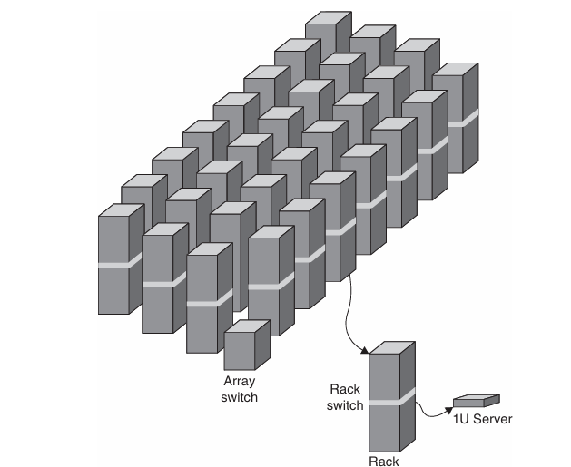
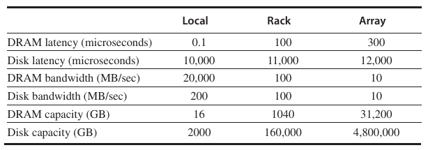
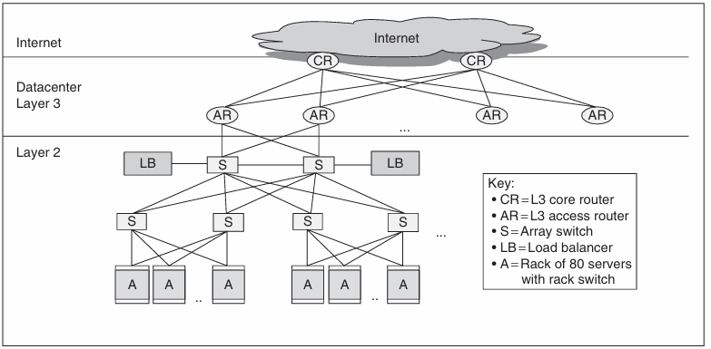
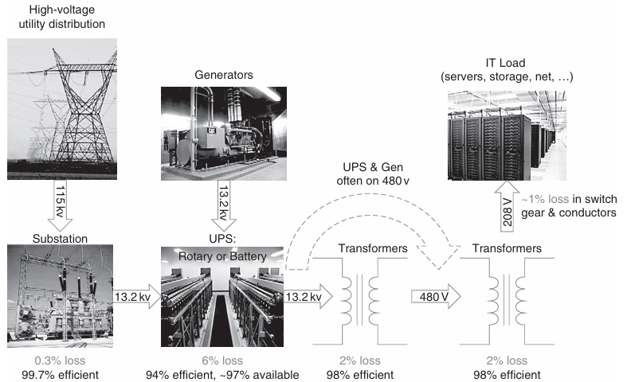
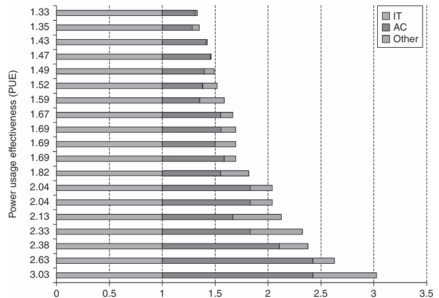
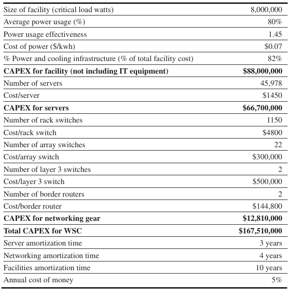

# Warescale-Scale Computers to Exploit Request-Level and Data-Level Parallelism

## Introduction

WSC is not datacenter

WSC architects share many goals and requirements with server architects:

- Cost-performance

- Energy efficiency

- Dependability via redundancy

    - While server architects often utilize more hardware offered at higher costs to reach high availability, WSC architects rely instead on multiple cost-effective servers connected by a low-cost network and redundancy managed by software.

- Network I/O

- Both interactive and batch processing workloads

There are also characteristics not shared with server archiecture

- Ample parallelism

    - **data-level parallelism**: e.g., batch applications benefit from the large number of independent datasets that require independent processing, such as billions of Web
pages from a Web crawl.

    - **request-level parallelism**: e.g., search uses a read-only index and email is normally reading- and writing-independent information.

- Operational costs count

- Scale and the opportunities/problems associated with scale

## Programming Models and Workloads for Warehouse-Scale Computers

The most popular framework for batch processing in a WSC is `Map-Reduce` and its open-source twin `Hadoop`.

```pesudo
map(String key, String value):
    // key: document name (URL)
    // value: doucment contents
    for each word w in value:
        EmitIntermediate(w, "1")    // Produce list of all words

reduce(String key, Iterator values):
    // key: a word
    // values: a list of counts
    int result = 0;
    for each v in value:
        result += ParseInt(v);  // get integer form key-value pair
        Emit(AsString(result));
```

**Performance heterogeneity** is the norm for 50,000 servers in a WSC. 

- For example, <u>toward the end of a MapReduce program, the system will start backup executions on other nodes of the tasks that haven’t completed yet and take the result from whichever finishes first.</u> In return for increasing resource usage a few percent, Dean and Ghemawat[2008] found that some large tasks complete 30% faster.

WSC uses **Automated monitoring** software so that one operator can be repsonsible for more than 1000 servers.

**Replicas** can help with read performance as well as with availability.

- Some systems use *erasure encoding* rather than full replicas, but the constant is **cross-server redundancy** rather than within-a server or within-a-storage array redundancy.

- Google File System (*GFS*), Amazon's key value storage system *Dynamo*, Google record storage system *Bigtable* (Bigtable stores its logs and data on GFS, much as a relational database may use the file system provided by the kernel operating system.)

WSC storage software often uses **relaxed consistency** than following all the ACID (atomicity, consistency, isolation, and durability) requirements of conventional database systems.

- for multiple replicas of data to *agree eventually*, but for most applications they need not be in agreement at all times.

## Computer Architecture of Warehouse-Scale Computers

### Hierarchy of Networks



### WSC Memory Hierarchy



- Each **server** contains 16 GBytes of memory with a 100-nanosecond access time and transfers at 20 GBytes/sec and 2 terabytes of disk that offers a 10-millisecond access time and transfers at 200 MBytes/sec. There are two sockets per board, and they share one 1 Gbit/sec Ethernet port.

- Every pair of **racks** includes one rack switch and holds 80 2U servers. Networking software plus switch overhead increases the latency to DRAM to 100 microseconds and the disk access latency to 11 milliscecnds. Thus, the total storage capacity of a rack is roughly 1 terabyte of DRAM and 160 terabytes of disk storage. The 1 Gbit/sec Ethernet limits the remote bandwidth to DRAM or disk within the rack to 100 MBytes/sec.

- The **array** switch can handle 30 racks, so storage capacity of an array goes up by a factor of 30:30 terabytes of DRAM and 4.8 perabytes of disk. The array switch hardware and software increases latency to DRAM within an array to 500 microseconds and disk latency to 12 millisceonds. The bandwith of the array switch limits the remote bandwidth to either array DRAM or array disk to 10 MBytes/sec.



The WSC needs 20 arrays to reach 50,000 servers, so there is one more level of the networking hierarchy. The above figure shows the **conventional Layer 3 routers** to connect the arrays together and to the Internet.

### Example

A 1000MB transfer disks takes:

$$\text{within sever} = 1000 / 200 = 5 \text{ secs}$$

$$\text{within rack} = 1000 / 100 = 10 \text{ secs}$$

$$\text{within array} = 1000 / 10 = 100 \text{ secs}$$

A memory-to-memory(DRAM) block transfer takes:

$$\text{within server} = 1000 / 20000 = 0.05 \text{ secs}$$

$$\text{within rack} = 1000 / 100 = 10 \text{ secs}$$

$$\text{within array} = 1000 / 10 = 100 \text{ secs}$$

Thus, for block transder outside a single server, **it doesn't even matter whether the data are in memory or on disk since the rack switch and array switch are the bottlenecks.**

## Physical infracstructure and Costs of Warehouse-Sacle Computers



The efficiency of turing 11500 volt power from the utility into 208 volt power that servers can use is 89%:

$$99.7\% \times 94\% \times 98\% \times 98\% \times 99\% = 89\%$$

Suggeted Deployment:

- 33% of power for processors

- 30% for DRAM

- 10% for disks

- 5% for networking

- 22% for other reasons (inside the server)

### Measuring Efficiency of a WSC

**Power utilizatin effectiveness** (PUE)

$$\text{PUE} = \text{Total facility power} / \text{IT equipment power}$$

PUE must be greater than or equal to 1, and the bigger the PUE the less efficient the WSC.



### Cost of a WSC

Designers of WSCs worry about operational costs as well as the cost to build the WSC. Accounting labels for former costs as *operational expenditures(OPEX)* and the latter costs as *captial expenditures (CAPEX)*.

Amortize CAPEX as a fixed amount each month for the effective life of the equipment.

$$\frac{\text{Monthly cost of infrastructure} + \text{Monthly cost of power}}{\text{Facility size in watts}} \times 12 = \frac{\$ 765\text{K} + \$475\text{K}}{8\text{M}} \times 12 = \$1.86$$



## Cloud Computing: The Returen of Utility Computing

### Amazon Web Services

**Virtual Machines**

- protect users from each other

- simplified software distribution within a WSC, in that customers only need install an image and then AWS will automatically distribute it to all the instances being used.

- the ability to kill a virtual machine reliably makes it easy for Amazon and customers to control resource usage

- limit the rate at which they use the physical processors, disks, and the network as well as the amount of main memory

- hide the identity of older hardware, allowing AWS to continue to sell time on older machines that might otherwise be unattractive to customers if they knew their age

- introduce new and faster hardware by either packing even more virtual cores per server or simply by offering instances that have higher performance per virtual core

**Very low cost**

**(Initial) reliance on open source software**

**No (initial) guarantee of service**

**No contract required**
